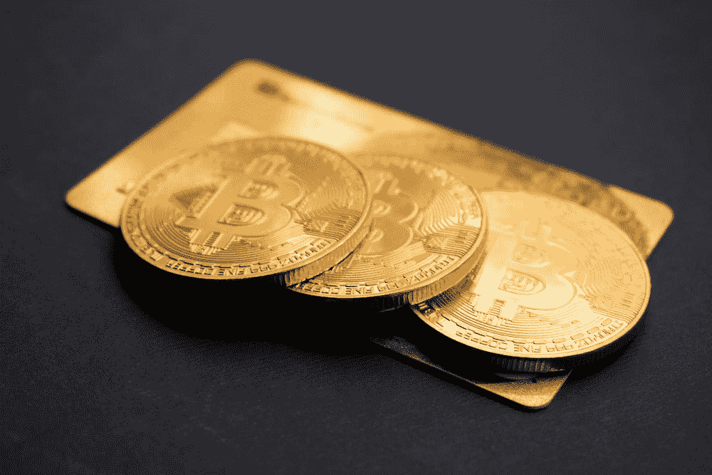

# 比特币缓解反弹的主要指标

> 原文：<https://medium.com/coinmonks/top-indicators-for-a-bitcoin-relief-rally-aabcb44c2fc0?source=collection_archive---------21----------------------->

过去几个月，加密货币市场一直处于低迷状态。比特币是最大、最知名的加密货币，自 2021 年 11 月达到峰值以来，其价值已经大幅下降。

那么，什么是救济集会呢？当价格在一段时间的下跌或停滞后飙升时，就是一个缓解反弹。就比特币而言，最近的反弹可能是因为…