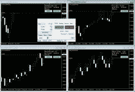

# 2023 年顶级 metatrader 回溯测试软件

> 原文：<https://medium.com/coinmonks/top-metatrader-backtesting-software-in-2023-b63927129f55?source=collection_archive---------20----------------------->

MetaTrader 4 (MT4)是一个受零售外汇(forex)交易者欢迎的平台，它提供了一系列功能，包括对历史数据进行回溯测试的能力。[回溯测试](https://www.nasdaqstrategy.com/2022/12/top-metatrader-backtesting-software-in.html)是利用历史数据评估交易策略表现的过程。

要在 MT4 上执行回溯测试，您可以使用内置的策略测试工具。这个工具允许你选择一个交易策略，设置历史数据周期，并运行模拟来观察该策略在不同市场条件下的表现。您还可以自定义各种设置，如价差、滑点和交易的资金量，以更好地匹配现实世界的交易条件。

也有第三方软件工具可用于在 MT4 上执行回测。这些工具通常提供更高级的特性和功能，例如同时测试多个策略的能力，或者使用遗传算法优化策略参数的能力。

> 交易新手？在[最佳加密交易](/coinmonks/crypto-exchange-dd2f9d6f3769)上尝试[加密交易机器人](/coinmonks/crypto-trading-bot-c2ffce8acb2a)或[复制交易](/coinmonks/top-10-crypto-copy-trading-platforms-for-beginners-d0c37c7d698c)

重要的是要记住，回溯测试结果只是策略在过去表现的近似值，并不能保证未来的表现。在现实交易中实施策略之前，使用回溯测试和前瞻测试(在真实市场数据上测试策略)彻底测试策略总是一个好主意。

# [外汇模拟器](http://blz.soft4fx2for.c2strack.com/)

**让你回到过去，从任何一天开始回放市场。它向你展示图表、指标和经济新闻，就像正在现场发生的一样。您可以下单、修改或关闭订单，就像您正在进行实时交易一样。**

**交易历史数据相比演示交易和其他形式的纸面交易节省了大量时间。它还允许调整模拟的速度，所以你可以跳过不太重要的时段，专注于最重要的时段。**

# 实时数据

**与其他** [**交易模拟器**](https://www.nasdaqstrategy.com/2022/12/top-metatrader-backtesting-software-in.html) **不同，我们的软件可以让您使用多达 10 年的真实报价点数据和真实变量价差。**

# 它是如何工作的

[**外汇模拟器**](https://www.nasdaqstrategy.com/2022/12/top-metatrader-backtesting-software-in.html) **担任 Metatrader 4 的专家顾问。它将 MT4 强大的图表功能与高质量的逐笔交易数据和经济日历相结合，创建了一个强大的交易模拟器。它使用离线图表，允许您使用**[**meta trader**](https://www.nasdaqstrategy.com/2022/12/top-metatrader-backtesting-software-in.html)**中可用的指标、模板和绘图工具。**

**但是，并不局限于使用 Metatrader 提供的历史数据，这些数据通常是低质量的数据。它还允许您从 Dukascopy 和 TrueFX 下载和使用高质量的分笔成交点数据。**

# 不是 EA 测试人员

**我们的模拟器不是**[**EA back tester**](https://www.nasdaqstrategy.com/2022/12/top-metatrader-backtesting-software-in.html)**。不可能测试任何交易机器人或脚本。这个软件不是为此而设计的。**

# 60 个外汇对，黄金，白银，石油，比特币，以太网和 12 个股票指数

[**软件**](https://www.nasdaqstrategy.com/2022/12/top-metatrader-backtesting-software-in.html) **让你进入所有主要的外汇对和其他几个工具。选择你最喜欢的工具并交易它。**

# 使用经纪人的数据

**从** [**外汇模拟器**](https://www.nasdaqstrategy.com/2022/12/top-metatrader-backtesting-software-in.html) **的 1.7 版本开始，可以从** [**Metatrader 导入历史数据，并在模拟**](https://www.nasdaqstrategy.com/2022/12/top-metatrader-backtesting-software-in.html) **中使用。现在，你可以在任何一个** [**MT4 经纪人**](https://www.nasdaqstrategy.com/2022/12/top-metatrader-backtesting-software-in.html) **提供的所有工具上运行模拟。你只需要一个模拟账户。了解有关从 MT4 导入数据的更多信息。**

# 多个时间框架

**你可以一次打开几个图表，跟踪几个时间段的** [**价格走势**](https://www.nasdaqstrategy.com/2022/12/top-metatrader-backtesting-software-in.html) **。你也可以创建自定义的时间图表，如 10 分钟图表或 2 天图表。所有的图表都是同步的，并且是逐时更新的。**

# 更多图表功能

**您曾经需要的所有类型的图表都在一个地方:**

*   标准 [Metatrader](https://www.nasdaqstrategy.com/2022/12/top-metatrader-backtesting-software-in.html) 图:M1，M5，M15，M30，H1，H4，日线图，周线图，月线图
*   定制时间范围:M2，M10，H2，H3，2 天，…
*   第二张图表:30 秒，45 秒，…
*   伦科图表
*   范围图表
*   滴答图

**如你所见，我们的模拟器为你提供了比 MT4 更多的时间框架和图表类型。**

# 内置经济日历

**在模拟过程中，您可以随时访问当前的经济新闻。您也可以在图表上显示它们。经济日历是从外汇工厂下载的，包含从 2007 年开始的事件。将来可能会提供其他新闻提供商。**

新闻可以按重要性和货币进行过滤，所以你可以很容易地显示真正影响你交易的事件。

# 使用 MT4 指标和模板

**由于这个交易模拟器是 Metatrader 4 的附件，它允许您使用所有内置的 MT4 指标以及许多自定义指标。您也可以使用 MT4 模板快速准备图表。**

***我们不能保证所有的非标准指标都能在 Forex Simulator 中正常工作，但是很有可能其中的许多指标都能正常工作。在购买我们的模拟软件之前，请使用我们的免费演示来测试您最喜欢的指标。***

# 纽约收盘五日图

**模拟器能够以两种模式之一绘制图表:**

*   **GMT** —所有图表都基于格林威治标准时间(UTC+0)
*   **纽约收盘** —所有图表都与纽约交易时段收盘一致

这些模式之间的差异在日线图上很容易看出来。GMT 图表将一周呈现 6 天，包括周日棒线。纽约收盘图一周只显示 5 天。此外，随着时间推移几个小时，所有日线看起来都会有所不同。

许多交易者认为纽约收盘图在外汇交易中至关重要。Nial Fuller 的文章更好地描述了纽约收盘图的重要性。

# 随时保存您的模拟

**模拟可以保存到文件中，以后再加载。你所有的交易，挂单，止损，止盈，跟踪止损和其他设置都将被恢复。**

# 完全控制速度

**你可以随时暂停和恢复模拟。你可以让它加速或减速。你也可以在任何你喜欢的图表上逐根蜡烛线前进，包括分笔成交点图、连科图和极差图。**

**此外，有两种可能的速度模式:**

*   **每秒滴答** —滴答在时间上均匀分布，例如每秒 2 个滴答或每秒 10 个滴答。
*   **实时** —分笔成交点的分布方式与它们在现实生活中的分布方式相同。当然，你也可以加快速度，就像录像一样。

**您也可以告诉程序在某些事件上自动暂停模拟:**

*   点击 SL 或 TP
*   未决订单的执行
*   达到规定的价格水平

# 倒带模拟

**从模拟器 1.6 版本开始，如果需要，您可以轻松回到过去。现在每个图表都配备了一个按钮，可以让你逐栏后退。你所有的交易，挂单，止损，止盈，跟踪止损，账户信息甚至统计数据都将被恢复。**

**如果你错过了机会或者你只是简单地把速度提高太多，这都不是问题。模拟可以倒回一分钟、一小时、一天或任何你选择的时间范围。**

# 基于风险的头寸规模

**模拟器允许您使用基于批次的头寸规模估算或基于风险的头寸规模估算。例如，你可以设定它的风险不超过你余额的 2%，或者每次交易不超过 100 美元。基于风险的头寸规模需要设置止损才能正常运作。**

# 自动贸易管理

**以下自动规则可应用于任何交易:**

*   止损止盈
*   跟踪止损
*   自动盈亏平衡
*   挂单的一次取消其他(OCO)规则

此外，您可以使用订单模板加快工作速度，避免重复相同的步骤。模板可用于保存您的交易管理设置并随时加载。

# 可视化交易

**Forex Simulator 让你只需在图表上拖动线条就可以下单、止损和获利。您也可以用同样的方式修改现有订单。**

# 另存为 HTML 报告

使用 Soft4FX simulator，您可以将您的交易历史保存为 HTML 报告。它的格式与 Metatrader 帐户报表完全相同，因此可以很容易地将其导入任何第三方工具进行进一步分析。这种工具的一个例子是 Quant Analyzer。它提供了相当多有用的统计数据和特性，即使是在免费版本中。

# 导出到 Excel

您可以将自己的交易记录保存为 Excel 表格，以便更深入地研究和分析。

# 详细的统计数据

**模拟器显示类似于 Metatrader 提供的统计数据，包括:**

*   余额/权益图
*   利润/亏损
*   绝对、相对和最大下降
*   最大、最小和平均价差
*   利润因素
*   预期利润
*   最大的盈亏交易
*   最长/最大的连胜
*   最长/最长的连败
*   …

**您可以在模拟过程中随时访问您当前的统计数据，而不仅仅是在模拟结束后。**

# 热键

**使用热键可以非常快速地完成基本操作:**

*   **Ctrl +空格键** —暂停/播放
*   **Ctrl +向上箭头** —增加速度
*   **Ctrl +向下箭头** —降低速度
*   **Ctrl +右箭头** —下一条
*   **Ctrl +向左箭头** —上一条
*   **Ctrl + B** —购买
*   Ctrl + S —出售
*   **Ctrl + C** —关闭最后一笔交易
*   **Ctrl + A** —关闭所有交易

[**检查一下**](http://blz.soft4fx2for.c2strack.com/)

> 加入 Coinmonks [电报频道](https://t.me/coincodecap)和 [Youtube 频道](https://www.youtube.com/c/coinmonks/videos)了解加密交易和投资

# 另外，阅读

*   [Bookmap 评论](https://coincodecap.com/bookmap-review-2021-best-trading-software) | [美国 5 大最佳加密交易所](https://coincodecap.com/crypto-exchange-usa)
*   [密码交易机器人](/coinmonks/crypto-trading-bot-c2ffce8acb2a) | [硬币门评论](https://coincodecap.com/coingate-review)
*   最佳加密[硬件钱包](/coinmonks/hardware-wallets-dfa1211730c6) | [Bitbns 评论](/coinmonks/bitbns-review-38256a07e161)
*   [新加坡十大最佳加密交易所](https://coincodecap.com/crypto-exchange-in-singapore) | [购买 AXS](https://coincodecap.com/buy-axs-token)