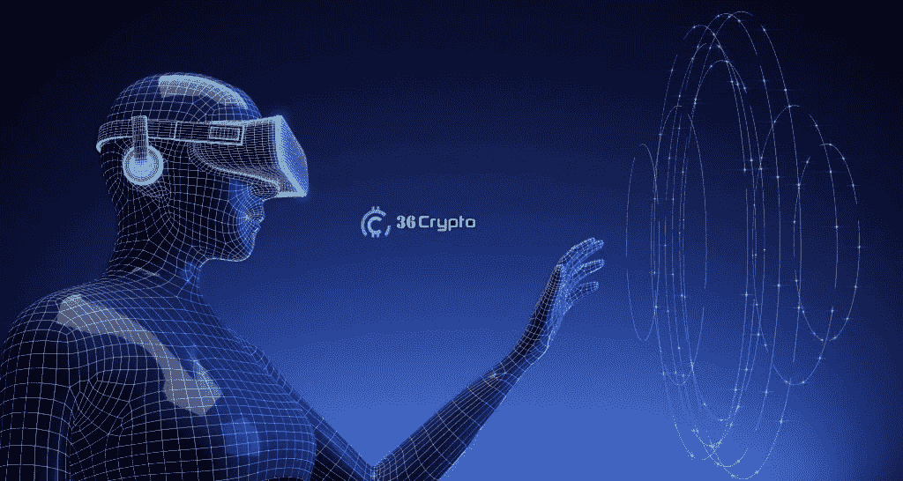
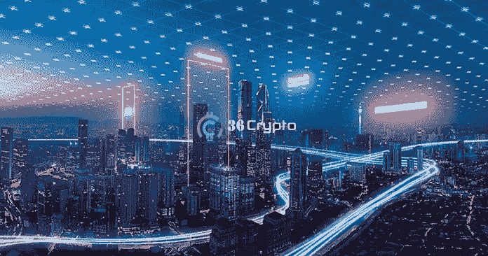
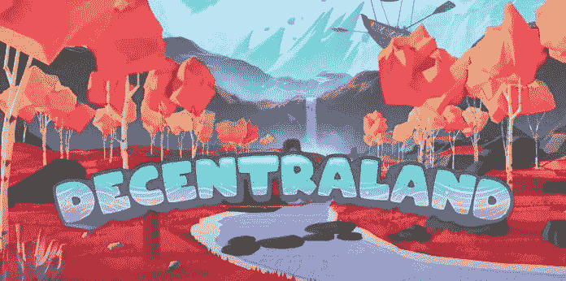
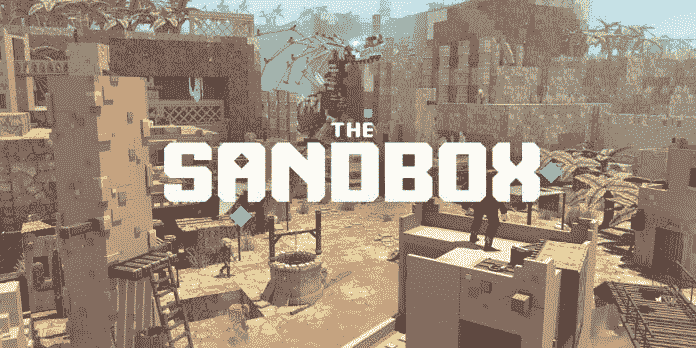
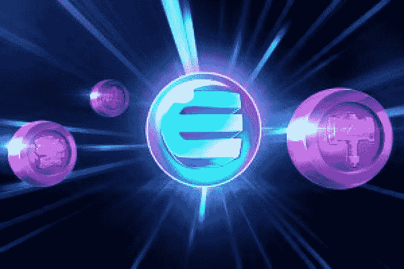
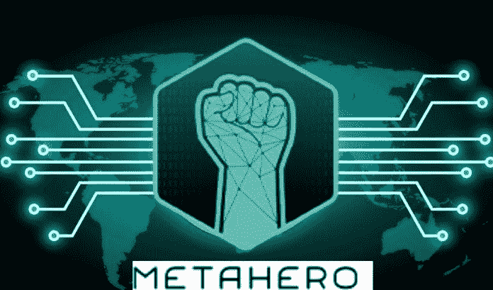
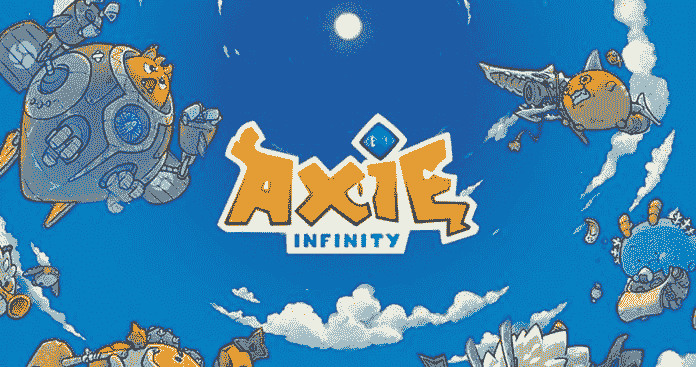

# 最值得投资的元宇宙硬币

> 原文：<https://medium.com/coinmonks/top-metaverse-coins-to-invest-in-503fdce82458?source=collection_archive---------22----------------------->

自从脸书更名为 Meta，标志着不断爆炸的虚拟现实世界融入其社交媒体平台以来，元宇宙硬币(技术的未来)的用例一直在上升。

元宇宙硬币项目是相当新的，硬币价格低，投资机会几乎对任何人开放。如果你一直在寻找高回报的元宇宙硬币，你来对地方了。

在这篇文章中，36crypto 列出了一些你现在应该投资的最好的元宇宙硬币。

# 最佳元宇宙硬币投资

元宇宙被预测为下一代互联网和技术的未来。最近元宇宙硬币正在上升，给投资者带来了巨大的回报。任何人都可以投资大量的元宇宙加密货币。以下是你可以投资的市值非常大的顶级元宇宙加密硬币。

# 分散土地(法力)

创造于 2017 年的[分散的土地](https://play.decentraland.org/?gclid=Cj0KCQiApL2QBhC8ARIsAGMm-KEMCxWtqt5io5JHMtoD52ikjrzWNHqOTSjOcCzoylqJK6SPBaQndQYaAijIEALw_wcB)截至 7 月 11 日的市值为 15.16 亿美元，是最受欢迎的元宇宙硬币之一，得到了广泛的认可。这是一个虚拟现实平台，它有一个突出的特点，允许购买虚拟土地**(一种不可替代的数字资产)**，可以用来创建虚拟游戏、办公室和整个村庄的设施

由以太坊区块链提供能量的统治令牌法力供玩家购买、出售或交易地块。在过去的一年里，MANA 的价格上涨了 4000%以上。截至本文撰写之时，法力令牌目前的交易价格为 0.8056 美元。

# 沙箱(沙子)

[沙盒](https://www.sandbox.game/en/about/sand/)是一个基于以太坊的虚拟游戏世界，用户可以以不可替代的代币(NFT)的形式创建数字资产，将它们上传到市场，用于游戏体验，并将其内容货币化。对于希望拥有虚拟房地产的投资者来说，这是一个可行的选择。

> 交易新手？尝试[加密交易机器人](/coinmonks/crypto-trading-bot-c2ffce8acb2a)或[复制交易](/coinmonks/top-10-crypto-copy-trading-platforms-for-beginners-d0c37c7d698c)

玩家可以使用元宇宙内的沙元宇宙硬币购买数字商品，并参与 P2E(玩赚)。沙盒背后的技术完全集中于去中心化。SAND 的价格去年年底上涨了 900%以上，截至发稿时，其市值为 14.3 亿美元。在撰写本文时，SAND token 目前的交易价格为 1.10 美元。

# 金恩(ENJ)

金恩是一个快速增长的游戏内非功能游戏交易市场。ENJ 是当地的象征，它被用来购买从药物到游戏角色的各种资产，这些资产可以帮助人们在虚拟游戏的不同阶段取得进步。

金恩元宇宙硬币是基于以太坊区块链，有超过 100 个游戏和应用程序。最近，金恩网络正计划扩展到称为 Polkadot 的异构网络，以避免 ETH 网络带来的高额燃气费。

微软目前正在与金恩合作开发 Azure Heroes，这是一个赚取数字收藏品的程序。目前的市值为 4.7 亿美元，截至发稿时，交易价格为 0.4774 美元。

# 超英雄(英雄)

[Metahero](https://metahero.io/) 是元宇宙的一个项目，其基础是使用 3D 技术创建与现实世界物体和人相关的高清化身。这些头像被用于游戏、交易和社交媒体。

在全球拥有 270 万游戏玩家的情况下，Metahero 多年来再次受到欢迎。其原生令牌加密货币 HERO 截至 2022 年 7 月的市值为 6700 万美元，目前交易价格为 0.0086 美元。

# 无限轴(AXS)

[Axie Infinity](https://axieinfinity.com/) 是业内最活跃的游戏之一，在其他游戏中非常出名。据估计，它在全球平台上有 300 万活跃玩家。游戏《元宇宙》中的浏览器角色被称为 Axies，是可以购买、繁殖和交易的 NFT。

这个游戏也有虚拟的不动产，吸引非游戏玩家到这个平台。玩家可以使用 AXS 代币进行游戏内购买、下注以及参与社区治理。

Axie Infinity (AXS)可在币安、火币环球、比特币基地、FTX 等交易平台交易。

目前的市值为 11.6 亿美元，截至发稿时交易价为 14 美元。

# 结论

元宇宙加密项目正在获得动力，你不会想错过这个真正的金矿。元宇宙的概念深深植根于区块链和加密货币，这就是为什么投资这些项目可能是一个好主意。

然而，与任何其他投资一样，交易加密货币也存在风险，因此在投资任何项目之前，最好对项目进行彻底的研究。最好分散投资，更重要的是买你认为有潜力的币。