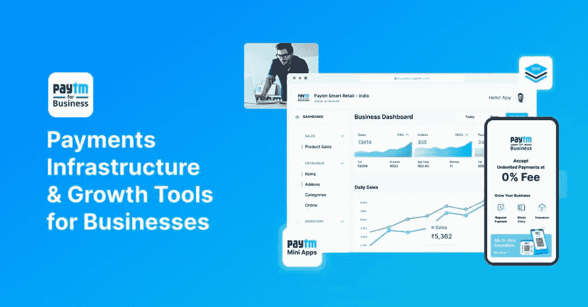
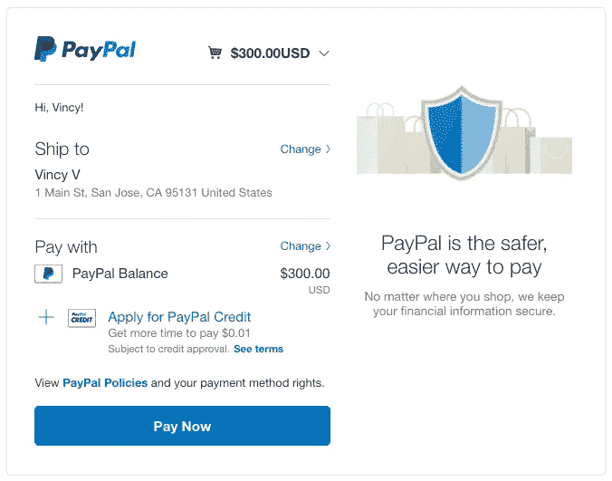
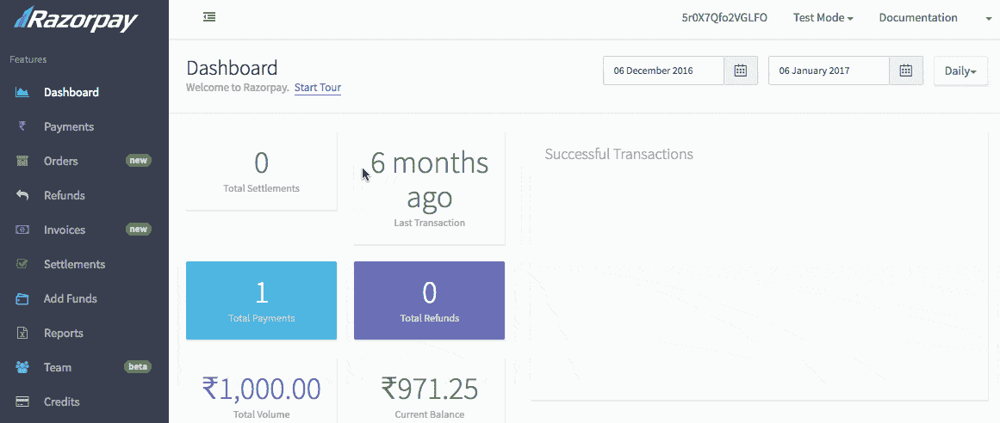
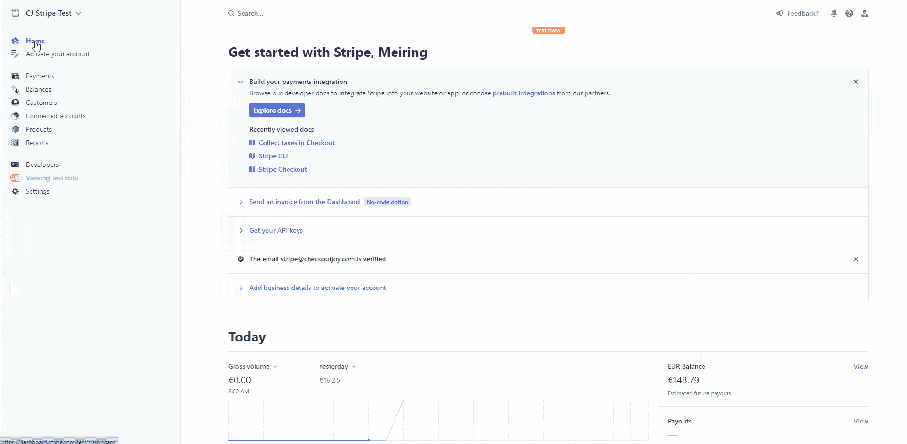
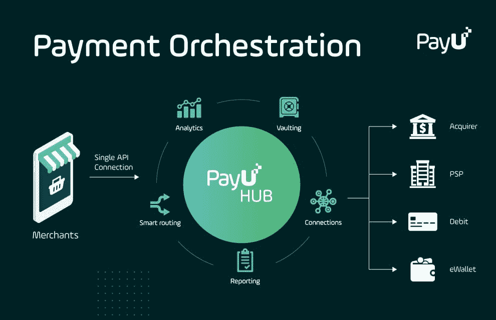

# 2022 年面向开发者的顶级支付 APIs 印度的数字支付趋势

> 原文：<https://medium.com/coinmonks/top-payment-apis-for-developers-in-2022-digital-payment-trends-in-india-4e20deaf339c?source=collection_archive---------18----------------------->

了解关于支付 API 和前 5 名支付 API 的一切

支付 API 已经存在了一段时间，但它仍然是最受欢迎的在线支付方式之一。印度的数字支付趋势将使您只需在智能手机或笔记本电脑/台式机屏幕上点击几下，就能快速处理和接受支付。根据 BCG 的一份报告，到 2026 年，印度数字支付的价值将增长三倍，从目前的 3 万亿美元增至 10 万亿美元。

在本文中，您将了解为什么支付 API 对您和您企业至关重要。我们还会给出排名靠前的支付 API 列表。

# 为什么选择支付 API？

无论是 2022 年还是 2023 年，印度的支付 API 都将保持趋势。我们之所以这样说，是因为

1.  企业通过 Google Pay、Amazon Pay 和 PhonePe 等平台接受支付已经成为一种必然。事实上，有许多公司已经开始通过将这些 API 集成到他们的网站和在线商店中来接受客户的数字支付。
2.  在印度，一些印度初创公司、公司和企业正在使用支付网关为他们的客户提供便捷的体验。[普华永道](https://www.pwc.in/assets/pdfs/consulting/financial-services/fintech/payments-transformation/the-indian-payments-handbook-2020-2025.pdf)的一份报告称，印度的数字支付领域正以令人印象深刻的 30%的年复合增长率(CAGR)增长。合众国际社为这一增长做出了巨大贡献，在 2020-2021 年达到创纪录的 220 亿笔交易。
3.  如今，人们更喜欢通过非接触式支付进行交易。这意味着所有交易都可以通过移动和基于互联网的交易来完成，而不是实物现金支付。你可以支付账单，在朋友之间分摊账单，从餐馆点餐等等。，只需在智能手机或笔记本电脑/台式机屏幕上点击几下。
4.  不需要随身携带现金或卡；如果我们用手机代替现金或信用卡，而不是随身携带手机(尤其是外出时)，那么你的钱包会更安全。

# 2022 年面向开发者的顶级支付 API

随着数字支付的兴起，这一领域的参与者数量大幅增加。支付网关被视为使消费者能够在线或离线支付的核心组件之一。

以下是目前一些领先的支付网关:

1.  [Paytm](https://paytm.com/)

Paytm 支付网关是印度领先的支付网关。Paytm 支付网关提供了印度最有前途的独角兽所信赖的技术。Paytm 支付网关提供即时在线入职以及简单的集成选项。

*   支付网关兼容所有类型的网站和应用程序，它包括所有主要电子商务平台的插件。
*   它还提供了现成的 JS 片段和健壮的 API
*   没有安装费。没有经常性费用或年度维护费用。

[2。贝宝](https://www.paypal.com/in/home)

Paypal 是最受欢迎的支付网关之一，在全世界都很有名。Paypal 已经提供服务超过 20 年，目前在全球 200 多个市场开展业务。它目前在多个平台上拥有超过 2.37 亿活跃账户持有人。

*   Paypal 允许商家和消费者以 100 多种货币进行交易，以 56 种货币提取资金，并在其 PayPal 注册账户中持有 25 种货币的余额。
*   没有提现费，没有启动费，没有终止费，没有月租费。
*   有各种各样的计划可以满足你的需要。

[3。Razorpay](https://razorpay.com/)

凭借其产品套件，Razorpay 是印度唯一允许企业接受、处理和支付支付的支付网关。它让您可以使用所有支付方式，如信用卡、借记卡、网上银行、UPI 和流行的钱包。

*   没有一次性安装费，也没有每年的维护费。
*   每笔成功交易的交易手续费:2%；对于大莱卡、美国运通卡、国际卡和 EMI 卡+1%。
*   该公司的文件是优秀的。

[4。条纹](https://stripe.com/en-in)

Stripe 成立于 2010 年，现在是开发者中最受欢迎的支付网关之一。Stripe payment API 提供了接受付款、管理订阅、跟踪用户帐户和向开发人员发送发票的方法。用户界面在业界是无与伦比的。它的服务被大量有信誉的企业所使用。开发人员需要生动详细的文档来实现服务。

*   最有效的开发者和市场工具。
*   国际交易是可行的。
*   适合那些可以雇佣内部开发人员或雇佣 web 开发公司来完成项目的大公司。
*   Fess-在印度发行的大多数卡收取 2%的费用，在世界其他地方发行的卡收取 3%的费用。货币兑换额外收取 2%的费用。

[5。PayU](https://www.payu.in/)

PayU 是最好、最简单的在线支付解决方案之一，旨在填补复杂服务提供商留下的空白。他们有一个简单的注册和入职流程，并且几乎不需要开发工作。用户界面非常吸引人。该服务提供了一个单一的集成解决方案，允许用户在其所有位置开始接收本地付款。PayU 接受超过 250 种本地支付方式和多种货币。

*   没有安装或年度维护费用。每笔交易的交易费为 2% + GST。
*   国际支付和信用卡受理:支持的支付方式包括 UPI、借记卡/信用卡和网上银行
*   文档是业内最好的，可与 Stripe 和 Razorpay 相媲美。

这是我们为印度开发者提供的 5 大支付 API 列表。所有这些 API 都易于集成，开发人员可以使用它们来开发新的应用程序或服务。您还可以在您的企业或组织中使用这些 API，为您的客户提供一种无麻烦的体验。

除此之外，我们还想告诉您有关加密支付 API 的信息。随着人们寻求越来越安全的交易并控制自己的财务，许多大公司开始允许通过加密支付。因此，知道哪个是最好的加密支付 API 是很重要的。我们在 [Alpyne Labs](https://alpyne.tech/) 是一个新兴的加密支付平台，为全球的 web3 用户提供入口和出口服务。所以，去吧！现在就开始探索 API 集成的可用选项吧！

> 加入 Coinmonks [电报频道](https://t.me/coincodecap)和 [Youtube 频道](https://www.youtube.com/c/coinmonks/videos)了解加密交易和投资

# 另外，阅读

*   [3 商业评论](/coinmonks/3commas-review-an-excellent-crypto-trading-bot-2020-1313a58bec92) | [Pionex 评论](https://coincodecap.com/pionex-review-exchange-with-crypto-trading-bot) | [Coinrule 评论](/coinmonks/coinrule-review-2021-a-beginner-friendly-crypto-trading-bot-daf0504848ba)
*   [莱杰 vs n rave](/coinmonks/ledger-vs-ngrave-zero-7e40f0c1d694)|[莱杰 nano s vs x](/coinmonks/ledger-nano-s-vs-x-battery-hardware-price-storage-59a6663fe3b0) | [币安评论](/coinmonks/binance-review-ee10d3bf3b6e)
*   [加密交易机器人](/coinmonks/crypto-trading-bot-c2ffce8acb2a) | [Bingbon 审查](https://coincodecap.com/bingbon-review)
*   [Bybit Exchange 评论](/coinmonks/bybit-exchange-review-dbd570019b71) | [Bityard 评论](https://coincodecap.com/bityard-reivew) | [Jet-Bot 评论](https://coincodecap.com/jet-bot-review)
*   [3 commas vs crypto hopper](/coinmonks/3commas-vs-pionex-vs-cryptohopper-best-crypto-bot-6a98d2baa203)|[赚取加密利息](/coinmonks/earn-crypto-interest-b10b810fdda3)