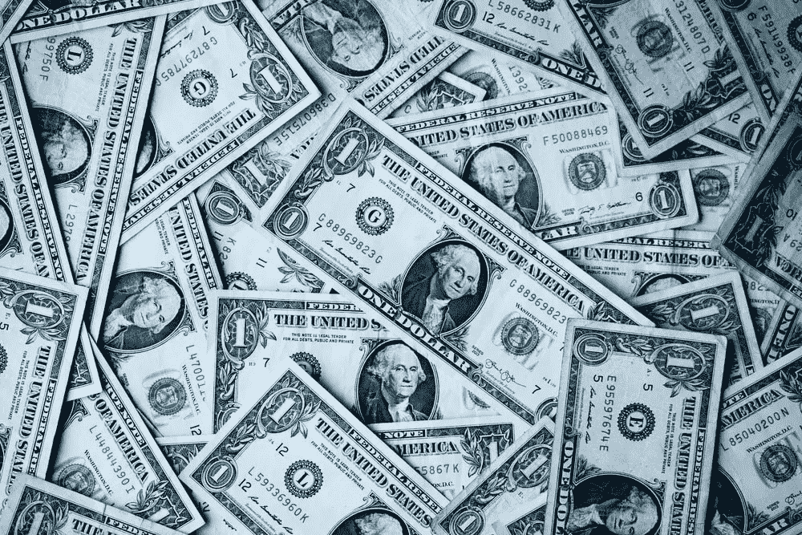

# 堆积稳定硬币的最佳地点，所有约 13%+APY，不含算法、锁定或替代硬币(2022 年 12 月)

> 原文：<https://medium.com/coinmonks/top-places-to-stack-stablecoins-all-13-apy-without-algos-lock-ups-or-altcoins-12-2022-235e3c2d1f3d?source=collection_archive---------1----------------------->

大家好，欢迎来到我的 12 月更新，我发现了最好的地方堆叠稳定的债券，所有收益率至少为 13%或以上的 APY。自从我上次在 11 月份做了[我的最后一份清单，](/coinmonks/top-places-to-stack-stablecoins-all-13-apy-without-algos-lock-ups-or-altcoins-11-2022-5a0dcc4c13aa)以来，大多数策略都有了全面的下降，我想下次我做更新时，情况会继续变化…