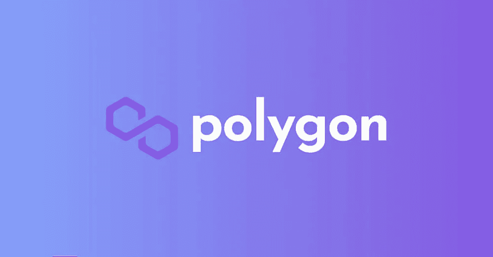
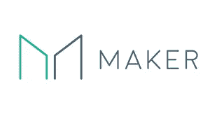

# 2023 年最值得期待的项目

> 原文：<https://medium.com/coinmonks/top-projects-to-look-forward-to-in-2023-1a17ce5f1c40?source=collection_archive---------14----------------------->

欢迎大家回来今天我要讨论的是 2023 年我期待的项目。所有这些项目都是我真正喜欢的项目，因此我可能会有偏见，但我会尽力提供一个完全公正的观点，所以让我们开始吧

**1。多边形(Matic)**

Polygon 已经成为领先的以太坊第二层一年多了。它目前占以太坊第二层锁定的总价值的 50%以上，并致力于许多以太坊扩展解决方案，最著名的是**多边形零**和**多边形黄昏**。两者都是以太坊的汇总解决方案，致力于使以太坊成为一个可扩展但安全的区块链。

你可能想知道以太坊 2.0 发布后 Polygon 会有什么变化。答案很简单，Eth 2.0 的架构是可扩展的，因为在浪涌升级后引入了分片。但是这些碎片不是智能合约兼容的，将被用来记录这些汇总发送的事务快照，因此我相信 Polygon 将比以往任何时候都更强大。所有这些还不包括 polygon 的 pos sidechain，它已经运行了一年多。我们继续前进

**2。马克尔道(MKR)**

Makerdao 曾经是以太坊 Defi 协议的领导者，现在它也是广受欢迎的分散式 Stablecoin(称为 **DAI)的支持者。Maker 有一个独特的模式，所有刀的利润都将被转换成 MKR 并烧掉，这对 MKR 持有者来说是一件好事。我喜欢 Maker 的另一个重要原因是，当 crypto 看到突然下降时，它往往会做得很好，因为许多贷款被清算，并且有 13%的清算罚款用于烧毁 Maker。**

持有 Maker 的另一个重要原因是，它最近的表现远远落后于加密市场，但该协议继续增长，使其市盈率低于 12，这使其成为一项伟大的长期投资。继续我们的下一个

**3。拼写**

我个人认为，与上面提到的其他硬币相比，这是一项非常高风险的投资，但我同样相信，从长远来看，这个项目有很大的潜力。这是 **ABRACADABRA MONEY** 生态系统的原始令牌，类似于 maker Dao，但可用于铸造他们自己的稳定硬币 **MIM** 该协议的好处是，基础抵押品可以赚取利息，而您可以利用杠杆进行收益种植。我个人不持有这个令牌，但我真的相信这里的技术。

**优秀奖**

**1。以太坊**

以太坊自 2015 年发布以来一直名列前茅。它也是世界上最大的智能合约兼容加密有一个强大的生态系统，尽管遇到挫折，总价值约 1800 亿美元。很难与以太坊竞争，随着以太坊 2.0 的推出，我仍然相信它有很大的增长空间

**2。创**

Tron 是另一种智能合约加密技术，以其低费用和高速度而闻名。此外，Tron 生态系统内的通货膨胀相对较低，并且具有良好的 POS 功能。

最后感谢你阅读我的文章，如果你没有告诉我哪里可以改进 cya，希望你喜欢

> 交易新手？试试[密码交易机器人](/coinmonks/crypto-trading-bot-c2ffce8acb2a)或者[复制交易](/coinmonks/top-10-crypto-copy-trading-platforms-for-beginners-d0c37c7d698c)