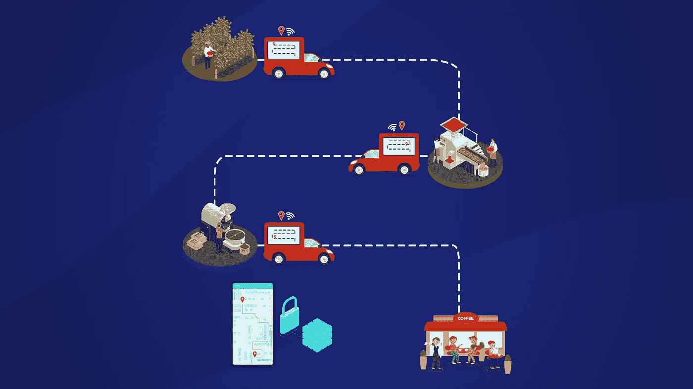

# 六大改变生活的区块链趋势:我们的观点

> 原文：<https://medium.com/coinmonks/top-six-life-changing-blockchain-trends-our-take-dfb66bfe8d1a?source=collection_archive---------16----------------------->

~ Smita Selot，内容团队；坎多拉

你真的知道你的咖啡来自哪里吗？

虽然大多数人将区块链与去中心化金融(DeFi)、隐私和安全联系在一起，但区块链的好处远远不止这些。区块链的其他同样重要的目标是透明、意识和信任。区块链点对点互动旨在包容参与者的意见。因此，参与者可以就如何共享数据、寻求包容性以及要求道德实践发表意见。以下是我们挑选的将改变全球人民生活的顶级区块链趋势。

## **可持续生活的区块链**

世界各地的生态学家和环保主义者正在使用区块链来激励可持续的习惯。基于智能合同的激励机制正在引领节约、再利用和回收的方向。一个这样的项目是 [Aquakraft](https://blockchainhealthcaretoday.com/index.php/journal/article/view/120/175) ，它通过在区块链账户中记入代币来激励节水习惯。KlimaDAO、MOSS 和 Toucan 是另外几个制造区块链代币代替碳信用来抵消排放的环境平台。这些公用事业代币的价值随着供给和需求的变化而变化，使它们变得更有价值。

## **健康的区块链**

整体保健不仅需要药物和治疗，还需要健康饮食和日常锻炼。这就是 Fitbits、智能手表、智能补丁和智能手机应用发挥重要作用的地方。这些可穿戴设备和监测设备简化了对我们饮食、锻炼、睡眠、心率和其他健康参数的跟踪。然而，安全保密地共享这些数据仍然是一个挑战。区块链使患者和健身爱好者能够与他们的医生和医疗保健提供商安全地共享患者生成的健康数据(PGHD)。

## **追踪商品来源**

当今天的消费者啜饮一杯埃塞俄比亚咖啡时，他们想要确定咖啡豆的来源。当他们在网上订购有机蔬菜和水果时，他们想一路追溯到农场。基于 GPS 的传感器可以记录区块链上产品的旅程。可追溯性通过从源头到最终目的地追踪产品的来源，可以增加来源声明的真实性。事实上，ALKO 和 NAKO 这两家销售咖啡豆的企业都已经使用区块链让他们注重质量的客户追溯咖啡豆的原产地。

## **让物联网设备更加智能**

全球有超过 100 亿台物联网设备。因为他们连接到互联网，他们也可以使用机器-机器接口互相交谈。这些交互赋予了它们一种智能，这种智能在早期只有人机界面才有。不幸的是，物联网设备在连接到互联网后 5 分钟内就容易受到黑客攻击。区块链不仅可以使物联网通信安全，还可以允许设备使用智能合同相互协商。

## **社交媒体平台**

数字隐私、欺诈性内容和错误数据是共享内容和媒体的几个最大障碍。区块链的去中心化架构比传统的中心化平台更安全。进一步的区块链交互不需要个人身份信息(PII)，因此保护了用户的数字隐私。分散式社交媒体平台 Steemit 由其用户拥有和运营。STEEMit Dapp 建立在 Steem 区块链的基础上，并为其用户提供本地加密硬币 Steem 进行内容创建和管理。

## **区块链作为一种赚钱手段**

任何制造商都不应该在不了解消费者习惯和偏好的情况下推出自己的产品。因此，用户习惯和偏好具有内在价值，用户是这些信息的实际所有者。然而，互联网 Web2.0 收集这些信息对用户没有任何价值，前提是用户数据是方便网购的成本。使用区块链账户，用户可以选择付费分享数据。Loomia 开发的面料技术允许用户通过分享他们对穿着特定服装的偏好来赚钱。

Kandola 生态系统将使所有领域和行业的企业能够开发可扩展、安全和隐私设计的区块链设备和解决方案。请通过 hello@kandola.network 告诉我们您的想法

> 交易新手？试试[密码交易机器人](/coinmonks/crypto-trading-bot-c2ffce8acb2a)或[复制交易](/coinmonks/top-10-crypto-copy-trading-platforms-for-beginners-d0c37c7d698c)