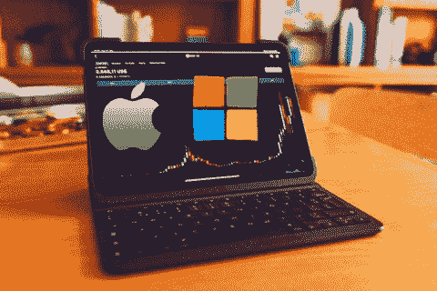

# 7 月份最值得购买的股票

> 原文：<https://medium.com/coinmonks/top-stocks-to-buy-in-july-2f54f51e3a42?source=collection_archive---------30----------------------->

Source photo Unsplash.com

# 微软(MSFT)

总部位于西雅图的微软是一家被低估的蓝筹科技公司(纳斯达克股票代码:MSFT)。比尔·盖茨共同创立的公司继续取得惊人的成绩。然而，尽管表现出色，但随着市场波动，MSFT 股票今年已经下跌。

以每股 260 美元的价格，微软的股票今年以来下跌了 17.1%，几乎…