# 蜡区块链的顶级钱包

> 原文：<https://medium.com/coinmonks/top-wallets-of-wax-blockchain-ee2cacdf8ba2?source=collection_archive---------17----------------------->

查看你可以用来连接区块链蜡像馆网络的著名钱包列表。

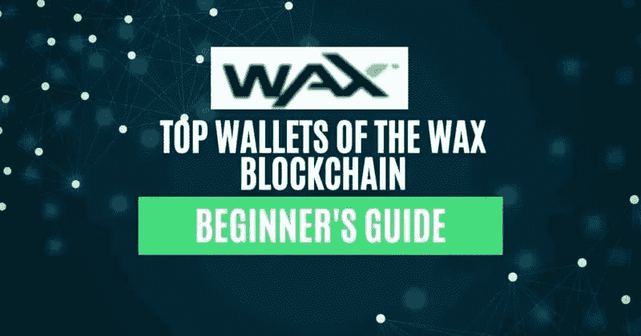

## 全球资产交换或简称 WAX，被认为是最节能的网络之一。它是领先的 NFT 平台之一，允许用户创建、购买、出售和交易虚拟资产。根据他们的报告，与基于 PoW 的链(如[比特币](https://www.altcoinbuzz.io/reviews/technical-analysis/the-fear-greed-index-for-bitcoin-an-introduction/)和以太坊)相比，WAX 区块链使用授权的股权证明机制，能效提高 125，000 倍，能耗不到 0.00001%。2021 年，该网络获得了气候关怀组织颁发的碳中和认证奖。

根据 [dappradar](https://dappradar.com/industry-overview) 的说法，WAX 区块链每天拥有超过 32.5 万名用户，每天处理超过 1500 万笔交易。

在本文中，我们将详细解释支持 WAX 区块链的不同钱包。因此，如果你是一个想探索任何蜡基 dapps 的用户，但不确定你应该使用什么样的钱包，那么请阅读这篇文章。最后，你将能够决定什么样的钱包将适合你的目的。

**蜡区块链的不同钱包**

以下是一些著名的钱包，你可以用它们来连接 WAX 网络:

*   **蜡云钱包-** 蜡云钱包是用户可以用来连接蜡网**的最著名的钱包。**在支持非功能性钱包的情况下，钱包可让您连接众多基于蜡的 dApps。

你可以阅读我们之前的指南[如何设置和使用蜡云钱包](https://www.altcoinbuzz.io/bitcoin-and-crypto-guide/how-to-use-the-wax-cloud-wallet/)

*   **硬件钱包-** 硬件钱包是安全存放您资产的最佳选择。请注意，如果您希望在分类帐中存储 WAX，您必须在您的分类帐设备中安装 EOS 应用程序，因为分类帐没有可用的 WAX 应用程序。用户现在需要使用分散钱包生成密钥(分类帐不支持密钥生成)。然后，用户可以将密钥从分类帐设备导入您的分散钱包。
*   **Anchor Wallet-**Anchor Wallet 是一款安全、以隐私为中心的开源钱包，允许您连接基于 EOSIO 的网络。该钱包由 Greymass 开发，可用于各种操作系统，包括 Windows、Linux、macOS 等。

因此，在本文中，我们将解释如何安装和设置锚钱包。

**访问主播钱包**

访问主播钱包，请访问[主播钱包](https://greymass.com/en/anchor/)官网。向下滚动主页，你可以看到下面的屏幕。

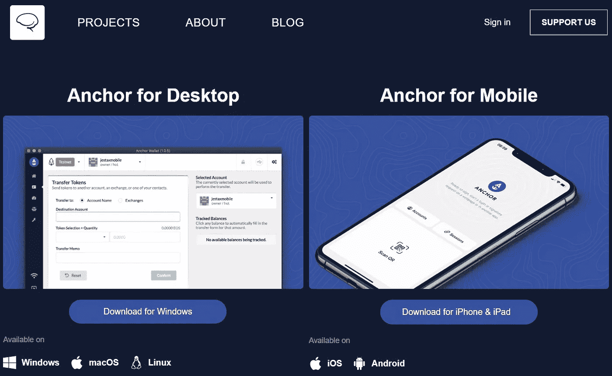

正如所给出的，用户可以下载桌面版的 Windows、macOS 和 Linux 的钱包应用程序。移动用户可以在他们的 Android 或 iOS 设备上安装它。

我们将解释如何为 Windows 操作系统(桌面版)安装应用程序。

**安装锚钱包**

要安装 Windows 版钱包应用，点击**下载** **Windows** (见上图截图)。一个. exe 文件将被下载到您的本地系统。运行。exe 文件并完成安装过程。

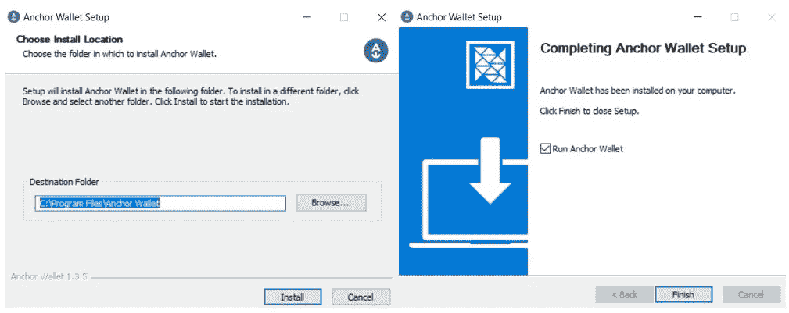

现在，您可以在桌面上找到锚钱包图标。

**为主播钱包设置选项**

点击应用程序图标，启动并设置您的锚定钱包。在这里，您可以找到以下三个钱包设置选项:

*   **设置帐户-** 帮助您创建新的锚定钱包帐户
*   **导入锚点备份文件**–通过给定备份文件导入现有账户
*   **恢复帐户-** 通过提供密钥证书详细信息来导入帐户

**设置账户**

如果要创建新的锚定钱包帐户，请选择此选项。该应用程序将要求您首先设置您的钱包的密码。接下来，它会提示您选择要访问的网络。

Anchor wallet 允许您连接以下不同的网络:

*   黎明的女神
*   FIO
*   质子
*   泰洛斯
*   蜡

用户可以在下拉列表中找到更多的网络(主网和测试网)选项来连接。

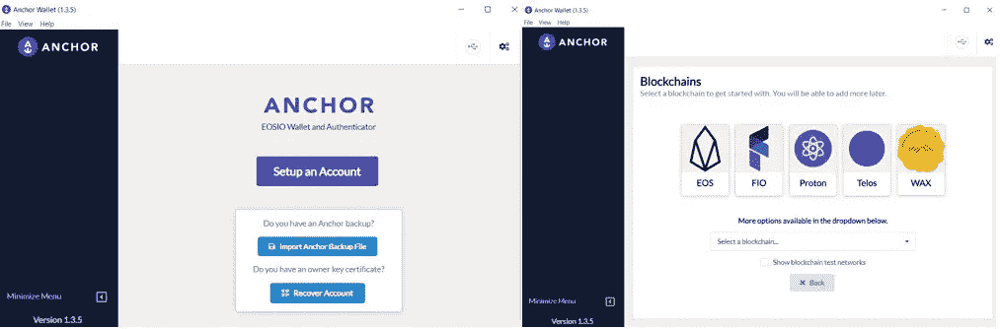

选择您想要的网络。我们将连接 EOS 网络。您可以按照相同的步骤连接到任何支持网络。

**注意:**如果您没有在 Anchor wallet 中找到创建帐户选项，请不要感到惊讶。这是因为钱包应用程序对帐户创建收费。用户必须支付 1.99 美元才能在 EOS 网络中创建一个帐户。您可以检查移动(Android)版本，以了解在不同网络上创建帐户的费用(参见下面的截图，取自 Anchor 移动钱包应用程序)。

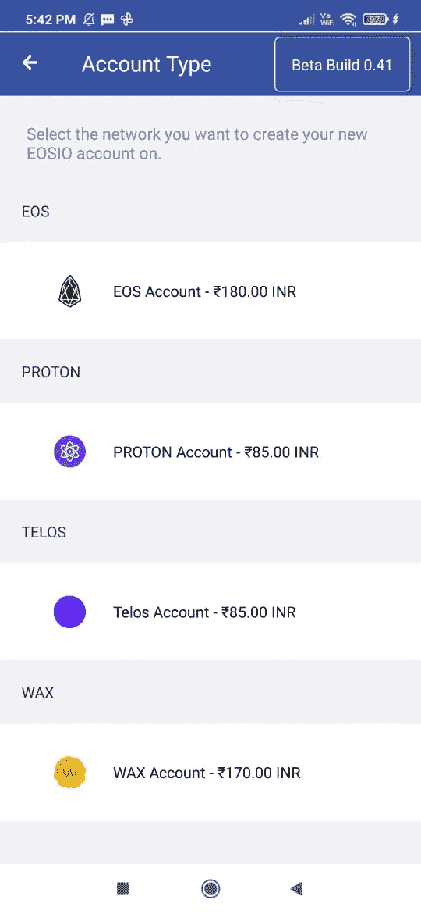

**如何付款创建账户**

要支付账户创建费用，用户需要访问[链接](https://create.anchor.link/)。你可以找到**创建新账户**按钮。点击它。

接下来，您需要选择帐户所在的网络。根据网络的不同，应用程序将显示您需要支付的金额(以美元为单位)(请参见下面的流程步骤)。

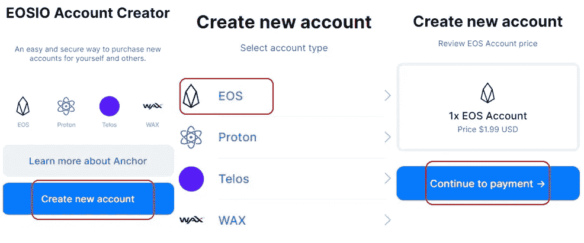

点击**继续支付**，将出现支付窗口。输入您的卡详细信息并批准支付流程。

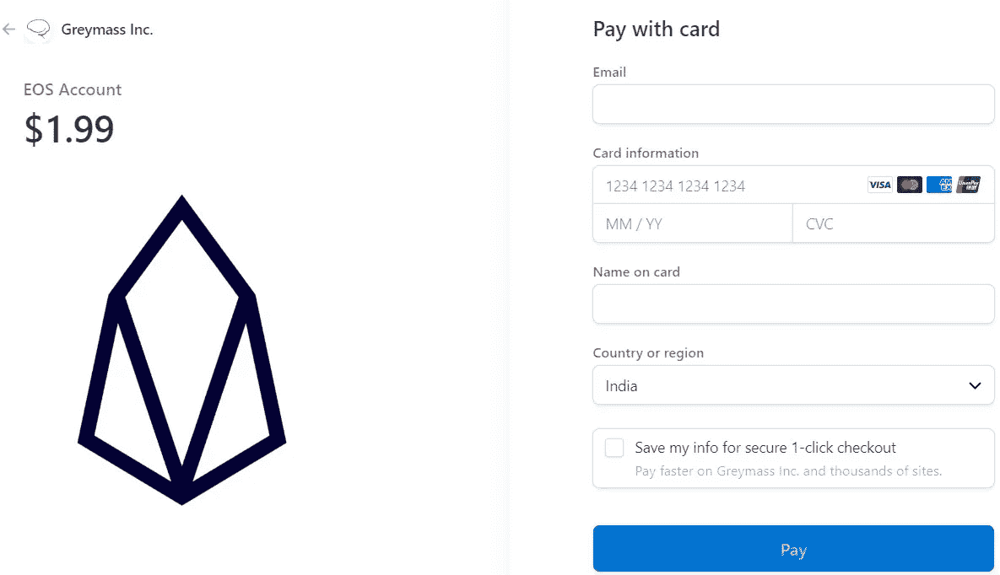

您可以在屏幕上看到包含**立即创建账户**按钮的支付成功消息。

点击它。您现在可以获得下面的选项来创建一个帐户(按照下面截图中显示的步骤)。

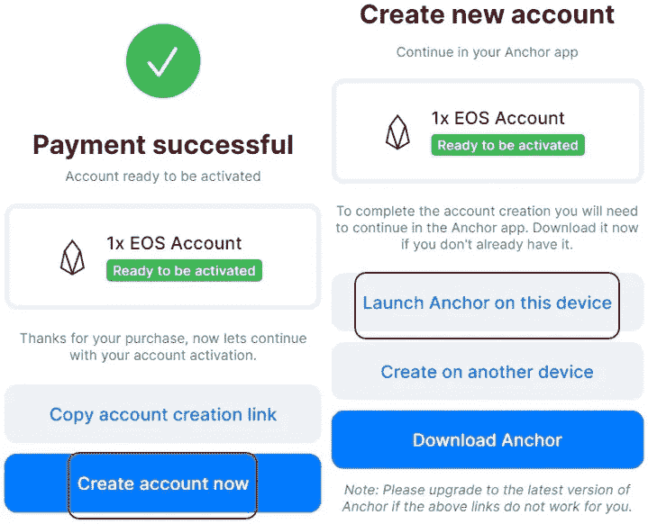

**创建一个锚账户**

因为我们已经在同一台计算机上安装了 Anchor wallet，所以我们将在该设备上选择**启动 Anchor**按钮(见上面的截图)。

要创建一个 EOS 帐户，您可以在**帐户名称**字段中检查您想要的名称/单词的可用性。

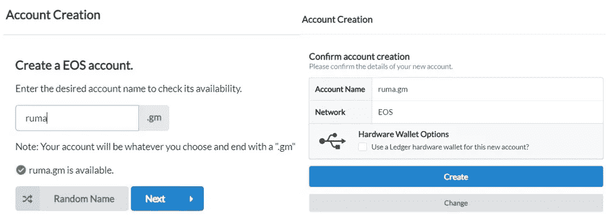

用户名是唯一的，并将有一个. gm 后缀。如果有，您可以确认帐户创建过程。否则，您可以搜索另一个唯一的帐户名。一旦你的帐户被创建，你将得到下面的成功信息。

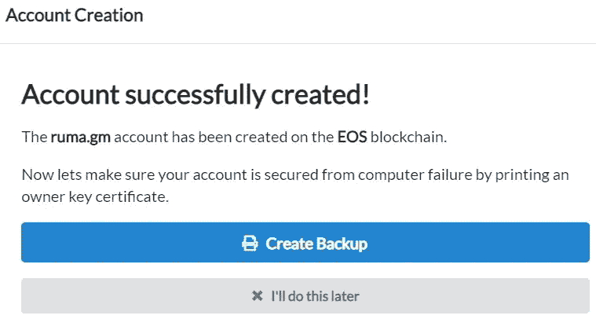

**账户备份**

我们总是建议用户在创建钱包时立即备份他们的钱包帐户。

要进行备份，点击**创建备份**按钮，如上图所示。应用程序将显示一个 6 个单词的关键短语，并要求您验证该关键短语。

一旦成功完成，用户将可以选择打印或保存证书。

认证是关于用户帐户的文档，它由助记键、QR 码和一个长字母数字地址组成。

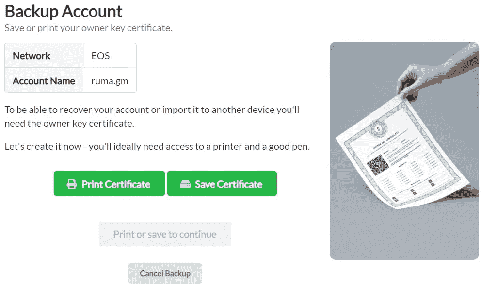

所有者的密钥证书将如下所示。

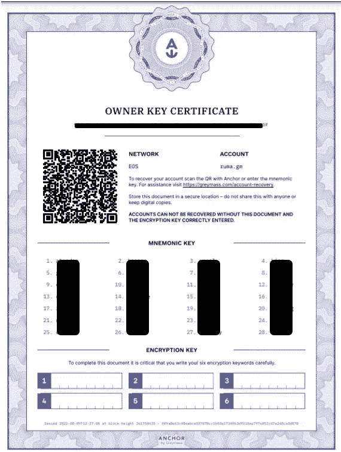

请注意，要恢复帐户，用户需要 6 个字的加密密钥和证书中给出的详细信息。因此，请将您的加密密钥和证书存储在安全的地方。

**登陆界面/账户概述**

保存证书后，您将被重定向到钱包登录页面。在这里，您可以找到以下选项卡:

*   **系统令牌-** 显示本地选定区块链网络的令牌余额
*   **令牌-** 选择、跟踪和管理任何 EOS 网络令牌
*   **资源-** 检查 EOS 网络中不同账户的资源(CPU、RAM 和网络)使用明细
*   **治理-** 检查 EOS 网络中各账户的治理统计数据

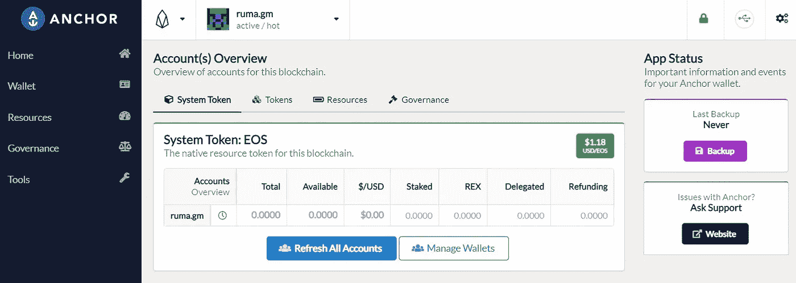

您还可以看到**备份**按钮(在面板的最右侧)。单击它以保存。本地驱动器中的 json 文件。

**进口账户**

用户可以将他们现有的 EOS 帐户导入到 Anchor wallet。

要导入账户，点击**管理钱包**。您现在可以看到**导入钱包**按钮。单击它后，您会发现可以用来导入帐户的各种选项:

*   通过私钥导入
*   启用分类帐支持
*   从密钥证书导入

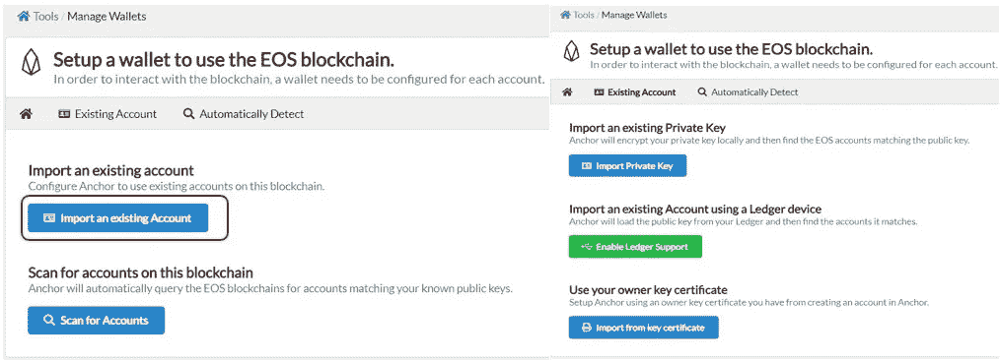

用户可以选择上面的任何选项，在正确提供关键细节后，您的钱包将被导入。

**钱包**

在**钱包**标签下，你可以找到将资产转移到其他钱包地址的选项。

要启动转账流程，用户需要提供以下详细信息:

*   目的地址
*   代币及其金额
*   转账备忘录

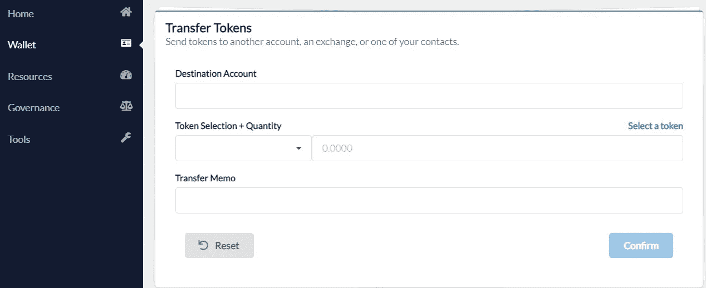

填写完详细信息后确认流程。

**资源**

从**资源**选项卡，您可以检查资源(CPU、RAM 和网络)状态。每个资源都需要完成特定的任务。每当用户用完资源，他们可以来到这个部分，并通过给 EOS 硬币购买所需的资源。

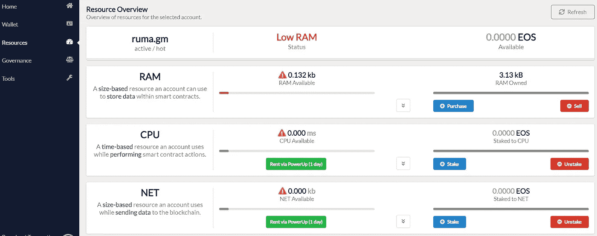

**治理**

从**治理**选项卡，您可以检查块生产者的列表。你可以把投票权交给一个值得信任的代理投票人。

只需点击**设置投票人代理**，搜索已注册代理投票人的账户名称。你可以随时撤销你的权力。

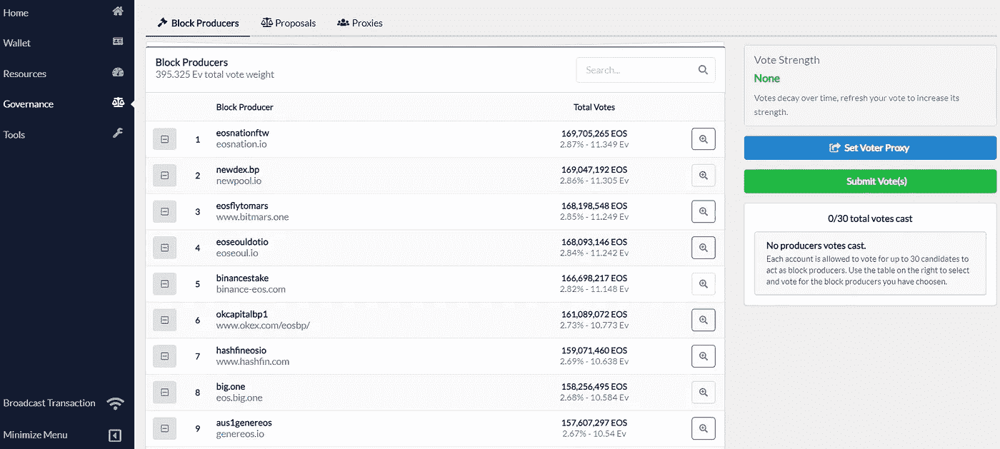

**管理区块链**

如前所述，Anchor wallet 支持各种 EOSIO 链。你可以在页面顶部找到**管理区块链**选项。点击它，它将显示所有的测试网络和主网络。选中您希望使用的网络的复选框，所选网络将被添加到您的网络字段中。看到下面的截图，我们已经添加了蜡网络。

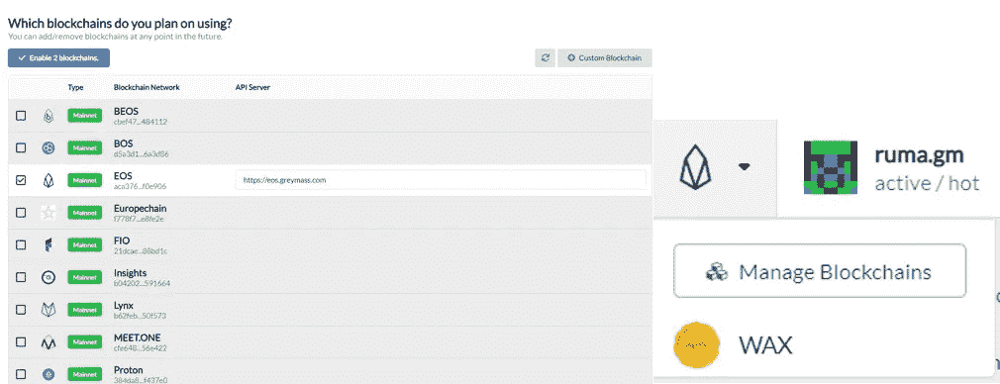

**设置**

从“设置”选项卡，您可以检查/更新以下重要功能:

*   语言
*   启用/禁用选项以显示高级选项
*   启用/禁用签名请求以访问外部应用程序的选项
*   块浏览器
*   连接外部应用程序时显示警告消息
*   钱包超时
*   重置应用程序

并且可以设置更多的参数。

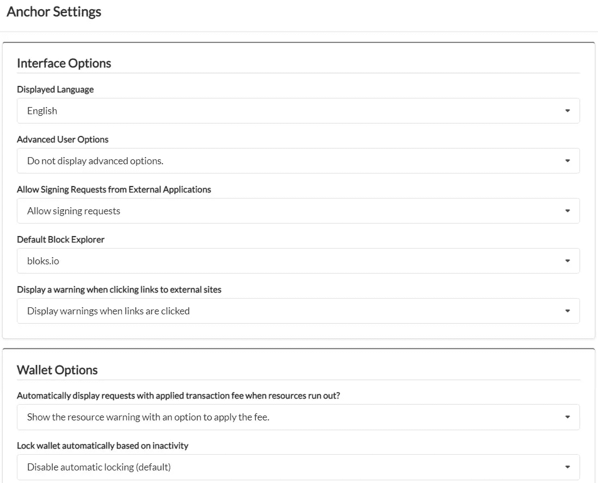

你也可以在这里阅读我们关于著名的 NFT 蜡市场之一，即原子中心[的指南。](https://www.altcoinbuzz.io/bitcoin-and-crypto-guide/how-to-use-the-atomichub-platform/)

***注:*** *本帖首发* [*此处*](https://www.altcoinbuzz.io/bitcoin-and-crypto-guide/top-wallets-of-wax-blockchain/) *带* [*一个* ltcoinbuzz.io](https://www.altcoinbuzz.io/) *。*

跟我来

**👉** [推特](https://twitter.com/rumadas123)

**👉** [Linkedin](https://www.linkedin.com/in/ruma-das-a1439320/)

> 交易新手？尝试[加密交易机器人](/coinmonks/crypto-trading-bot-c2ffce8acb2a)或[复制交易](/coinmonks/top-10-crypto-copy-trading-platforms-for-beginners-d0c37c7d698c)