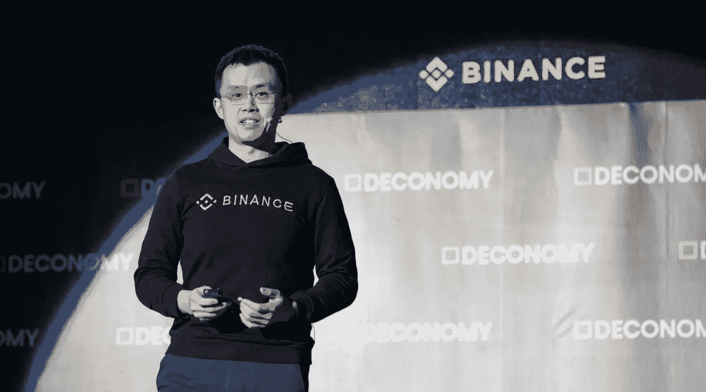

# 2023 年值得关注的 Web3 Twitter 影响者

> 原文：<https://medium.com/coinmonks/top-web3-twitter-influencers-to-follow-in-2023-4746deaf886?source=collection_archive---------9----------------------->

Here are the Top 5 Web3 Influencers you MUST follow on Twitter

这些年来，**网络**已经**进化了很多**。它开始是一个只读网站，但后来它变得互动和社交。现在有一个新版本的互联网，叫做 **Web3** 。这个新版本预计将以**用户为中心**，它将使用**区块链技术**、**加密货币**、 **NFTs** 、**元宇宙**。

如果你想了解所有最新的 Web3 发展，最好的方法之一就是关注 **Twitter 上有影响力的人**，他们可以让你直接了解 **Crypto** 、 **Web3** 、 **NFTs** 和**元宇宙**的世界里发生了什么。以下是你必须关注的五大客户:

# 赵昌鹏

加密货币领域最富有的企业家**赵昌鹏**(又名 CZ)，是最大的加密货币交易所**币安**的创始人和 **CEO** 。

CZ 每天都发微博，分享他对 Crypto、Web3 和元宇宙的不同发展的观点。他的 Twitter 账户绝对是你在 Crypto Twitter 上可以关注的最吸引人的账户之一。你可以在推特 [**这里**](https://twitter.com/cz_binance) 加入他的**730 万粉丝**。

# ZachXBT

ZachXBT 是一名**网络侦探**，他以**揭露秘密骗局**为己任。随着加密货币受欢迎程度的强劲上升，诈骗数量大幅增加。这些骗局可以采取多种形式，从假 ico 到庞氏骗局。 **ZachXBT** 利用他的**平台**来**教育人们** **关于**这些**骗局**以及如何规避。

多亏了 ZachXBT 的努力，无数人的血汗钱才没有被这些无良犯罪分子抢走。跟着他[这里**这里**。](https://twitter.com/zachxbt)

# 加密中心

**加密中心**是 **№1 加密教育中心**。他们的**目标**是**为每个人**提供**知识**，他们需要**在密码领域**取得成功。Crypto Hub 在平台上发布教育内容，比如推特、抖音、媒体和媒体。Crypto Hub 在 [**Telegram**](https://t.me/officialcryptohub) 上还有一个**令人惊叹的社区**，在这里，持不同观点的人每天都在讨论当前的话题。

无论你是刚刚入门的**还是经验丰富的**， **Crypto Hub** 都能帮你搞定。所以关注他们的推特账号 [**这里**](https://twitter.com/CryptoHub210) ，成为他们**神奇社区**的一部分。

# 克里斯·狄克逊

克里斯·迪克森从 20 世纪 90 年代初开始涉足互联网。他是一位专家，写下了他对加密货币长期发展方向的**观点。迪克森还是安德森·霍洛维茨基金的合伙人。**

他偶尔会发微博说说自己对**编程**、**哲学**、**历史**、**互联网**、**创业** & **Web3** 的看法。加入他的 882k 追随者 [**这里**](https://twitter.com/cdixon) 。

# 维塔利克·布特林

以太坊的**联合创始人是出生于俄罗斯的加拿大程序员 Vitalik Buterin。他在 19 岁时设计了以太坊区块链，并且是在世的最年轻的亿万富翁之一。加密社区的许多人认为**维塔利克**是在加密领域工作的最聪明的人**。

布特林也是比特币杂志的联合创始人，他经常在推特上与超过 450 万名粉丝分享他对加密和区块链的看法。跟着他[这里**这里**。](https://twitter.com/VitalikButerin)

🤑加入我们的 [**电报频道**](https://t.me/officialcryptohub) 与志同道合者互动

🐦也可以查看我们的 [**推特账号**](https://twitter.com/CryptoHub210?s=20&t=ts3bUBYtX7g0s5_ClYnL_A) 获取更简短的分析

💰欢迎 [**关注我们**](/@officialcryptohub0) 获取更多此类分析

👋业务请求: [**电报:联系@cryptohubtiktok**](https://t.me/cryptohubtiktok)

> 交易新手？尝试[加密交易机器人](/coinmonks/crypto-trading-bot-c2ffce8acb2a)或[复制交易](/coinmonks/top-10-crypto-copy-trading-platforms-for-beginners-d0c37c7d698c)