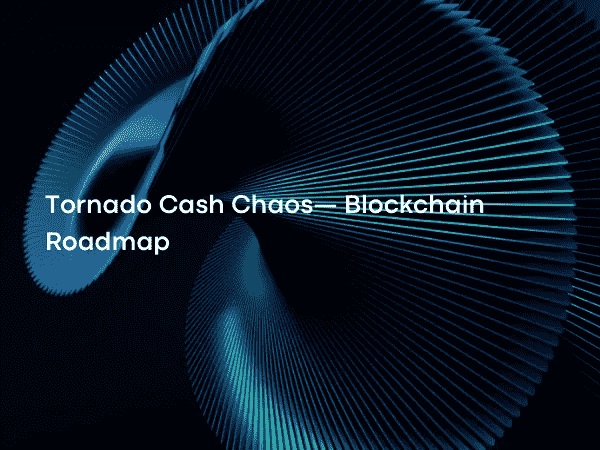

# 龙卷风现金混乱——区块链路线图

> 原文：<https://medium.com/coinmonks/tornado-cash-chaos-blockchain-roadmap-c40198a0650c?source=collection_archive---------4----------------------->

Photo by [DynamicWang](https://unsplash.com/@dynamicwang)on [Unsplash](https://unsplash.com/?utm_source=medium&utm_medium=referral)

龙卷风现金是一种 dApp，用于隐藏以太坊区块链的资金来源。基本上，它是一个智能合约，可以将发送给它的 eth 进行池化和混合，然后撤回到所需的地址。这样一来，寄给任何地址的钱都不清楚是从哪个地址寄出的。自该应用程序投入使用以来，已有大约 70 亿美元通过该应用程序进行交易。

 [## OFAC 制裁受欢迎的以太坊搅拌机龙卷风现金洗钱密码被朝鲜窃取…

### 今天，美国财政部外国资产控制办公室(OFAC)批准了流行的以太坊搅拌机龙卷风现金…

blog.chainalysis.com](https://blog.chainalysis.com/reports/tornado-cash-ofac-designation-sanctions/) 

在过去的几年中，已经看到 DeFi 世界的许多黑客事件中被盗的钱通过龙卷风现金丢失。调查结果表明，这些黑客攻击中有很大一部分是由一个名为 Lazarus 的黑客组织实施的，该组织由朝鲜政府发起，并得到了美国的批准。最近的一起事件是，Axie Infinity 建立的连接浪人区块链和以太坊的桥梁遭到袭击，4 . 55 亿美元被盗。

 [## 朝鲜拉扎勒斯黑客瞄准世界各地的能源供应商

### 与朝鲜有关联的拉扎勒斯集团发起了一场针对全球能源供应商的恶意运动。

thehackernews.com](https://thehackernews.com/2022/09/north-korean-lazarus-hackers-targeting.html)  [## 无限轴

### 斧头是凶猛的动物，喜欢战斗、建造和寻找宝藏！建立一个收藏库，并在……

axieinfinity.com](https://axieinfinity.com/)  [## 财政部制裁朝鲜国家支持的恶意网络组织

### 华盛顿——今天，美国财政部外国资产控制办公室(OFAC)宣布制裁…

home.treasury.gov](https://home.treasury.gov/news/press-releases/sm774) 

朝鲜是美国自 20 世纪 50 年代以来一直对其实施制裁的国家。正因如此，与政府有关联的黑客在单一事件中窃取的资金当然令美国当局感到不安。考虑到大约 28%通过 Tornado Cash 流动的资金直接来自黑客和受制裁的机构，当局采取行动是不可避免的。

 [## 对朝鲜的制裁——维基百科

### 一些国家和国际组织已经对朝鲜实施了制裁。目前，许多制裁…

en.wikipedia.org](https://en.wikipedia.org/wiki/Sanctions_against_North_Korea)  [## OFAC 制裁受欢迎的以太坊搅拌机龙卷风现金洗钱密码被朝鲜窃取…

### 今天，美国财政部外国资产控制办公室(OFAC)批准了流行的以太坊搅拌机龙卷风现金…

blog.chainalysis.com](https://blog.chainalysis.com/reports/tornado-cash-ofac-designation-sanctions/) 

美国财政部有两个机构从事反洗钱活动。其中一个是金融犯罪执法网络，另一个是 OFAC 外国资产管制办公室。虽然金融罪行执法网就金融机构在侦查可疑交易时应遵循的方式制定政策，但 OFAC 直接处理识别可疑人员或机构并实施制裁的问题。

 [## 美国财政部金融犯罪执法网络| FinCEN.gov

### 金融犯罪执法网络(FinCEN)通知美国金融机构，金融行动…

www.fincen.gov](https://www.fincen.gov/)  [## 外国资产控制办公室——制裁计划和信息

### 搜索 OFAC OFAC 制裁名单 OFAC 公布的个人和公司拥有或控制，或代理…

home.treasury.gov](https://home.treasury.gov/policy-issues/office-of-foreign-assets-control-sanctions-programs-and-information)  [## 特别指定的国民和封锁人员名单(SDN)的人可读名单

### 最后更新日期:2022 年 9 月 9 日作为执法工作的一部分，OFAC 公布了以下个人和公司的名单

home.treasury.gov](https://home.treasury.gov/policy-issues/financial-sanctions/specially-designated-nationals-and-blocked-persons-list-sdn-human-readable-lists)  [## 马克尔道应该“认真考虑准备”戴德鹏:创始人

### 根据共享的不和谐信息，鲁恩·克里斯滕森认为马克尔道应该为阿呆·德佩格做好准备…

cryptobriefing.com](https://cryptobriefing.com/makerdao-should-seriously-consider-preparing-for-dai-depeg-founder/) 

这两家机构之一的 OFAC 在一份声明中宣布，它已将 Tornado Cash 应用程序和与此应用程序相关的 38 个地址列入禁止列表 SDN(特别指定的国民和个人列表)。

 [## 美国财政部制裁臭名昭著的虚拟货币搅拌机龙卷风现金

### 今天，美国财政部外国资产控制办公室(OFAC)批准了虚拟…

home.treasury.gov](https://home.treasury.gov/news/press-releases/jy0916)  [## 网络相关名称

### 以下实体已被添加到 OFAC 的 SDN 列表中:TORNADO CASH(又名 TORNADO CASH CLASSIC 又名龙卷风现金…

home.treasury.gov](https://home.treasury.gov/policy-issues/financial-sanctions/recent-actions/20220808) 

紧接着这一宣布，行动开始跟随关于龙卷风现金。

发行加密世界第二大稳定货币 USDC 的 Circle 冻结了与 Tornado Cash 相关的制裁名单中的 7.5 万 USDC 账户。

 [## 美元硬币(USDC) |更高标准的加密| Circle

### 人们和企业使用美元硬币(USDC ),因为这是一种更快、更安全、更有效的汇款和消费方式…

www.circle.com](https://www.circle.com/en/usdc)  [## Circle 冻结 Tornado Cash 美国财政部批准的钱包中的 USDC 资金

### 美元硬币(USDC)发行者冻结了受制裁的加密混合器 Tornado 持有的以太坊钱包地址中的 USDC 资金…

www.theblock.co](https://www.theblock.co/post/162172/circle-freezes-usdc-funds-in-tornado-cashs-us-treasury-sanctioned-wallets) 

GitHub 已经暂停了为龙卷风现金的发展做出贡献的账户的页面。

 [## GitHub:世界构建软件的地方

### GitHub 是 8300 多万开发者共同塑造软件未来的地方。为开源做贡献…

github.com](https://github.com/) 

Infura 和 Alchemy 等中央基础设施提供商已被切断了龙卷风资金来源。

 [## 以太坊 API | IPFS API 和网关|以太网节点即服务

### 不要孤军奋战我们的全球社区受到 Uniswap、比特币基地钱包等公司的 400，000 多名开发人员的信任…

infura.io](https://infura.io/)  [## alchemy——web 3 开发平台

### 最强大的 web3 开发工具集，轻松构建和扩展您的 dApp。推动全球 web3 增长…

www.alchemy.com](https://www.alchemy.com/)  [## Infura 和 Alchemy 现在阻断了龙卷风现金的获取

### 区块链 RPC 端点提供商 Infura 和 Alchemy 正在从前端代码阻止对 Tornado Cash 的访问。

www.theblock.co](https://www.theblock.co/post/162402/infura-and-alchemy-blocking-access-to-tornado-cash) 

dydx、Aave、Uniswap 和 Balancer 等协议旨在去中心化，但仍有中心元素，它们开始封锁与 Tornado Cash 有互动的账户，或向当局报告这些账户。

 [## dYdX

### 我们不断推出新的永久合约市场。我们构建了速度最快、功能最强大的分散式…

dydx.exchange](https://dydx.exchange/)  [## aave——开源流动性协议

### Aave 是一个开源协议，旨在创建非托管流动性市场，以赚取供应和借贷的利息…

aave.com](https://aave.com/)  [## 主页| Uniswap 协议

### 交换，赚取，并建立在领先的分散加密交易协议。在最大的……

uniswap.org](https://uniswap.org/)  [## 平衡器 AMM 定义协议

### 平衡器是以太坊上的自动化投资组合管理器和交易平台

balancer.fi](https://balancer.fi/)  [## DeFi 协议 Aave，Uniswap，平衡器，禁止用户以下 OFAC 制裁龙卷风现金

### 更新:Aave 回应了这个问题，并声称已经从禁令中删除了“尘封”的地址…

cryptoslate.com](https://cryptoslate.com/defi-protocols-aave-uniswap-balancer-ban-users-following-ofac-sanctions-on-tornado-cash/) 

经营龙卷风现金的刀已经自行解散。该集团已关闭其不和谐频道和管理论坛。

 [## 龙卷风现金道关闭，因为它“不能打美国”，并保持捐助者的安全

### CryptoSlate 独家采访了龙卷风现金团队的一名成员，该成员已被授予匿名权，用于他们自己的…

cryptoslate.com](https://cryptoslate.com/tornado-cash-contributor-reveals-dao-shut-down-as-it-cant-fight-the-us-need-to-keep-contributors-safe/)  [## 龙卷风现金的不和谐服务器和治理论坛在逮捕中关闭

### 在美国财政部对该协议实施制裁后，Tornado Cash 的 Discord 服务器已被移除。

www.theblock.co](https://www.theblock.co/post/163228/tornado-cashs-discord-server-and-governance-forum-shuttered-amid-arrest) 

荷兰当局宣布，他们已经逮捕了龙卷风现金开发商之一。

这些针对 Tornado Cash 的行动给加密领域带来了一个问题。美国的这一举措主要是因为龙卷风现金提供的服务而受到批评。这个应用程序基本上在隐私方面为人们提供了好处。另一方面，隐私是不可或缺的基本自由之一，具有至关重要的意义，尤其是对区块链世界的用户而言。众所周知，区块链是一个非常透明的系统。即使看不到人的名字，账户做了什么大家都能看到。

当然，没有人希望区块链上的资产被用作恐怖活动的工具，但美国公众对此限制基本自由非常敏感。

另一个问题是，区块链领域更务实、更受尊敬的智库之一 Coincenter 声称美国当局在混淆视听。一般来说，个人或机构被列入此类名单，但一个黑名单龙卷风现金申请在这里。个人或机构按照自己的意愿行事，对自己的所作所为负责，必要时可以逆转自己的行为。当 OFAC 宣布将 Blender 这样的集中式应用程序列入黑名单时，没有人有任何异议。另一方面，Tornado Cash 是一种应用程序，由于区块链的不可变特性，一旦投入服务，任何人都可以使用它，没有人可以阻止它。美国的这一举动实际上类似于以面包刀杀人罪逮捕制刀者。根据 Coincenter 的说法，如果有机构或团体发行龙卷风现金，他们可以受到制裁，但对执法人员或使用它的人施加的制裁超出了其目的。

 [## 硬币中心——领先的非营利组织，专注于加密货币面临的政策问题，如…

### 我们从事研究，教育政策制定者，并倡导对此技术的合理监管方法…

www.coincenter.org](https://www.coincenter.org/)  [## 分析:在“龙卷风现金案”——硬币中心中，什么是可制裁的实体，什么不是

### 上周一，财政部外国资产控制办公室(OFAC)作出了指定，增加了龙卷风现金…

www.coincenter.org](https://www.coincenter.org/analysis-what-is-and-what-is-not-a-sanctionable-entity-in-the-tornado-cash-case/)  [## 美国财政部首次对虚拟货币混合器实施制裁，针对朝鲜的网络威胁

### 其他 Lazarus Group 虚拟钱包地址确定了华盛顿-今天，美国财政部的…

home.treasury.gov](https://home.treasury.gov/news/press-releases/jy0768) 

此外，为了表明所采取的措施是违反区块链精神的，0.1 ETH 的钱比 Tornado Cash 还被扔进了许多名人的账户，也就是做了除尘。如果有人用 Tornado Cash 将钱发送到池中，并且当钱发送到任何具有 Tornado Cash 的帐户时，帐户所有者都无法采取行动。因此，许多名人的账户，从比特币基地老板布莱恩·阿姆斯壮到著名主持人吉米·法伦，都受到了污染。

 [## 名人被某人从龙卷风现金中发送给他们的密码所迷惑；取笑美国的禁令

### 美国名人正被最近被禁的龙卷风现金密码发送给他们的人骚扰…

www.indiatoday.in](https://www.indiatoday.in/cryptocurrency/story/celebrities-get-trolled-by-someone-sending-them-eth-from-tornado-cash-1986226-2022-08-10) 

DeFi 协议必须为自己制定政策，甚至审查他们的策略。DeFi 顶级 MakerDAO 正在讨论将其在抵押品池中持有的美元债券(35 亿美元)转换为 ETH。马克尔道害怕圈子冻结 USDC 的个人账户，谁能保证圈子不会这样做？

 [## 马克尔道应该“认真考虑准备”戴德鹏:创始人

### 根据共享的不和谐信息，鲁恩·克里斯滕森认为马克尔道应该为阿呆·德佩格做好准备…

cryptobriefing.com](https://cryptobriefing.com/makerdao-should-seriously-consider-preparing-for-dai-depeg-founder/) 

这项制裁可能会将 DeFi 申请一分为二。一方面，试图遵守法定权限的协议将遵守这些禁止并应用必要的限制。可以说，这种限制有助于协议能够吸引更广泛的受众，因为这需要当局的批准。虽然 Tornado Cash over ETH 的用户占总账户的 0.03%，但这些用户接触的一级账户占全网的 2.36%，与之关联的二级账户几乎占整个以太坊网的一半。这意味着，作为经典金融学替代品出现的 DeFi，正逐渐成为经典金融学。从长远来看，这种结构如何以这种混合方式向用户提供价值主张，这可能是一个争论的问题。

开发团队可能希望通过 DAOs 将他们自己和所有的开发交给社区，以避免任何法律责任。或者，团队可能会将总部从美国转移到技术更友好的国家。美国可能因为不能提供合适的法律基础设施而失去在这一领域的领导地位，这对于该国的立法者来说是一个非常敏感的问题。在创新竞赛中失败的危险可能是建立必要的法律基础设施以限制 OFAC 等机构干预的重要动机。

由于其开源代码，复制龙卷风现金会有类似的应用出来。这里的关键点是，Tornado Cash 的混合器功能由于其规模而非常有效，尽管椭圆等跟踪公司解释说，他们可以用不同的方法在一定程度上对脏钱进行分类，但它有可能成功吗？

 [## Elliptic Connect |适用于治理、风险和合规专业人员的实用加密洞察

### 免费注册 Elliptic Connect，获取了解治理所需的所有相关信息…

hub.elliptic.co](https://hub.elliptic.co/)  [## 价值 1 亿美元的 Horizon Hack:追踪龙卷风现金流向朝鲜

### 摘要:Horizon Bridge 黑客已将价值 1 亿美元的被盗加密资产中的 98%转入 Tornado Cash…

hub.elliptic.co](https://hub.elliptic.co/analysis/the-100-million-horizon-hack-following-the-trail-through-tornado-cash-to-north-korea/) 

如果安装在区块链上的智能合约没有被配置为在安装到系统上之后进行更新，则 DeFi 协议基本上不受开发人员的控制。一般来说，用户可以通过协议的网页与智能合同进行交互。这些网站属于开发团队，可能会受到外部制裁，对这些页面的访问可能会受到限制。在智能合约方面，用户继续使用协议提供的合约。这种类型的区块链需要技术知识才能使用实现契约。未来，将会出现新的分散计划和工具，允许用户在区块链级别直接访问这些协议的智能合约。

虽然荷兰当局逮捕龙卷风现金开发商之一被认为是吓到了开发商，但坦率地说，从长远来看，这对当局没有多大好处。它给了开发者匿名的借口，这将允许他们匿名，而不是暴露他们的身份。

一级平台的安全性主要由 Proof-of-stage(PoS)提供。赌注证明(Proof-of-Stake，PoS)可以定义为用户将赌注平台的硬币押在系统上，并确认交易的准确性，以获得一定的费用作为回报。

虽然这是一个人们可以独立完成的过程，但是并不是每个人都适合做验证者。想要避免成为验证者的用户可以通过将他们的授权委托给专门的机构来完成这项工作来避免这部分工作。在这些专业机构中，比特币基地、北海巨妖和币安目前拥有委托给整个以太坊系统的 27%的 ETH。

 [## Glassnode 和 CoinMarketCap:连锁分析第一期—2022 年 7 月| CoinMarketCap

### 在此下载 Glassnode 和 CMC:链上分析报告，与我们一起展示加密货币革命，一…

coinmarketcap.com](https://coinmarketcap.com/alexandria/article/glassnode-and-coinmarketcap-on-chain-analytics-issue-one) 

OFAC 或类似机构可以要求这些中央机构不要批准来自被污染地址的交易。批准人必须公正地批准有效的交易。如果他们有意不批准，就有可能削减他们通过该体系承诺的资金。

 [## 什么是砍杀？—Cryptorobin.com

### 在这篇文章中，我们将解释什么是斜线。我们还将简要介绍它的目的和主要的不当行为…

cryptorobin.com](https://cryptorobin.com/what-is-slashing/) 

人们很容易低估美国的反应，或者发现它令人望而却步。对他们来说，对他们认为危险的敌人支持的这一行动作出反应是很自然的。另一方面，反应的严重程度或形式是过度的，因为它限制了个人自由，它可能会因为推动法律限制而从司法部门回归，但考虑到这种回归需要几年时间，短期内不会有解决方案。

智囊团和中央机构，如 Coincenter，将通过华盛顿 DC 游说，在创造公众舆论方面发挥作用。这里，主要的问题是担心美国会在创新方面落后，因为这些运动把在这个领域工作的团队偷运出了这个国家。

 [## 硬币中心——领先的非营利组织，专注于加密货币面临的政策问题，如…

### 我们从事研究，教育政策制定者，并倡导对此技术的合理监管方法…

www.coincenter.org](https://www.coincenter.org/) 

仍然会有尝试将传统金融与 DeFi 相结合的应用，但是随着监管的增加，这方面的增长可能会减少一点。也可以看出，对企业有吸引力的产品因 Aave Pro 等分散服务提供商而有所增加。另一方面，随着公众压力的增加，当局可能会做出更多努力来理解 DeFi 协议，并引入更具约束性的制裁，而不是独裁政权式的大规模禁令。

龙卷风式的现金混乱对区块链来说是一个糟糕的举动，即使中央政府是正确的。这一事件实际上不是对区块链采取的措施，而是权力机构对被视为敌人的人采取的行动。

下一篇文章再见…

> 交易新手？试试[加密交易机器人](/coinmonks/crypto-trading-bot-c2ffce8acb2a)或者[复制交易](/coinmonks/top-10-crypto-copy-trading-platforms-for-beginners-d0c37c7d698c)