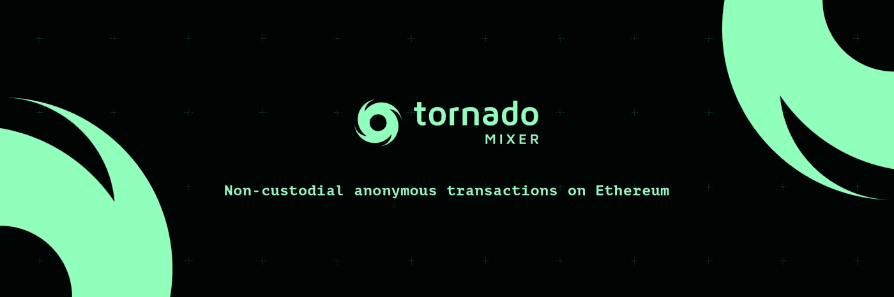

# 龙卷风现金解释道

> 原文：<https://medium.com/coinmonks/tornado-cash-explained-204e262853fc?source=collection_archive---------0----------------------->

龙卷风快速指南

Tornado cash

Tornado Cash 是一种分散金融(DeFi)协议，允许用户在以太坊区块链上进行匿名交易。该协议使用智能合同来创建私人和安全的交易，使用户能够更多地控制自己的财务隐私。

## 什么是龙卷风现金？

Tornado Cash 是一个非托管的智能合约平台，允许用户匿名发送和接收以太坊(ETH)。该协议使用零知识证明和其他密码技术来确保交易不可追踪和不可链接。

这意味着用户可以在不暴露身份或交易历史的情况下进行交易。这对于希望保护其财务隐私的用户，或者出于法律或其他原因要求匿名的交易来说非常有用。

Tornado Cash 是一个开源项目，这意味着任何人都可以访问和贡献代码库。该协议也是无许可的，这意味着任何人都可以使用该平台，而不必经过任何形式的批准过程。

## 龙卷风现金是如何运作的？

Tornado Cash 使用一种称为“混合器”的智能合约来创建匿名交易。当用户想要进行匿名交易时，他们首先将他们的 ETH 存入混合器。

然后，混合器将 ETH 分成多个较小的面额，并与其他用户的存款混合。这使得无法跟踪原始 ETH 或将其与用户的身份联系起来。

混合完成后，用户可以从混合器中取出匿名的 ETH。撤销的 ETH 可用于任何目的，包括进行进一步的匿名交易。

Tornado Cash 还有一个名为“屏蔽”的功能，允许用户将其 ETH 转换为名为“zETH”的私有版本。该 zETH 可用于在其他支持 zk-SNARKs(一种零知识证明)的 DeFi 协议上进行匿名交易。

## 龙卷风现金有什么好处？

Tornado Cash 为用户提供了多种好处，包括:

*   金融隐私:该协议允许用户进行匿名交易，保护他们的金融隐私，并给予他们更多的控制权。
*   **安全性**:该协议使用先进的加密技术，确保交易安全且不可追踪。
*   **开源无权限**:该协议是开源无权限的，意味着任何人都可以访问和使用该平台。
*   可访问性:该协议易于使用，不需要特殊的技能或知识。
*   **与其他 DeFi 协议的集成**:该协议允许用户将其 ETH 转换为 zETH，可用于支持 zk-SNARKs 的其他 DeFi 协议。

## 我如何能使用龙卷风现金？

要使用 Tornado Cash，你需要一个 Web3 钱包(比如 MetaMask)和一些 ETH。然后，您可以按照以下步骤操作:

1.  进入龙卷风现金网站([https://tornado.cash/](https://tornado.cash/))，点击*“混合”*标签。

2.点击*“连接钱包”*按钮，将您的 Web3 钱包连接到平台。

3.选择您想要存入的 ETH 金额，然后点击*“存款”*按钮。

4.平台会给你看混合费和最低存款额。点击*“批准*”按钮确认交易。

5.平台会把你的 ETH 和其他用户的存款混在一起。这个过程可能需要几分钟。

6.混合完成后，您可以点击“撤回”按钮撤回您的匿名 ETH。

7.点击“提交”按钮确认交易。

**谢谢各位**

**在 Twitter 上关注我:**[**@ Param _ eth**](https://twitter.com/Param_eth)

> 交易新手？试试[加密交易机器人](/coinmonks/crypto-trading-bot-c2ffce8acb2a)或者[复制交易](/coinmonks/top-10-crypto-copy-trading-platforms-for-beginners-d0c37c7d698c)