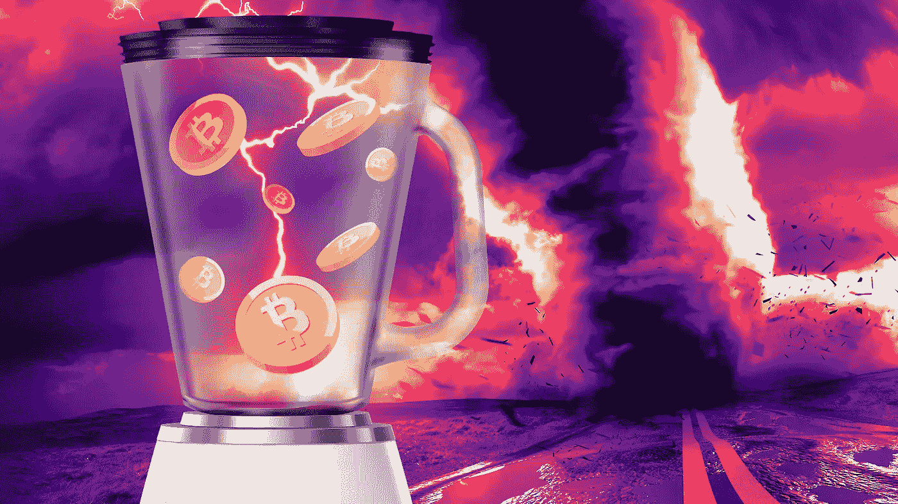
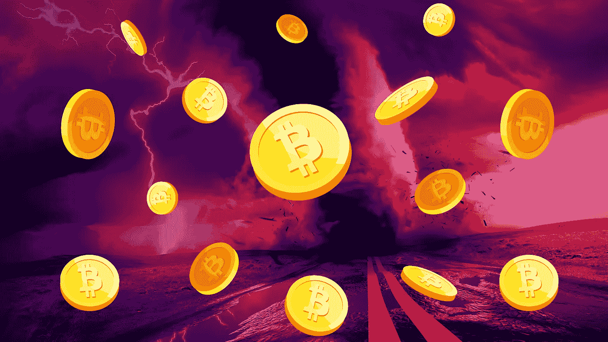
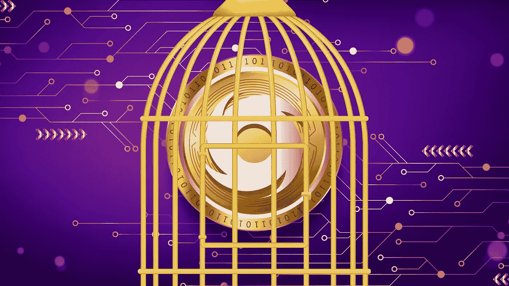
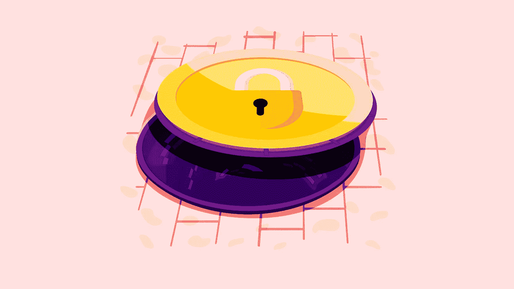

# 龙卷风现金在美国已被禁止。这是 Crypto 隐私的终结吗？

> 原文：<https://medium.com/coinmonks/tornado-cash-has-been-banned-in-the-us-is-this-the-end-of-privacy-for-crypto-6d4d4e8569c4?source=collection_archive---------18----------------------->

在比特币的早期，它被吹捧为一种私有的匿名货币。当时的想法是，这将是一种点对点、数字化和去中心化的货币。支持这种电子现金形式的技术，区块链，将记录每一笔交易，并将这些记录公之于众。任何人都可以看到每一笔交易，从数百万美元的巨鲸到用户第一次测试钱包的微支付。这并不完全是匿名的，但你不是把比特币寄给约翰·史密斯，而是把硬币寄到有加密地址的钱包里。你不知道谁拥有这些钱包，也不知道它们在哪里。然而，你会知道他们收到了多少比特币，发送了多少比特币。

这最终将使当局更容易跟踪大量比特币在不同钱包之间的转移。例如，在加密货币的早期，大多数交易都是在丝绸之路这样的暗网市场上进行的。如果这些市场上的一个卖家赚了数百万美元，并通过交易所直接将这些钱发送到他们的银行账户，就会留下数字足迹，从而将他们的隐私置于风险之中。当局可以追踪交易的源头，这将使钱包的主人受到他们的注意。是什么让比特币变得私有？这一切都归结于隐形技术，如比特币搅拌器。

# 什么是比特币搅拌机？

不要错误地认为比特币联谊会是一群密码迷聚在一起，交流他们最新的迷因币去月球的故事的地方。把比特币搅拌机想象成一个硬币罐，你把你的比特币和其他 100 个人一起放入其中，摇晃它，然后打开盖子把他们的硬币还给每个人。每个人都会得到一个不同于他们投入的比特币，没有人知道最初是谁投入的比特币，这是关键。比特币混合器掩盖了硬币的来源。这显然会为非法交易和洗钱提供便利。出于这个原因，美国财政部外国资产控制办公室(OFAC)采取行动，禁止以太坊动力加密混合服务龙卷风现金。

# 那么，你问一个小小的混合器有什么问题？

你可能认为这是完全合理的。毕竟，应该尽一切可能限制洗钱和贩毒。事实是，比特币混合器通常用于合法(取决于你的政治观点)交易。例如，对乌克兰战争的捐赠在俄罗斯国内受到严格限制。比特币混合器提供了捐赠资金的替代选择，而不会引起俄罗斯当局的注意。混合器本身并不违法，尽管它取决于你交易的司法管辖区。也就是说，当局正在使隐藏加密交易变得更加困难，这导致我们彻底禁止龙卷风现金。

# 美国为什么禁止龙卷风现金？

Tornado Cash 被拿下的消息震惊了整个加密社区，也许还包括几个混合器。虽然有些人认为这是一个积极的举措，表明该行业将不再容忍犯罪活动，但其他人认为这是加密隐私结束的开始。该部门声称，该混合器“自 2019 年创建以来，已被用于清洗价值超过 70 亿美元的虚拟货币。”这不是一个小数目。当诈骗项目失败时，这些资金中的很大一部分可能来自投资者的资金，创始人将他们的横财转移到比特币酒杯中，以重新回到他们的个人钱包中。尽管与洗钱有明显的联系，但看到专用于隐私的工具被根除还是令人担忧。如果比特币混合器是禁区，有什么替代方案？

# 隐私币是解决方案吗？

加密和隐私从一开始就携手并进。比特币有一些我们在本文开头提到的明显缺陷。这导致了隐私币的发展。这些加密货币内置了专门为用户提供完全匿名的机制。隐私币很像其他加密货币，尤其是比特币。像 Zcash 和 Monero 这样的主要参与者在市值方面领先。尽管它们并非没有争议。政府与这些隐私硬币的关系很困难，在监管非法行为和适应私人电子交易之间走钢丝。隐私硬币也不是傻瓜证明。随着计算机处理能力的指数级增长，它们总是有机会破解保护硬币的加密方法。

# BAXE 肩负着解放 web3 的使命！

隐私对 web3 的发展至关重要。随着我们越来越深地陷入监控状态，社会已经放弃了隐私权，这些新工具和技术为我们提供了一个出口。如果社区继续迎合限制隐私的政府法规，我们将继续沿着这条可怕的道路走向极权主义。区块链可能是我们自由和个人赋权或数字奴役的关键。BAXE 正在建设人类应得的 web3 未来，而隐私币将在实现这一目标的过程中发挥重要作用。BAXE 正在构建一个强调安全性和用户主权的生态系统。这意味着用户可以控制他们在各种应用程序中产生和使用的数据。他们还可以使用法定货币、加密硬币和保密硬币来兑换与欧元挂钩的稳定硬币。这为用户提供了他们希望如何体验网络的选择，从他们如何花钱，到他们如何使用他们的应用程序和如何管理他们的数据。

涉及隐私时，没有任何保证，尤其是在技术发展如此迅速的情况下。为了保护我们现有的隐私，我们需要确保制定的法规与技术的使用方式保持一致。现金是最匿名和最私密的交易方式。几个世纪以来一直如此。当我们走向数字货币时，我们需要确保我们的数字货币也有同样的保护。这不是为了助长犯罪活动或欺诈；这是关于保持我们舒适的现状，这种现状已经运作了几千年。

如果你喜欢这篇文章，并想留在了解所有事情的网站 3，请确保你关注 BAXE 博客并注册我们的邮件列表。

你也可以在[推特](https://twitter.com/BaxeApp)上关注我们，并加入我们的[电报组](https://t.me/BaxeCommunity)。

我们承诺让您了解最新信息，尽情娱乐😏

> 加入 Coinmonks [电报频道](https://t.me/coincodecap)和 [Youtube 频道](https://www.youtube.com/c/coinmonks/videos)了解加密交易和投资

# 另外，阅读

*   [Bookmap 评论](https://coincodecap.com/bookmap-review-2021-best-trading-software) | [美国 5 大最佳加密交易所](https://coincodecap.com/crypto-exchange-usa)
*   [加密交易机器人](/coinmonks/crypto-trading-bot-c2ffce8acb2a) | [CoinGate 点评](https://coincodecap.com/coingate-review)
*   最佳加密[硬件钱包](/coinmonks/hardware-wallets-dfa1211730c6) | [Bitbns 点评](/coinmonks/bitbns-review-38256a07e161)
*   [10 新加坡最佳加密货币交易所](https://coincodecap.com/crypto-exchange-in-singapore) | [买入 AXS](https://coincodecap.com/buy-axs-token)
*   [红狗赌场点评](https://coincodecap.com/red-dog-casino-review)| Swyftx 点评
*   [投资印度的最佳加密货币](https://coincodecap.com/best-crypto-to-invest-in-india-in-2021) | [WazirX P2P](https://coincodecap.com/wazirx-p2p) | [高收益点评](https://coincodecap.com/hi-dollar-review)