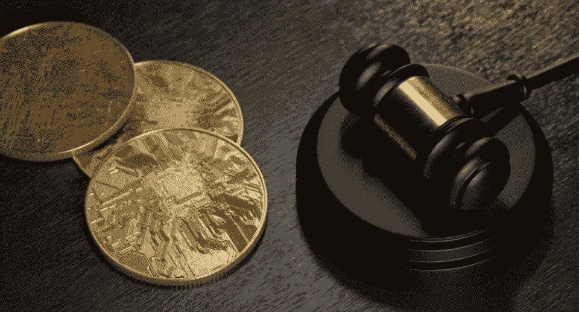

# 龙卷风现金诉讼已经开始

> 原文：<https://medium.com/coinmonks/tornado-cash-litigation-has-commenced-8a5027f6ce41?source=collection_archive---------38----------------------->

今天早些时候，六名原告在联邦法院提起诉讼，指控财政部将龙卷风现金列为特别指定国民(SDN)超越了法定权限，违反了宪法第一和第五修正案。这是可能成为分散融资的重要先例的开端。

比特币基地实际上承担了原告的所有法律费用，这一事实证明了这一点的重要性。根据诉状，损失最大的原告在 Tornado 现金智能合约中持有约 1.3 乙醚。由于价值如此之低(出版时约为 2100 美元)，来自比特币基地等相关方的资金支持至关重要。这种支持使得案件更有可能根据是非曲直来决定，而不是因为法律费用堆积而迫使原告和解。

但是原告提出的论据到底是什么？有三个。

# 财政部超越了法定权限

实际上将 Tornado Cash 列为 SDN 的外国资产控制办公室(OFAC)是在第 13694 号行政命令的授权下运作的。奥巴马总统于 2015 年 4 月 1 日发布了这一命令，并授权财政部确定参与网络攻击的某些人，并允许他们封锁这些被确定的人的任何财产或财产权益。

在诉状中，原告认为 Tornado Cash，包括相关的智能合同，仅仅是开源软件，因此不是人或财产。由于 Tornado Cash 不是个人或财产，财政部无权将其列为 SDN。这与另一个类似的加密资产混合服务 Blender.io 不同，blender . io 是集中控制的。集中控制使 Blender.io 更像一个实体，而不像 Tornado Cash，它是一大群不相关的开发者的产品。此外，由于 Blender.io 对软件有更多的控制权，软件更有可能被视为财产。

# SDN 名单违反了第一修正案

原告的第一修正案有三个论点。首先，他们声称 Tornado Cash 是一个表达言论的场所。这是因为它使用户能够向慈善事业捐款，如果没有该协议提供的匿名性，他们可能会避免捐款。第二，原告声称软件代码本身是受保护的言论(我有理由怀疑这一论点会成功[ [并非所有代码都是言论](/coinmonks/not-all-code-is-speech-e666bd21c718) ])。第三，原告声称龙卷风现金是受保护的言论与商业活动有关。商业言论不像传统言论那样受到同等程度的保护，但还是有一些保护的。

# SDN 名单违反了第五修正案

这个论点很简单，但只适用于原告，他们有一些加密资产仍然在龙卷风现金协议。这些原告认为，由于 SDN 上市完全没有通知，没有过程，因此剥夺了他们获得自己的财产。原告声称，这种未经任何程序剥夺财产的行为违反了第五修正案。

# 下一步是什么？

下一步将是财政部的回应。我可以向你保证，他们会否认诉状中的每一项指控(这只是基本的诉讼程序)。但是我们要多久才能得到答案？好吧，那可能是几个月，几年，也许永远不会。当事方完全有可能达成和解，而没有就是非曲直作出决定。

无论如何，这是一个很好的机会来弄清楚*去中心化*去中心化金融实际上是怎样的。截至目前，原告最有力的论据似乎是基于违反正当程序，以及龙卷风现金不是人或财产，因此不属于 sdn 的清单。正如我在另一篇关于法典和第一修正案的文章中所讨论的，我认为原告有一些很好的论据，但还有一场更艰难的战斗要打。

如果您对这一诉讼和其他诉讼的持续更新感兴趣，请继续关注未来的文章。但是要为美国司法系统荒谬的缓慢步伐做好准备。

> 交易新手？试试[密码交易机器人](/coinmonks/crypto-trading-bot-c2ffce8acb2a)或[复制交易](/coinmonks/top-10-crypto-copy-trading-platforms-for-beginners-d0c37c7d698c)