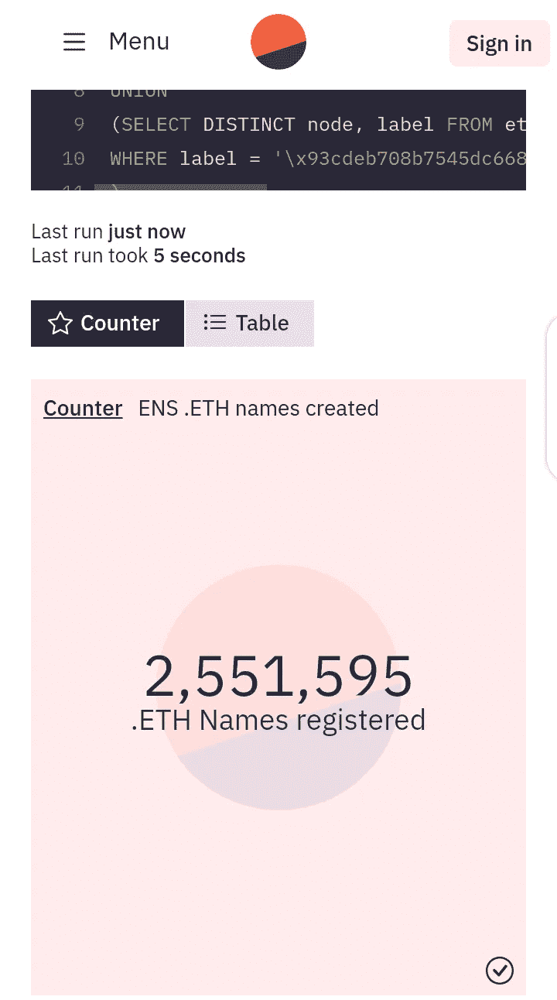

# 以太坊域名服务注册总数已超过 250 万。

> 原文：<https://medium.com/coinmonks/total-number-of-ethereum-name-service-registrations-ens-has-surpassed-2-5-million-b70989910c61?source=collection_archive---------32----------------------->

> 来自 Dune analytics 的数据证实，以太坊名称服务注册量已超过 250 万。
> 
> 在 2017 年推出后，花了 5 年时间才注册了 100 万，仅用了 3.5 个月就达到了 200 万。如今，ENS 已经超过 250 万，并且随着加密成为主流，数据还在快速增长。

## **但是什么是以太坊名称服务，俗称 ENS，开发它的原因是什么？**

以太坊基金会的 Nick Johnson 和 Alex van de Sande 领导了 ENS 的最初开发，目的是解决加密地址的技术性和模糊性。

就像 80 年代开发域名服务是为了取代当你想在网上搜索某样东西时输入 IP 地址的不方便过程一样，ENS 的开发是为了用人类可读的地址取代机器可读的钱包地址。

ENS 会将您的钱包地址与人性化的名称进行匹配。例如，不用输入 4r5667ui68q45554hg5，您可以用 Uche.eth 来替换它。这样，您就可以确保输入长字符串数据不会出错，也不会犯将资金转移到错误地址的错误。(上面的例子只是针对本文)

ENS 允许用户购买和管理自己的域名。通过这个域名，可以进行经过验证的交易，而不必处理又长又复杂的地址。它还减少了在输入发送资金的收件人地址时可能出现的任何输入错误。

## **ENS 是如何工作的？**

ENS 基于在以太坊区块链之上开发的智能合约，可以将机器可读的加密地址转换为人类可读的格式。因为它是在以太坊区块链之上开发的，所以它比传统的 DNS 更安全、更私密、更能抵抗审查。ENS 并不试图取代 DNS，而是致力于成为一个开放、分散、社区驱动的非营利性组织。

ENS 由两个智能合同组成；注册表和解析器。ENS 注册表记录了所有域和子域以及所有者的信息和到解析器的链接。而解析器是另一个智能契约，它处理从名称到地址或者从地址到名称和其他类型资源的转换。

从技术上讲，ENS 可以利用现有的以太坊生态系统，这意味着它是可编程的，可以与命名之外的其他智能合约进行交互。ENS 的运行类似于互联网的 DNS。它允许一个分级系统，让域名所有者完全控制任何子域。因此，Uche.eth 可以创建一个子域和名称，如 email.Uche.eth。

## **ENS 的重要性**

拥有. eth 域名有很多好处。除了在 web3 生态系统和区块链之间开放更多的互操作性，ENS 还带来了许多其他惊人的好处，包括:

*   自 2021 年起，ENS 允许所有者整合域名，如以结尾的域名。com，。因此，如果你拥有 Uche.eth，你可以直接链接到 Uche.eth，这样访问者就可以在网站上查看内容，也可以向同一个地方汇款。
*   因为 ENS 是建立在区块链(以太坊区块链)之上的，所以它不会面临 DNS 系统所面临的众多安全威胁。相反，ENS 记录不能被销毁，由以太坊区块链保护。
*   ENS 名称可以充当以太坊地址以及其他加密货币地址。您可以连接任意多的地址，而不必处理普通钱包地址的令人困惑的长串数据。
*   ENS 域名允许所有者利用子域名。因此，您可以为其他网站或电子邮件地址创建一个子域。
*   ENS 旨在通过创建一个可在所有区块链和 Dapps 间互操作的压缩 web3 用户名，成为分散式互联网的命名协议。
*   。eth 域名完全是 NFTs。当您希望将已注册的 ENS 名称转让给其他人时，您可以像发送任何其他不可替换的令牌一样发送该名称。它们可以在市场上交易，比如 Opensea。

请注意，ENS 并不是要取代 DNS。这个想法是为 web3 资源，如区块链地址和分布式合同，提供一个分布式的、可信的名称解析。

## **如何获得自己的 ENS 域名**

遵循这些简单的步骤可以帮助你得到你的。以太网域名在任何时候；

*   使用类似 MetaMask 的以太坊钱包，访问 manager.ens.domains 搜索可用的域名。
*   一旦你找到一个可用的域名，系统将引导你完成注册。
*   您需要确认钱包中的两笔交易。
*   你还需要选择注册域名的年数，费用为每年 5 美元(用 ETH 支付)。
*   作为该域名的所有者，您可以设置您希望该域名链接的几个地址或信息以及任何子域。

## **结论**

ENS 域名使您能够用一个友好、易记的 ENS 地址(如 Uche.eth. )替换您的长而不可读的以太坊地址和其他地址。这允许您接收加密资产并将您的 ENS 地址输入以太坊 Dapps，而不必复制和粘贴长的公共地址。你也可以链接你的其他网站，并按照你的意愿创建子域名。

所以，如果你有雄心去注册你的。eth 域名，你可能要加快速度了，因为，随着最近以太坊燃气费的下降，很多人会注册，并可能在你知道之前就要求你最喜欢的名字。如果你真的想把它要回来，你可能要为此付出一大笔钱😥😁。

> 交易新手？试试[加密交易机器人](/coinmonks/crypto-trading-bot-c2ffce8acb2a)或者[复制交易](/coinmonks/top-10-crypto-copy-trading-platforms-for-beginners-d0c37c7d698c)