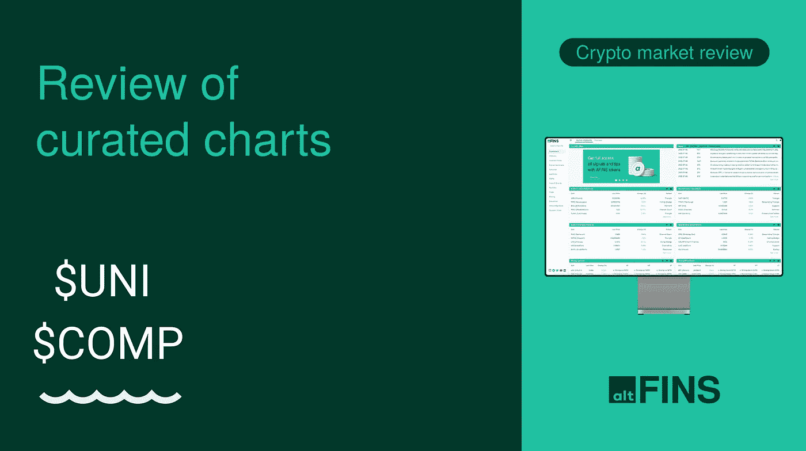
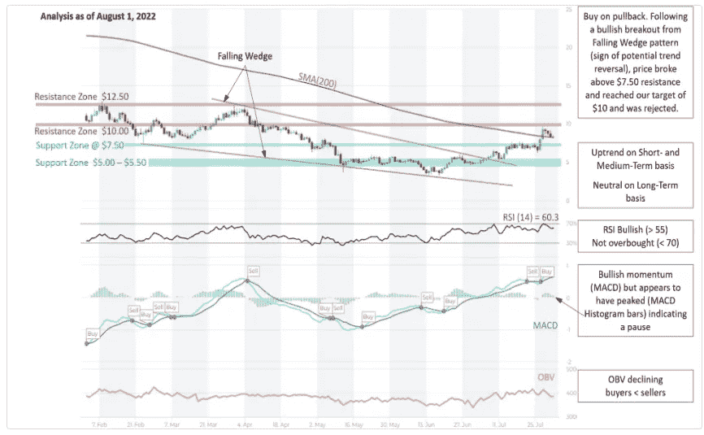
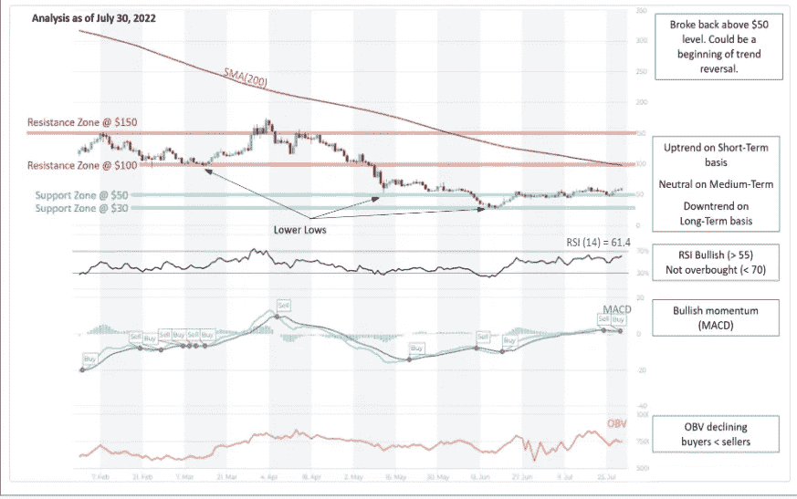

# 在 altFINS 视频中解释了 UNI 和 COMP 的交易设置

> 原文：<https://medium.com/coinmonks/trade-setups-of-uni-and-comp-explained-in-altfins-video-9109ecb2e778?source=collection_archive---------37----------------------->

在最新的**视频**中，altFINS Richard 的首席执行官回顾了两个交易设置: **Uniswap (UNI)和 COMP(COMP)。在这里观看视频** [**。**](https://www.youtube.com/c/altFINS)

这些硬币也恰好是一对夫妇的既定项目。Uniswap 是前三大 DeFi 贷款平台中最大的 DEX 和 Compound。拥有基础良好的项目总是好的，它降低了一些灾难性损失的风险。

**交易设置如我们的** [**策划图表部分**](https://platform.altfins.com/curatedCharts) **:** 所述

**Uniswap (UNI)** —在下跌楔形突破之后，价格显示出明显的趋势反转迹象。ST 和 MT 趋势已经上升，形成更高的高点和更高的低点。价格今天上涨了 10%，再次接近 10 美元阻力区。看到它在 200 日均线的支持下强劲反弹是积极的。趋势逆转正在进行中。如果突破 10 美元，就像回到 12.50 美元，这基本上完成了教科书式的楔形下跌突破。突破的距离应该大约是楔形开始时的宽度。

Source: altFINS

复合(COMP) —可能正准备爆发，并且有趋势反转的早期迹象。价格突破 50 美元水平，重新测试了 3x！它可能开始接近 100 美元。COMP 是一个高质量、成熟的 DeFi 借贷平台，位列前三大平台。

Source: altFINS

在 altFINS [YouTube 频道](https://www.youtube.com/c/altFINS)上，你可以找到交易视频、教育视频、公司公告等等。立即订阅以保持更新。

> 交易新手？尝试[加密交易机器人](/coinmonks/crypto-trading-bot-c2ffce8acb2a)或[复制交易](/coinmonks/top-10-crypto-copy-trading-platforms-for-beginners-d0c37c7d698c)