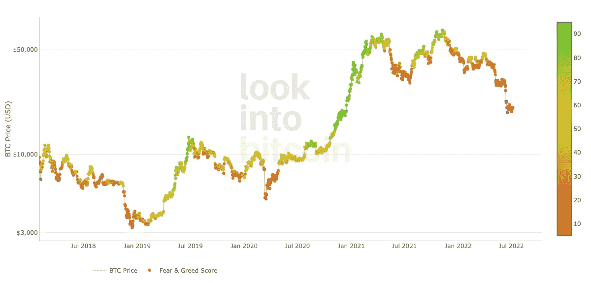

# 用恐惧和贪婪指数交易比特币:一个简单的策略

> 原文：<https://medium.com/coinmonks/trading-bitcoin-with-the-fear-and-greed-index-a-simple-strategy-ba14e9ab99d8?source=collection_archive---------1----------------------->

## 不要把事情搞得太复杂，保持简单

Source: lookintobitcoin.com

如果你想要一个简单明了的交易比特币的方法，恐惧和贪婪指数是一个很好的指标。

在上面的图表中，由[lookintobitcoin.com](https://www.lookintobitcoin.com/charts/bitcoin-fear-and-greed-index/)发布，这条线代表了比特币价格的演变，每个彩色点反映了恐惧的价值…