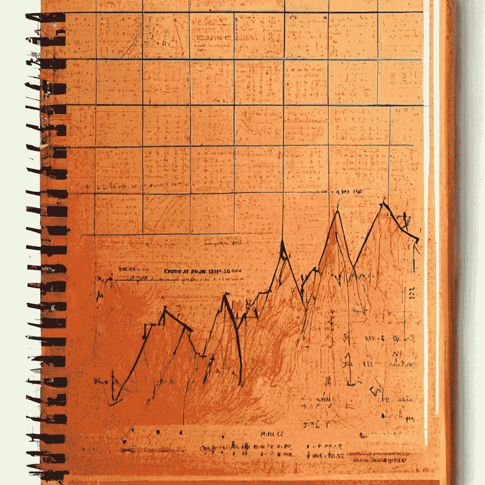
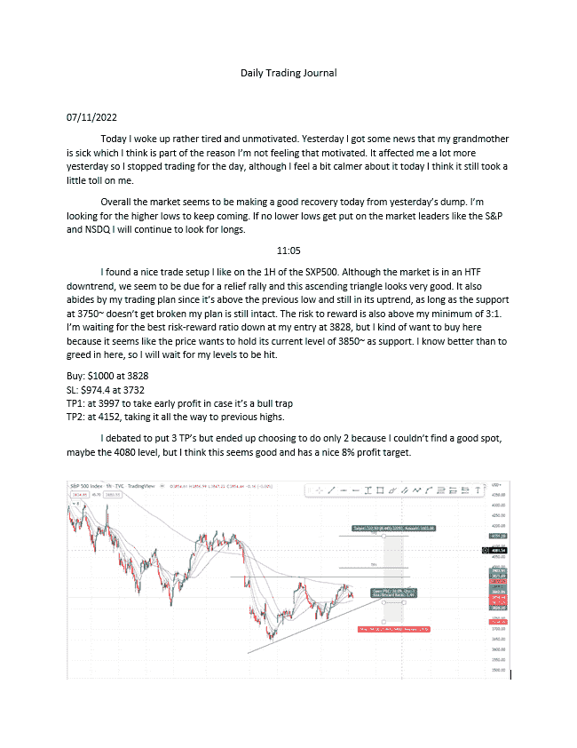
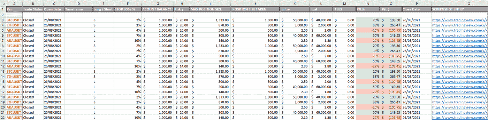

# 交易日志示例——3 种最简单的交易日志

> 原文：<https://medium.com/coinmonks/trading-journal-examples-3-easiest-trading-journals-d6ec2ea72418?source=collection_archive---------46----------------------->

作为一个交易者，写日记当然会觉得是不必要的负担，但它对你的交易之旅至关重要。

# 介绍

‍

作为一个交易者，写日记当然会觉得是不必要的负担，但它对你的交易之旅至关重要。你必须记录你的交易和你的情绪。将来你会感谢你的。

‍

但是不是所有类型的交易日志都适合所有人。选择一个适合你的方法对确保你在交易过程中的日志记录和自我反省是至关重要的。

‍

这篇文章将涵盖你需要在交易日志中包含的内容，以及 3 个你今天就可以开始使用的优秀交易日志例子。

‍

‍

# 我应该在我的交易日志里写些什么？

‍

# 交易计划

‍

你应该有一个交易计划和风险管理计划，每天提醒自己。

‍

什么是交易计划以及如何创建交易计划是一个过程，我们在这里有一个循序渐进的指南。

‍

当你交易一个地方时，你想包括交易的各个方面，如进场时间、进场价格、止损价格、止盈水平、仓位大小、保证金等。

‍

# 贸易分析

‍

在日志中写上你为什么交易。为什么这个设置比其他的好？你喜欢这个设置的什么？系统如何遵守你的交易计划？问这些问题将确保你不是为了交易而随意交易。

‍

# 心态分析

重要的是涵盖与交易设置无关的主题，这些主题会很快变得更费时间，比如心态。在交易日开始时，你可能想坐下来写下你当前的情绪状态和你的感受。

你在交易之外的感受会直接影响你的交易方式。

‍

# 日终总结

日末总结是总结和反思你一天的精神状态和交易表现的好方法。

‍

# 截屏

你可能想要添加截图以供参考。这可以通过文字截图或 TradingView 或其他交易软件中保存的截图来完成。

‍

# 世界贸易杂志

‍

对于大多数交易者来说，典型的 Word 文档就足够了。在这种长格式的写作中，记录交易技术和你当天的情绪状态是最容易的

‍

了解你在任何一天的感受都会让你在接下来的一天里头脑清晰，所以早上从心态分析开始吧。

‍

接下来，你可能想写一小段关于一般市场正在做什么和你对一天的预期，只是为了澄清你的偏见和你对一天的方向性无效是什么(当然，我们不权衡预期，我们总是在必要时改变我们的偏见！).

‍

现在是做交易的时候了。写下之前的交易计划，以及你想做的任何交易的交易分析。

‍

如果你发现自己差点做了一个糟糕的交易，不应该把交易的想法从日志中删除，相反，反思一下为什么你决定不做这个交易，这是很好的学习材料。

‍

最后，如果你找到了一个好的设置，并写下了你的想法。你可以进行交易。

‍

你也可以把交易设置的截图直接添加到日志中，而不是链接。直接截屏更容易访问，并在日志中创建一个清晰的概览。

‍

下面提供了这种格式的一个例子。

‍

*Word 文档交易日志示例*

‍

‍

# Excel 交易日志

‍

一个更省时、更普通但更注重技术的交易日志版本是使用 Excel 表格作为交易日志。Excel 表格为你提供了交易条目所有技术方面的清晰概述，但排除了对你的交易和心态的更深入的思考(见图 2)。

‍

Excel 使你的交易日志更加结构化，这使 Excel 成为一个更加省时和以数字为中心的交易日志范例。使用 Excel 表格的一个缺点是，它很难记录长格式的内容，比如你的情绪状态、市场概况和交易概况。

‍

Excel 表格也限制了将你的交易截图直接添加到日志中的可能性，这使得很难对交易进行即时连贯的反映。虽然可以添加通过 TradingView 或者其他交易软件制作的截图链接。

‍

**下面是 Excel 交易日志的例子。**

‍

*Excel 表格交易日记账示例*

‍

‍

# 屏幕记录交易日志

‍

最省时的日志是记录你的屏幕，显示实时图表，给自己讲述你的交易过程。

‍

这让你可以直接对未来的自己说出你对交易的想法。大声讲述你的反思过程能让你更彻底和批判性地反思自己。

‍

你也可以回头看，准确地看到你在未来交易的图表模式。自始至终，它都是你情绪状态的直接记录，因为你可以听到自己以一种可能是贬低、愤怒、善良或情绪受控的方式批评自己。

‍

下面是一个短视频的例子。

‍

[https://www.youtube.com/watch?v=hsNAjx27qKU](https://www.youtube.com/watch?v=hsNAjx27qKU)

‍

# 混合交易日志格式

‍

你也可以把列出的所有交易日志的例子结合起来，如果你把它们都做了，在一周结束的时候，反思你的个人文字日志，你的 excel 数字日志和你的视频日志，你会比其他市场参与者有一个非常好的优势。

‍

在这种情况下，你会比大多数其他市场参与者更彻底地了解自己，反思自己。

‍

# 结论

‍

这实际上可以归结为尝试所有不同形式的日志，看看哪种最适合你的风格。确保你记下了。

如果你愿意，可以复制我们在这里给出的任何一个交易日志例子。

H‍ere 是免费 pdf 的链接，您可以立即下载并用作期刊模板:

> 交易新手？试试[加密交易机器人](/coinmonks/crypto-trading-bot-c2ffce8acb2a)或者[复制交易](/coinmonks/top-10-crypto-copy-trading-platforms-for-beginners-d0c37c7d698c)