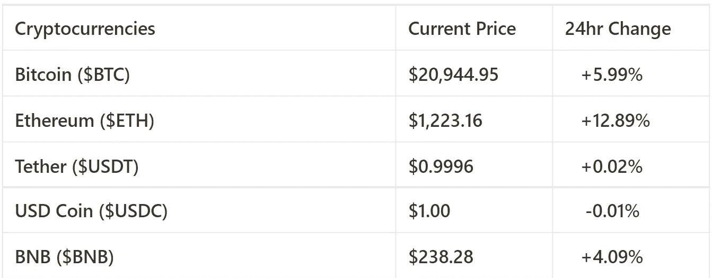
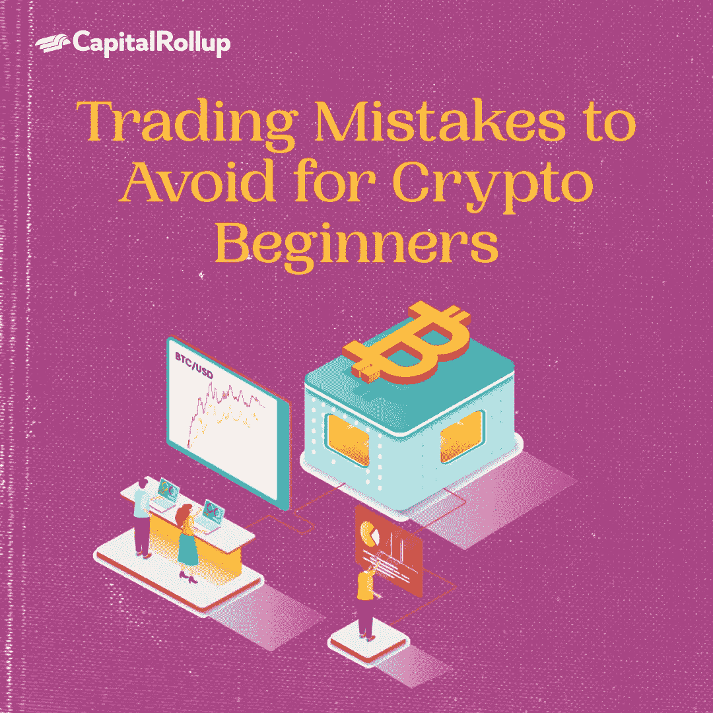

# 密码初学者要避免的交易错误。

> 原文：<https://medium.com/coinmonks/trading-mistakes-to-avoid-for-crypto-beginners-eac6ebc019dd?source=collection_archive---------29----------------------->

欢迎来到最新一期的 CapitalRollup Digest！今天的文摘是 7 月 15 日的，大约需要 5 分钟。我们马上开始。

*   今天的市场看起来怎么样？(前 5/10 大流行加密货币)

Price Market Update

# 密码初学者要避免的交易错误

对投资者来说，交易加密获利风险很大，也很困难。这并不适合每个人，但如果你愿意冒险，你可能会获得巨大的回报。

密码市场是最不稳定的市场之一，如果你是新手，交易并获利是非常困难的。据估计，95%的交易者在交易密码时会亏损，这包括有经验的交易者。

在加密交易中赚钱通常需要很多技巧和策略，这是很多新手的运气。正确的方法始于对市场的深入了解。

以下是新交易者在交易加密货币时应该避免的 6 个错误。

# 没有分散你的投资组合

你的加密货币投资策略必须包含多样化。虽然这可能很诱人，但不要把所有的鸡蛋放在一个篮子里。每个有经验的投资者都通过投资多种资产来最小化或保护自己免受风险。有些硬币一前一后地上下浮动，一个上升，另一个下降。如果是这种情况，并且你对两种硬币的未来都感兴趣，那么考虑投资这两种硬币。这样投资安全多了。

# FOMO:不要随大流

FOMO 意味着害怕错过。这是许多加密交易者犯的一个错误，特别是在你周围的每个人都以特定的方式交易的情况下，你可能会有 FOMO 的感觉(害怕错过)。

每个交易者都有自己的风格。换句话说，A 先生的方法可能不适合 b 先生。

作为初学者，跟随大众的交易方式可能是正确的。然而，这不是真的，你可以进行技术或基本面分析，或咨询专家，如果你不知道，但你会发现你在加密交易的利基。

# 新手想要捷径

交易没有捷径，不要找。关注图表和关注新闻一样重要，玩市场没有简单的方法。如果你想获得收益，你必须制定并坚持一个策略。

加密货币价格的突然飙升并不总是一个泵和转储计划的迹象——积极的消息或主要影响者的推广也可能导致其上涨。在投资之前，了解一枚硬币为什么会飙升是必要的。否则，你可以得到 rekt。大多数加密货币交易新手都在尝试承诺立即获利的抽水和转储小组。经历过一两次亏损的交易者会吸取教训，寻求更明智的方法。

> 交易新手？试试[加密交易机器人](/coinmonks/crypto-trading-bot-c2ffce8acb2a)或者[复制交易](/coinmonks/top-10-crypto-copy-trading-platforms-for-beginners-d0c37c7d698c)

# 同时交易多个市场

新手交易者从一个市场跳到另一个市场，从外汇跳到指数，从加密货币跳到大宗商品，这并不罕见。这是一个常见的错误，可能导致过度交易和重大损失。

不要跟着你的情绪走，试着根据事实理解市场是如何运作的。在进入另一个市场之前，你应该在一个市场获得经验，并在开始交易其他市场之前巩固你的优势。

# 情感交易

交易不应该基于情绪。保持一致，不要执着于资产、亏损或你是“好”或“坏”交易者的概念。当情绪试图在交易时出现时，找一个专家或阅读交易方面的书籍可以帮助你。如果你有赌徒的心态，这些模式可能会出现在你的交易中，这可能意味着你不适合交易，或者最终需要解决这些问题。

# 向 FUD 屈服(恐惧、不确定和怀疑)

FUD 是恐惧、不确定和怀疑的简称。FUD 的目标是吓你卖出，而不是买入。它通常发生在负面消息在市场上迅速传播时，这导致交易者恐慌抛售，失去信心。三思而后行。

**关闭思路**

在我们今天的简讯中，我们讲述了新交易者在交易加密货币时犯的六个错误。如果你遵循这些简单的提示，你将能够避免在买卖加密货币时一些最常见的陷阱。同样，在任何交易中应用这些技巧都有助于减少损失，也有助于你成长和成熟。

多样化您的投资组合是重要的，在成为一个有利可图的密码交易员，我们有你涵盖。点击[这里](http://Diversifying your portfolio is important in becoming a profitable crypto trader and we've got you covered. Check here to see how Capital Rollup can help you diversify your portfolio.)查看资本积累如何帮助你分散投资组合。

# 琐事🤔

**监管机构和执法部门无法追踪加密货币交易。**

A.真实的

B.错误的

在下一期的 CapitalRollup Digest 中找到答案。😉

最后一个琐事的答案是 **D .以上全部。**

# 每日一词！

💡 **BUIDL**

BUIDL 是 HODL 的衍生词。它提醒我们要低着头，继续建设未来很可能为数十亿人服务的基础设施。

**一句话中用到的术语:** *——****BUIDL****是“建”字的误拼。*

# 社区更新📢

我们与 3 位行业领袖组织了一次 Twitter 空间会议，我们在会上讨论了“分享您的熊市经验& CeDeFi 内爆”您可以在这里[正确收听](https://twitter.com/i/spaces/1YpKkZzakbNxj?s=20)

# 我们今天在读什么📰

**加密货币交易。** [***阅读更多***](https://www.finder.com/cryptocurrency/trading)

**如何交易加密货币。** [***阅读更多***](https://www.ig.com/en/cryptocurrency-trading/how-to-trade-cryptocurrency)

## 与朋友一起学习和投资加密💰

当您邀请您的朋友开始使用 CapitalRollup 进行有利可图的投资时，您将获得独特的奖励。

💬对 CapitalRollup Digest 有什么反馈吗？ [**告诉我们！**](mailto:hi@capitalrollup.com)

> 加入 Coinmonks [电报频道](https://t.me/coincodecap)和 [Youtube 频道](https://www.youtube.com/c/coinmonks/videos)了解加密交易和投资

# 另外，阅读

*   [Bookmap 评论](https://coincodecap.com/bookmap-review-2021-best-trading-software) | [美国 5 大最佳加密交易所](https://coincodecap.com/crypto-exchange-usa)
*   [密码交易机器人](/coinmonks/crypto-trading-bot-c2ffce8acb2a) | [硬币门评论](https://coincodecap.com/coingate-review)
*   最佳加密[硬件钱包](/coinmonks/hardware-wallets-dfa1211730c6) | [Bitbns 评论](/coinmonks/bitbns-review-38256a07e161)
*   [新加坡十大最佳加密交易所](https://coincodecap.com/crypto-exchange-in-singapore) | [购买 AXS](https://coincodecap.com/buy-axs-token)
*   [红狗赌场评论](https://coincodecap.com/red-dog-casino-review) | [Swyftx 评论](https://coincodecap.com/swyftx-review)
*   [投资印度的最佳密码](https://coincodecap.com/best-crypto-to-invest-in-india-in-2021)|[WazirX P2P](https://coincodecap.com/wazirx-p2p)|[Hi Dollar Review](https://coincodecap.com/hi-dollar-review)