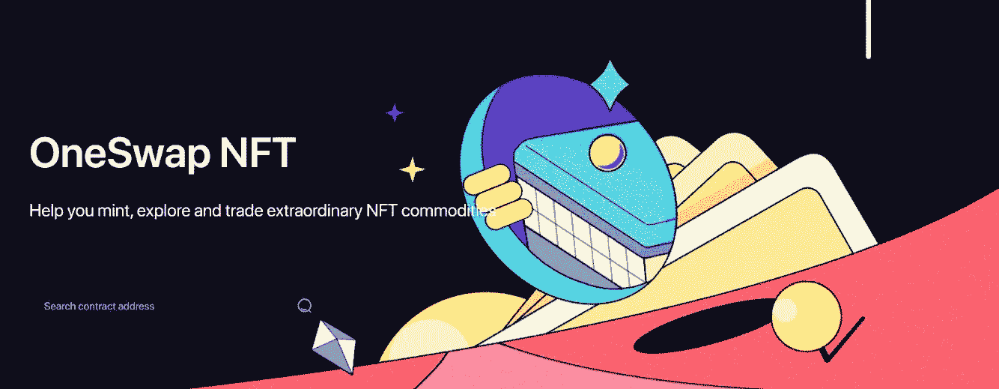

# 交易 NFT 的

> 原文：<https://medium.com/coinmonks/trading-nfts-67c6c9335c2d?source=collection_archive---------17----------------------->

## CSC 上的 NFT 交易

NFT 贸易公司突然介入，给本已混乱的局面火上浇油。在本教程中，你将学习如何买卖非期货交易，以及什么是最好的 NFT 市场。

## 内容

*   NFT 简介
*   CSC 区块链
*   NFT 的利弊
*   如何交易 NFT 的
*   创造和销售 NFT 的
*   摘要

NFT 有多种形式，为收藏家和创作者提供了有利可图的机会。你可能想知道，如果 10 年前的一只猫的 gif 图片值得一提的话，NFT 交易的利润会有多高。大约七千万美元。这是 2021 年初一件 Beeple 数字艺术品的售价。如果这引起了你的注意，请阅读文章的其余部分，了解 NFTs，它们是如何工作的，以及如何开始 NFT 交易。

## NFT 简介

我是我以前的文章，我们涵盖了 NFT 的介绍，更多详情，[看这里](/coinmonks/csc-the-nft-market-68ca48846e8e)

与加密货币一样，NFT 是记录在区块链账本上并通过网络交易的数字代币。NFT 交易有很多好处，比如透明、安全和不变性。

## CSC 区块链

csc 与以太坊虚拟机(EVM)完全兼容，这意味着以太坊上几乎所有的 DApps、生态系统组件和工具都可以直接迁移到 CSC，或者只需做非常小的改动。

[CoinEx Smart Chain — CSC](https://www.coinex.org/?lang=en_US) ，是一个去中心化、高效率的公链。CSC 为开发人员提供了一个高效、低成本的链上环境来运行分散式智能合约应用程序(DApps)和存储数字资产。

## NFT 交易的优点

*   效率
*   可除性
*   透明度
*   证明
*   提高艺术家版税
*   降低第三方成本

## NFT 交易的缺点

*   环境担忧
*   需要数字钱包
*   年轻的技术

## 如何交易 NFT 的

*   **直接交易 NFTs】**

最简单也是最明显的参与 NFT 交易的方法就是简单的买卖非功能性交易。要找到出售的 NFT，你需要访问一个专门的市场或应用程序。网上有许多市场，大多数都有稍微不同的关注点或好处。

为了进行交易，还需要一个数字钱包，但不是任何钱包。不是所有的钱包都支持 NFTs，所以请确保您找到一个支持的钱包。一旦建立，就需要填充加密货币。到那时，你有钱买的任何 NFT 都可以用钱包来买。该交易将被永久记录在区块链上，一旦交易通过验证，NFT 将出现在您的钱包中。

## 创建和销售 NFT

最后，只需创造一个人们可能想买的 NFT，然后卖掉它，就能赚钱。

大多数支持 NFT 的区块链都有可以使用的模板。比如以太坊有 ERC-721。csc 与以太坊虚拟机(EVM)完全兼容，这意味着以太坊上几乎所有的 DApps、生态系统组件和工具都可以直接迁移到 CSC，或者只需做非常小的改动。

半可替换令牌，如音乐会门票或一些游戏项目，使用 ERC-1155 标准。NFT 的意思是不可替代的令牌，即每个令牌都是唯一的，ERC-721 是以太坊中表示不可替代令牌所有权的标准。

## 用 Oneswap 交换 NFT 的。

OneSwap 是一种基于智能合约的完全分散式交易协议，支持自动做市(AMM)和订单簿模式以及免许可令牌列表。通过内置的 OneSwap 钱包，它一站式提供各种服务，将用户交互提升到一个新的水平。

与以太坊生态系统完美兼容。开发者可以方便地将 Dapp 迁移到 CSC，CSC 基于以太坊虚拟机(EVM)，使用成熟的开发工具，用户也可以快速访问 CSC 网络。

OneSwap NFT 交易市场是 CSC 链上领先的 NFT 交易平台，将艺术世界与 CoinEx 分散金融的创新相结合，赋予艺术家权力，促进合作，并鼓励创意业务。目前，NFT 铸造，交易和展示已得到支持。

[https://youtu.be/RIMwg9I3N0k](https://youtu.be/RIMwg9I3N0k)

## 购买

*   “连接钱包后，如果想购买固定价格的 NFTs，请点击商品页面的【立即购买】按钮完成交易。交易成功后，我们会将 NFT 转到你的钱包地址，卖家会收到货款”…
*   …”要参与拍卖，请点击页面上的[出价]按钮，并尽量使您的出价高于卖家设定的底价。这保证了当拍卖结束且您的出价为最高价时，连接钱包后交易将自动完成，如果您想购买固定价格的 NFTs，请点击产品页面上的【立即购买】按钮完成交易。交易成功后，我们会将 NFT 转到你的钱包地址，卖家会收到货款”…
*   …”要参与拍卖，请点击页面上的[出价]按钮，并尽量使您的出价高于卖家设定的底价。这样可以确保当拍卖结束，你的出价是最高价时，交易将自动完成”…
*   ……”当然，如果定增价和拍卖底价都没有达到你的预期价格，你也可以选择按照你心目中合适的收购价格【报价】。卖家会在要约有效期内选择是否接受你的要约。如果接受，交易可以完成。否则，交易将失败"…
*   ……”当然，如果定增价和拍卖底价都没有达到你的预期价格，你也可以选择按照你心目中合适的收购价格【报价】。卖家会在要约有效期内选择是否接受你的要约。如果接受，交易可以完成。否则，交易将失败”...

## 出售

…“OneSwap NFT 支持任何人列出您拥有的任何 NFT。完成交易设置后，您的 NFT 将立即在交易市场上上市。你可以根据自己的喜好选择固定价格出售、拍卖或出价”...

……”但是，请注意，只有通过我们审核的 NFT 收藏才可以公开展示和搜索。您个人创作的 NFTs 只能通过 URL 链接访问。你可以将链接发送给你的朋友和家人，或者在社交网络上展示，为你自己的 NFT 增加曝光率。如果您希望公开展示和销售您的 NFT，您也可以提交白名单申请，我们将在几个工作日内审查 NFT 内容，以确保其符合公开上市标准”...

[***访问如何在 OneSwap 上交易 NFT***](https://youtu.be/RIMwg9I3N0k)

## 摘要

NFT 交易正在快速增长，得益于 NBA 和体育运动中纸牌游戏的成功，加上对数字艺术日益增长的兴趣，截至 2021 年，投资额达 4.2 亿美元。随着 NFT 交易市场和平台的出现，支持行业也在不断发展。

OneSwap 也欢迎艺人、品牌、跨界爱好者联系我们，获取收藏白名单。CSC 完全兼容以太坊 ERC721 标准。

很多与 NFT 交易相关的兴奋之处在于数字艺术品，但它们可以是任何数字东西，比如音乐或游戏角色。一些最大的 NFT 是体育交易卡，音乐。

> 交易新手？尝试[加密交易机器人](/coinmonks/crypto-trading-bot-c2ffce8acb2a)或[复制交易](/coinmonks/top-10-crypto-copy-trading-platforms-for-beginners-d0c37c7d698c)