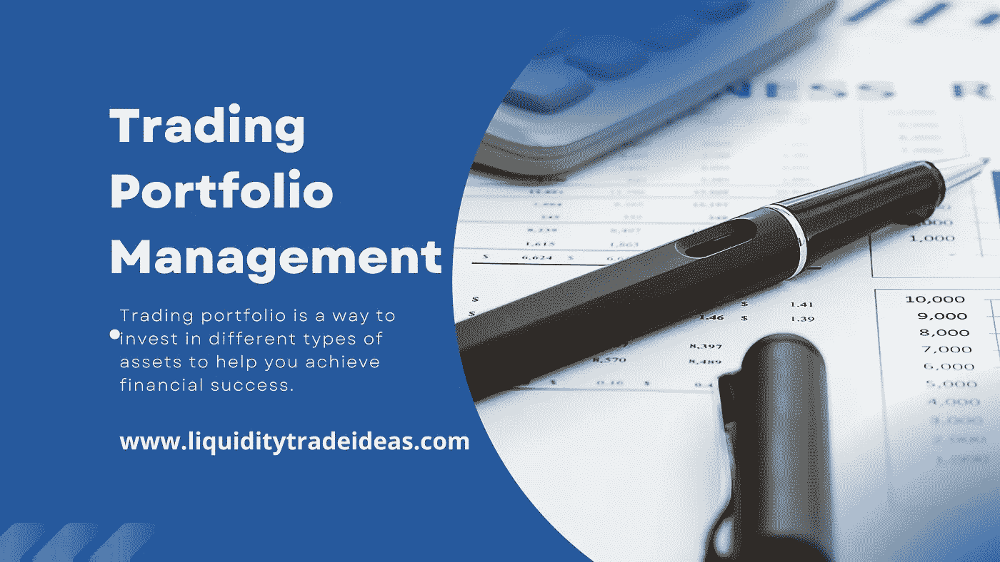

# 交易组合管理。

> 原文：<https://medium.com/coinmonks/trading-portfolio-management-liquidity-trade-ideas-e67973ff85c4?source=collection_archive---------50----------------------->

Image by [Chikwem Chinedu](https://liquiditytradeideas.com/community/) on [www.liquiditytradeideas.com](https://liquiditytradeideas.com/)

**交易组合管理**！想知道这是怎么回事吗？投资组合管理是交易者在分析工具的帮助下识别哪些资产对投资者最重要的最常用的方法。

在本文中，我们将向您介绍交易投资组合管理的基础知识，交易投资组合的类型，建立投资组合时要考虑的因素收益和风险。

我们还会给你一些有用的资源，帮助你作为一个初学者或高级交易者开始，以及它如何帮助你实现你的交易目标。

为了在交易中取得成功，很重要的一点是要很好地理解投资组合管理是如何运作的。投资组合管理的目标是保持资产组合尽可能多样化，以便当机会出现时，投资者有机会做出最佳投资决策。

# 什么是交易组合？

交易投资组合是一种投资不同类型资产的方式，帮助你实现财务成功。这意味着你将投资股票、债券、期权和其他类型的投资来帮助你赚钱。为了做到这一点，你需要能够对哪些投资和如何分配资金做出明智的决定。

谈到投资组合交易，有几件事你需要记住。首先，你需要确保你对每项投资所涉及的风险感到放心。

其次，你需要确保你考虑到了投资的潜在回报。第三，你需要确保你了解投资的动态。

# 什么是投资组合管理？

投资组合管理是分配资产组合以最小化风险和最大化回报(利润)的过程。目标是实现每项资产的最佳回报，同时将亏损风险降至最低。

投资组合管理工具可用于创建投资组合或管理资产组合。投资组合是为了实现特定目标而放置的资产的集合。例如，一个商人可能想投资股票以获得高投资回报。

# 什么是交易组合管理？

作为交易者，你需要能够管理你的投资组合，以实现你的交易目标。交易者的投资组合由不同的资产组成，可以是股票、商品、债券和外汇。交易员需要能够跟踪和管理他们的投资组合，以实现他们的交易目标。

投资组合管理中最重要的一步是确定你的交易目标。一旦你确定了你的交易目标，你需要创建一个符合你财务需求的投资组合。

# 各种类型的交易组合及其用途。

根据个人的目标，有多种交易组合可供选择。例如，一个初学者可能想创建一个投资组合，专注于被低估的股票，而一个更有经验的交易者可能想创建一个投资组合，强调基本面强劲的股票。

其他一些受欢迎的交易组合包括投资于各种资产、交易策略和共同基金的基金。

Photo by [Adeolu Eletu](https://unsplash.com/@adeolueletu?utm_source=unsplash&utm_medium=referral&utm_content=creditCopyText) on [Unsplash](https://unsplash.com/s/photos/portfolio-management?utm_source=unsplash&utm_medium=referral&utm_content=creditCopyText)

# 构建交易组合时需要考虑的因素。

创建交易组合时，考虑一些详细信息是非常必要的。以下是建立交易组合时需要考虑的一些因素:

1.  你的交易组合的规模
2.  你想交易的市场数量
3.  您想要进行的交易数量
4.  你想交易的时间范围
5.  你想交易的价格
6.  你想交易的数量
7.  你想交易的市场类型

在建立交易组合时，记住这几个因素在任何投资者的财务自由之旅中都扮演着重要的角色。

# 为什么交易组合管理是必要的。

交易投资组合管理的必要性有很多原因。最常见的原因是，它可以帮助确保投资组合的投资方式最符合你的目标和偏好。

此外，它还有助于防止意外损失。作为投资者，它还可以帮助你跟踪你的进展，了解你的投资表现如何。

# 交易组合管理的好处。

投资组合管理是将资产组合与个人财务分开的过程。这可以通过多种方式实现，但最常见的方法是将资产投资于不同类型的证券。

项目组合管理的一些好处包括:

1.  提高投资组合绩效。
2.  降低财务风险。
3.  减轻压力。
4.  降低成本。
5.  寿命延长。

# 交易组合管理的风险。

投资组合管理总是存在风险，这就是为什么充分了解与交易相关的风险非常重要。有许多不同的风险可以影响任何投资组合，其中一些比较常见的是技术风险、市场风险和金融风险。

**技术风险**可能来自市场波动、经济状况和政治事件等因素。**市场风险**来自于股票市场的不确定性和市场参与者对股票定价和估价的能力。**金融风险**与损失本身有关，这可能是负面经济事件、流行病等的结果。

# 结论。

说到交易，有一个经过深思熟虑和管理良好的投资组合是很重要的。这意味着要有一个资产和负债的组合，这样你的投资组合才是平衡的，并有潜力获得健康的利润。

谈到投资组合管理，最重要的事情之一是确保你在跟踪你的投资组合的表现。这意味着要考虑到所有可能影响你投资组合的不同因素，如股票价格、经济事件、市场情绪和技术指标。

我们希望听到您的意见——您对**交易组合管理**有什么想法或问题要问吗？是有帮助还是完全浪费时间？

请在[论坛](https://liquiditytradeideas.com/community/)或下面的评论中分享你的想法和经验，让我们知道你的想法，我们期待着阅读和回答你的问题！

*原载于 2022 年 7 月 18 日 https://liquiditytradeideas.com***。**

# *来自 LiquidityTradeIdeas 的消息*

*感谢您成为我们社区的一员！在你离开之前:*

*   *👏为故事鼓掌，跟着作者走👉*
*   *📰查看更多内容请点击*
*   *****📈**加入我们关于外汇、加密和股票的 [**论坛**](https://liquiditytradeideas.com/community/)***
*   ***📚**发现更多** [**交易电子书**](https://liquiditytradeideas.com/trading-e-books/)***

> ***交易新手？尝试[加密交易机器人](/coinmonks/crypto-trading-bot-c2ffce8acb2a)或[复制交易](/coinmonks/top-10-crypto-copy-trading-platforms-for-beginners-d0c37c7d698c)***