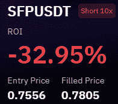
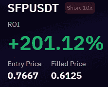
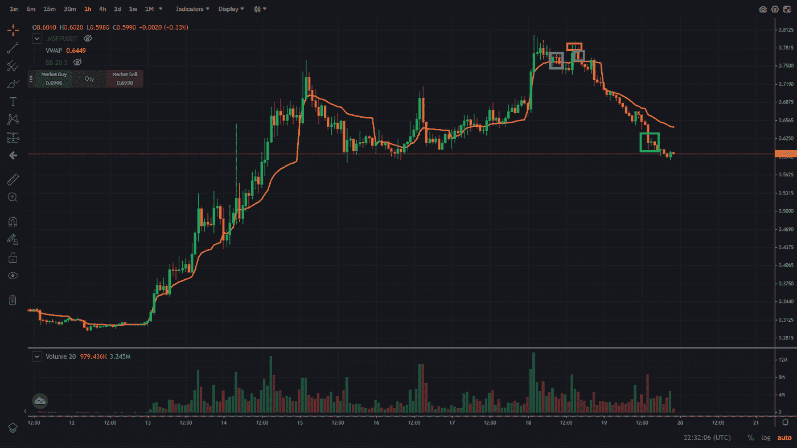
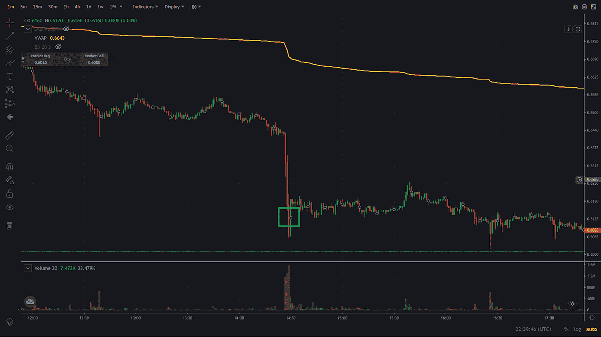

# 交易评论 2 —加密货币安全宝(SFP)

> 原文：<https://medium.com/coinmonks/trading-review-2-cryptocurrency-safepal-sfp-daf8df9c5c71?source=collection_archive---------23----------------------->

这是第二篇交易评论，再次关注加密货币 Safepal($ term)。要看第一篇评论的文章，可以点击以下链接:[https://www . publish 0x . com/crypto-trading-newsletter/trading-review-crypto currency-safe pal-dollar-SFP-xpzrmrw](https://www.publish0x.com/crypto-trading-newsletter/trading-review-cryptocurrency-safepal-dollar-sfp-xpzrmrw)。

这一次，我交易的是短密码，而不是长密码，之前我也亏损过。为了透明起见，我将在这里张贴两个交易报表:

Trading statements loss & profit

我第一次在交易中亏损，因为我追价格下跌太多，在反弹时被套住了。随着反弹似乎消失了，我重新进入。这一次我的时机更好。有时候想法是对的，但是时机不对。我的经验告诉我，如果时机不对，最好重新考虑头寸，削减头寸，稍后重新进入。在下面的图表中，你可以看到我的一些条目。这不是一个订单，而是许多条目。

1.  浅蓝色是第一次短暂的尝试。
2.  红色是第一期短片的封面。
3.  深蓝色标记了我重新拍摄的区域。
4.  把我上一个封面的区域涂成绿色。

正如你在这里看到的，我没有完美地缩短顶部或覆盖底部，加密很可能会下降更多(至少现在看起来是这样)。作为我重新做空的风险水平，我使用了最近的高点 0.80 美元左右。我对我的最后一次覆盖保持耐心，因为加密货币下滑速度相当快。正如你在下面的 1 分钟图表中看到的，它在 3 分钟内从 0.64 美元跌至 0.60 美元，所以我决定回补我的最后一点。

我希望这有助于理解我在交易背后的想法，并可能帮助你们中的一些人。

祝你周末愉快。

尼克拉斯

这不是理财建议，只是出于教育目的！

如果你有 2 分钟的时间，如果你能给我反馈，我会很感激，我可以用来提高我的写作。为了获得反馈，您可以参加反馈调查:【https://forms.gle/EfkFpn31K65QeQhh7 

> 交易新手？试试[密码交易机器人](/coinmonks/crypto-trading-bot-c2ffce8acb2a)或[复制交易](/coinmonks/top-10-crypto-copy-trading-platforms-for-beginners-d0c37c7d698c)