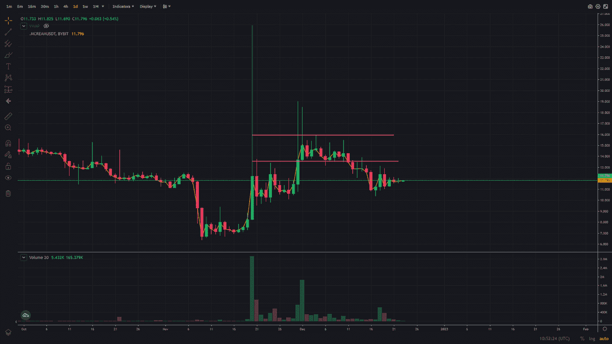
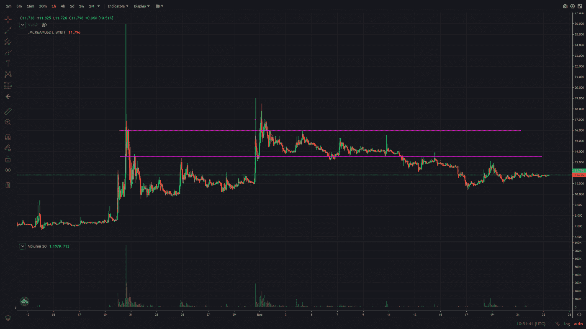
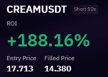
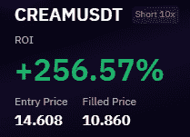
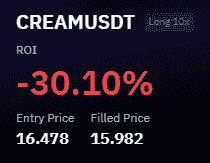

# 交易评论—加密货币奶油金融(奶油)

> 原文：<https://medium.com/coinmonks/trading-review-cryptocurrency-cream-finance-cream-85ad87022fae?source=collection_archive---------49----------------------->

2022 年 12 月 23 日

今天的交易回顾是对我在 Cream Finance 上做的交易的一个小回顾。在我在 FitFi 上损失惨重后，这帮我赚回了一大笔钱。这绝对是一个比我通常做的交易时间更长的交易(从时间跨度来看)，但我真的确信这将会成功。

你可以看看我最近关于索拉纳的交易想法(链接到索拉纳的文章)，如果你决定采取这种方式，你现在就会获利。

> 从顶级交易者那里复制交易机器人。免费试用。

因此，在上下文中，Cream Finance 有两次大幅上涨，第一次一直涨到 25 美元，我没有参与，因为当时我不在座位上。然后它保持在 10 美元附近，似乎没有被打破，最终向上突破，在 12 月初达到 18 美元左右。你可以在下面看到一张 11 月 30 日和 12 月 1 日进入 18 美元左右区域的奶油金融图表。

我开始进入这个行业寻找做空的机会，这一点我很确定，因为我们仍然处于熊市和世界经济不确定的时期。我确信，奶油融资最终会下降到个位数的价格水平。这类交易的难点在于把握好时机，因为你认为你可以在任何时候进场，尽管如此，它还是会消失。

这可能会导致巨大的损失，这种交易的例子可以在我关于加密货币 FITFI 的交易评论中看到(FitFi 文章的链接)，我太自信了，最终为此付出了代价。这一次我想更有耐心，等待大高峰结束，然后在后面发生时进场交易。下面你可以看到一个小时图的奶油金融，所以你有一个价格行动的想法。

中间有一根很大的小时蜡烛线，价格从 11 美元飙升到 19 美元。我在这里做了一笔小交易，但不想太大，因为价格波动会在短时间内变得非常剧烈。

我在 17 美元到 18 美元的区域小规模做空，当它跌到 14 美元左右的区域时，我马上平仓。下面是交易的声明。我在多个价位建仓，也在不同价位平仓，这样就不会总是和报表一致。下面是我的第一笔交易记录。

当 Cream Finance 进行另一轮融资时，我这次耐心多了，因为我不想破产。我在 16 美元时开始做空，仓位很小，每当它试图上涨但没有上涨时，我就在下跌时结束。所以最后我的均线是 14.60 美元，我的最佳仓位是 10.80 美元，几周前 Cream Finance 在这个价位找到了支撑。你可以看到，如果你把最近的低点放在小时图上，向左看。下面是我在奶油上最大的%收益。

我尝试了几次做多，以对冲潜在的更大上涨，并抵消一些成本。这并不是真的很好，但这是 1/5 或 1/6 的短期交易，止损很紧，所以这对 PnL 来说不是一个坏交易。下面的语句显示了一个长时间的尝试。

尽管交易花了一些时间才结束，但我对此感到高兴。此外，这比观看“主要”动作的压力要小得多，因为在“主要”动作中，你可能会在 5 分钟或更短的时间内爆炸。

当我交易加密货币的时候，我会试着先用小笔交易，如果我是对的并且有一点缓冲的话，我会快速加仓。

我希望这里面可能会帮助一些人，我很乐意提供它。如果这个故事对你有任何帮助，或者你喜欢它，请留下评论。如果你不喜欢，那么我很乐意阅读关于我可以改进的地方的评论。

祝所有庆祝的人有一个美好的一天和快乐的圣诞节！

尼克拉斯

这不是理财建议，只是出于教育目的！

如果你有 2 分钟的时间，如果你能给我反馈，我会很感激，我可以用来提高我的写作。为了获得反馈，您可以参加反馈调查:[https://forms.gle/EfkFpn31K65QeQhh7](https://forms.gle/EfkFpn31K65QeQhh7)

> 加入 Coinmonks [电报频道](https://t.me/coincodecap)和 [Youtube 频道](https://www.youtube.com/c/coinmonks/videos)了解加密交易和投资

# 另外，阅读

*   [AscendEx Staking](https://coincodecap.com/ascendex-staking)|[Bot Ocean Review](https://coincodecap.com/bot-ocean-review)|[最佳比特币钱包](https://coincodecap.com/bitcoin-wallets-india)
*   [霍比审核](https://coincodecap.com/huobi-review) | [OKEx 保证金交易](https://coincodecap.com/okex-margin-trading) | [期货交易](https://coincodecap.com/futures-trading)
*   [电网交易机器人](https://coincodecap.com/grid-trading) | [Cryptohopper 审核](/coinmonks/cryptohopper-review-a388ff5bae88) | [Bexplus 审核](https://coincodecap.com/bexplus-review)
*   [7 个最佳零费用加密交易平台](https://coincodecap.com/zero-fee-crypto-exchanges)
*   [氹欞侊贸易评论](https://coincodecap.com/anny-trade-review) | [霍比融资融券交易](/coinmonks/huobi-margin-trading-b3b06cdc1519)