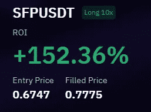
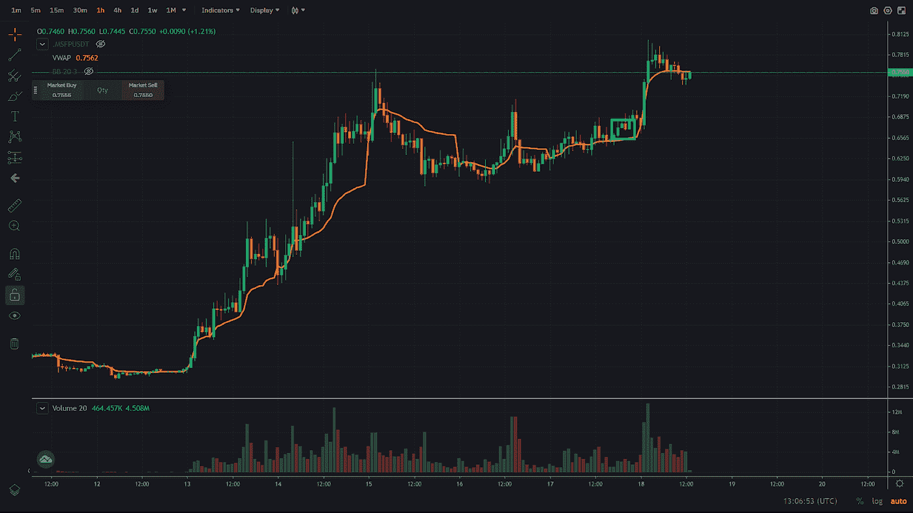

# 交易评论—加密货币安全宝(SFP)

> 原文：<https://medium.com/coinmonks/trading-review-cryptocurrency-safepal-sfp-13a54c0269c1?source=collection_archive---------38----------------------->

这将是一篇关于加密货币 Safepal 交易的简短评论，我在那里发表了一篇关于建立空头头寸的文章，但很久以后又转向了。以下是我的交易声明。

如果你想阅读我写的关于 Safepal 的文章，可以通过以下链接访问这个故事:[https://medium . com/coin monks/trading-spot light-crypto currency-SFP-3 f 999 c 9 b 482d](/coinmonks/trading-spotlight-cryptocurrency-sfp-3f999c9b482d)。

只是通知你，这将是一个我获利的交易，但我也会确保在我失败的地方张贴交易评论，因为我打算帮助和教育，而不是让任何人对他们的交易感到糟糕。

因此，Safepal 上涨超过 100%，至 0.75 美元左右，随后略有回落。我写了一个关于做空它的交易想法，如果它反弹到 0.70 美元左右，它确实反弹了，并提供了一个很好的进场点。我无法进行交易，因为当时我没有观察市场。SFP 很好地保持了这些水平(约 0.62 美元/盎司)，并在小时图上创造了更高的低点。因为它是向上卷曲的，很多人似乎都被做空的头寸套牢了，所以我在寻找做空的机会。我进入了我的位置，设置了止损和止盈目标，因为我睡着了，不能整夜观察市场。下图的蓝框显示的是我做多的区域。

希望这能让我稍微理解为什么我决定改变我之前提到的交易观点。

希望你们都平安，祝大家周末愉快。

尼克拉斯

这不是理财建议，只是出于教育目的！

如果你有 2 分钟的时间，如果你能给我反馈，我会很感激，我可以用来提高我的写作。为了获得反馈，您可以参加反馈调查:【https://forms.gle/EfkFpn31K65QeQhh7 

> 交易新手？试试[密码交易机器人](/coinmonks/crypto-trading-bot-c2ffce8acb2a)或[复制交易](/coinmonks/top-10-crypto-copy-trading-platforms-for-beginners-d0c37c7d698c)