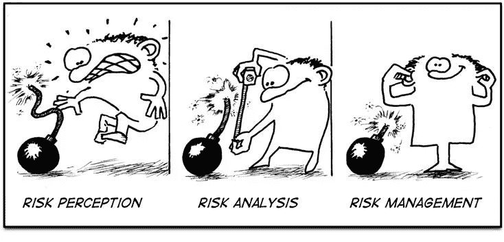

# 交易和风险管理

> 原文：<https://medium.com/coinmonks/trading-risk-management-7888b91ef646?source=collection_archive---------10----------------------->

风险就像火:如果控制住了，它会帮助你；如果任其发展，它会崛起并摧毁你” —西奥多·罗斯福

**风险管理适用于生活的方方面面。**
一般来说交易决策有 3 个方面&。**回报**，**风险** &我们如何**管理风险**

举个例子:我们吃了那块一直盯着我们的美味的三重巧克力饼干。