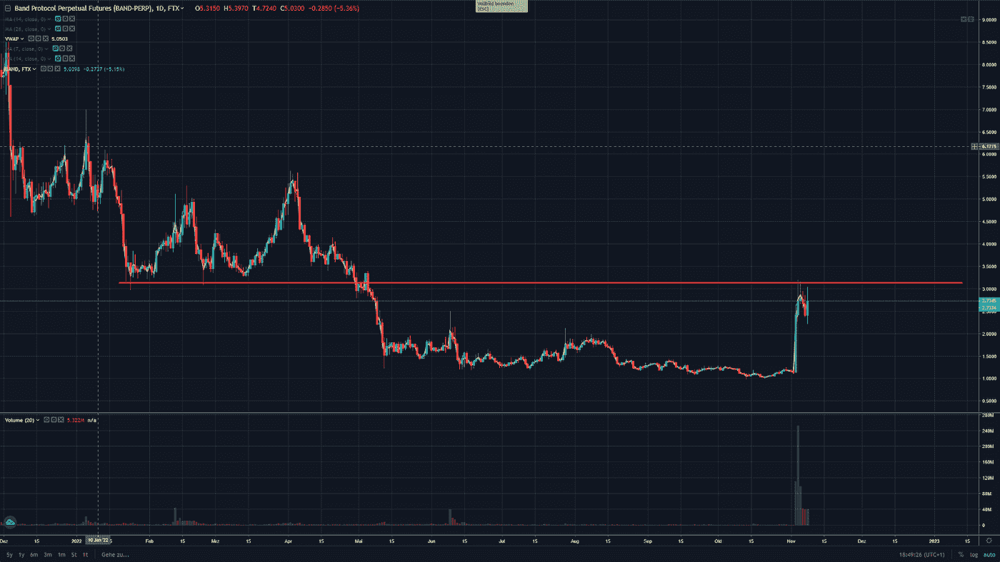
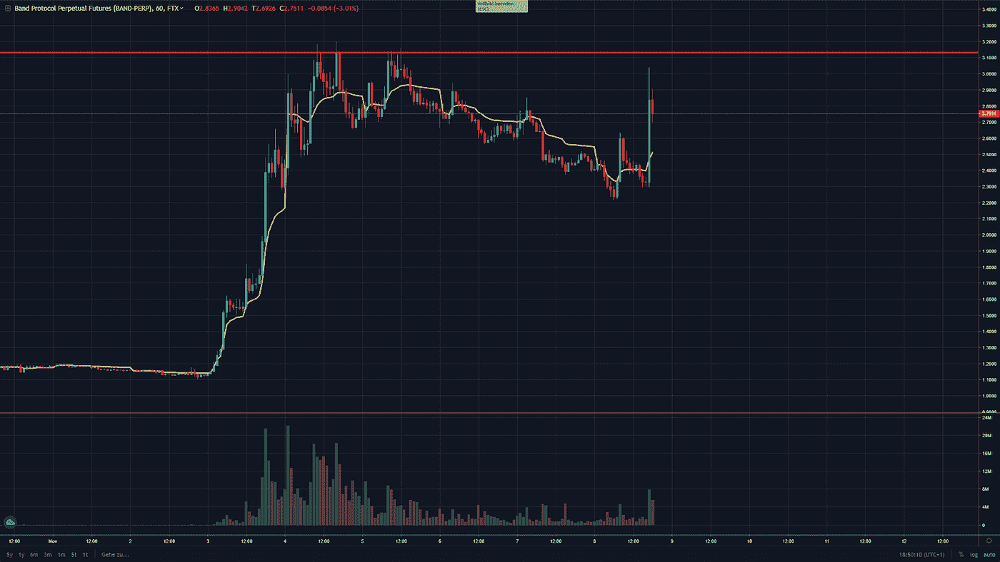

# 交易聚焦—加密货币波段协议($BAND)

> 原文：<https://medium.com/coinmonks/trading-spotlight-cryptocurrency-band-protocol-band-c34a62420e63?source=collection_archive---------45----------------------->

受竞争对手币安收购 FTX 加密货币交易所的影响，加密货币波段协议(Band)在一个动荡的交易日大幅飙升。如果你有所准备，这种波动会带来一些大的获利机会(如果你没有准备好，这种波动也会让你一败涂地)。重点是 Band 协议，该协议在 11 月 3 日已经实现了大约 100%的增长。已经达到 3.20 美元的范围，现在已经下降。它还出现了一个大的交易量高峰，这是这个名字迄今为止没有出现过的(至少在 FTX)。

下面你可以看到日线图以及今年年初以来$BAND 触及阻力(红色)的位置。

由于我们仍处于熊市，这提供了一个很好的机会去做空，并在可能的下跌中获利。我认为这是一个很好的风险回报方案，冒着 3.20 美元左右的红线或 3 美元左右的近期高点(下方)的风险。

在撰写本文时，风险为 0.40 美元，可能会下跌 1.20 美元或更多，这是一个很好的风险/回报交易。它当然会涨得更高，所以如果它达到了风险极限(或者更早)，就不要犹豫了。

希望这对你们有些人有所帮助。祝你有美好的一天，享受持续的短期波动。

尼克拉斯

这不是理财建议，只是出于教育目的！

如果您喜欢这个故事或认为它可能需要一些改进，我希望您能花 2 分钟时间回答以下链接提供的调查:[https://docs . Google . com/forms/u/1/d/1 fwfltulzy 7 vbvdv 1 hlz-sbksth 3 bjtigsmgkywhfafu/edit？usp=drive_web](https://docs.google.com/forms/u/1/d/1fwfltulzY7vBVdV1hLz-sBKstH3BJTigsmGkYWhFAfU/edit?usp=drive_web)

> 交易新手？试试[密码交易机器人](/coinmonks/crypto-trading-bot-c2ffce8acb2a)或者[复制交易](/coinmonks/top-10-crypto-copy-trading-platforms-for-beginners-d0c37c7d698c)