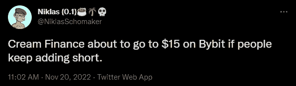
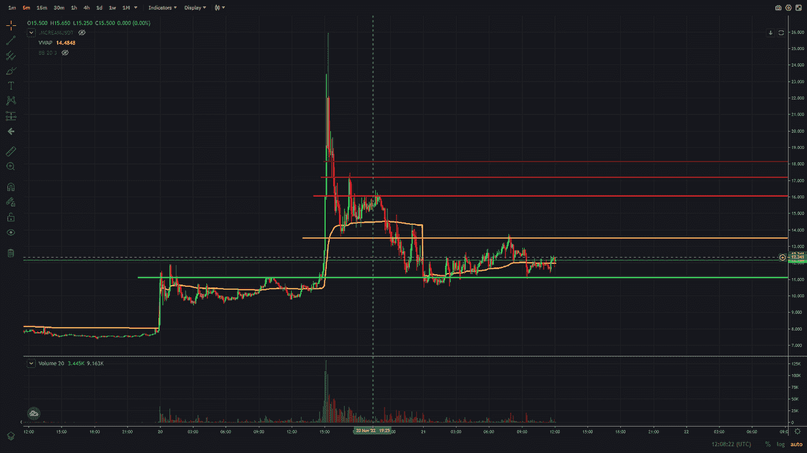

# 交易聚焦—加密货币奶油金融(奶油)

> 原文：<https://medium.com/coinmonks/trading-spotlight-cryptocurrency-cream-finance-cream-b535a129dd2d?source=collection_archive---------20----------------------->

今天的交易焦点是奶油金融的加密货币$CREAM。这种加密货币经历了大幅飙升，从 19 日的 7.50 美元一路飙升至 11 月 20 日的 25 美元。当我看到 20 日的图表上有如此多的空头加仓时，我发了一条推文预测这将达到 15 美元。我错误地预测了 15 美元，因为它一直涨到了 25 美元。我一直低估了加密的力量，有时非流动性令牌使这成为可能。下面是推文，后面是显示我推文时间的图表。

一如既往，我不想向你吹嘘这一点。反正我不能，因为我在试图在 11 美元左右做多时损失了交易，因为我早了 2 个小时被止损，然后错过了交易；(.

现在，我为什么要在《交易聚焦》时事通讯中提到这个代币呢？

我认为派对还没有结束，很有可能从中获利。目前的资金利率(多头对空头的比率)为-3.0%，这是一个严重的负值，因此空头将支付多头。相比之下，ByBit 目前对 BTC 的融资利率为 0.01%。

因此，如果倒计时到 0:00:00(每 8 小时一次),空头必须向多头支付费用。所以每个做多的人都会得到他们的头寸价值*资金利率，如果你的头寸很大，这可能会很多。因此，根据计划，我认为这些水平将巩固一段时间，然后挤出目前正在做空的人。

计划如下。建立一个多头头寸，并严格止损，以防计划失败。进入区域寻找大约 11.50 美元到 12 美元。等待一个潜在的挤压，我认为可能会达到 16 美元左右。卖出那里的多头头寸，转投空头头寸，再次面临资金紧张的风险。在下面的图表中，你可以看到我的支撑线和阻力线。长接将围绕绿线，在第二条红线(从底部数第二条红线)处切换到短接。

我希望这能让你对我的加密货币奶油金融计划有所了解。如果令牌刚刚跌破 11 美元，不再上涨，我可能会增加一个小的空头头寸，但挤压的潜力太大了，正如你在上面的大灯芯上看到的。

如果您想将这些计划直接发送到您的收件箱，请随时订阅我的 Twitter 简讯或关注我。我也张贴交易评论，在那里我张贴我的交易声明来帮助教育，不管是赢还是输。

祝你们这周有个好的开始，祝大家平安。

尼克拉斯

这不是理财建议，只是出于教育目的！

如果你有 2 分钟的时间，如果你能给我反馈，我会很感激，我可以用来提高我的写作。为了获得反馈，您可以参加反馈调查:[https://forms.gle/EfkFpn31K65QeQhh7](https://forms.gle/EfkFpn31K65QeQhh7)

> 交易新手？试试[加密交易机器人](/coinmonks/crypto-trading-bot-c2ffce8acb2a)或者[复制交易](/coinmonks/top-10-crypto-copy-trading-platforms-for-beginners-d0c37c7d698c)