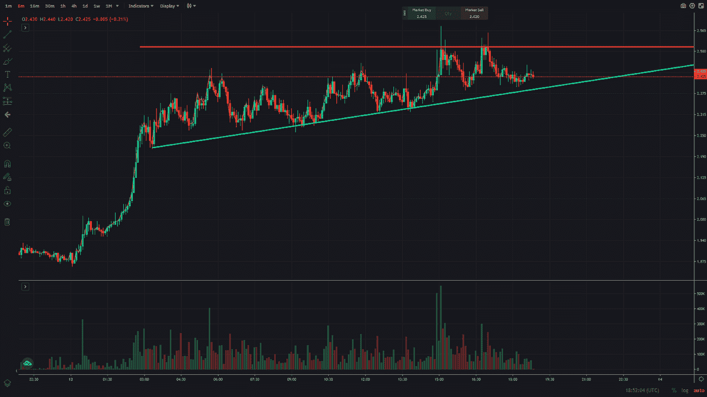

# 交易聚焦—加密货币 DYDX

> 原文：<https://medium.com/coinmonks/trading-spotlight-cryptocurrency-dydx-3526b5ae4c84?source=collection_archive---------16----------------------->

今天的交易焦点是加密货币 DYDX，它今天的价格上涨了 30%，在 3 到 4 天的时间里，从 1.30 美元一路上涨到 2.50 美元，在短时间内价格上涨了近 100%。考虑到整个加密市场的崩溃，这是一个很好的进步。如果你没有利用它，那么你有可能在下跌时交易(如果发生的话)。下面可以看到 DYDX 的日线图。

正如你在日线图上看到的，它在 2.50 美元区域遇到阻力。这为潜在做空提供了一个很好的风险/回报机会。你可以在 2.50 美元到 2.60 美元之间冒险，寻找下滑到 2 美元以下的机会。大约 0.1 美元的风险和 0.20 至 0.30 美元的可能下跌，我认为这是一个不错的交易想法。

这里你可以看到 5 分钟图上的趋势线(蓝色)和阻力/风险线(红色)。如果价格突破趋势线，我们可以看到 DYDX 得到一个很好的冲洗。

像往常一样，要小心，如果 DYDX 上涨或在可能的上涨中转换多头获利，就停止交易。

希望这能帮助你对可能的交易有一个好的想法。

祝你周日休息愉快！

尼克拉斯

这不是财务建议，仅用于教育目的。

如果您能花 2 分钟时间参加这个调查，并就我的写作给我一些反馈，我将不胜感激，这样我就能提高我的写作:[https://forms.gle/opUB72SZzbrPKrDk7](https://forms.gle/opUB72SZzbrPKrDk7)

> 交易新手？试试[密码交易机器人](/coinmonks/crypto-trading-bot-c2ffce8acb2a)或者[复制交易](/coinmonks/top-10-crypto-copy-trading-platforms-for-beginners-d0c37c7d698c)