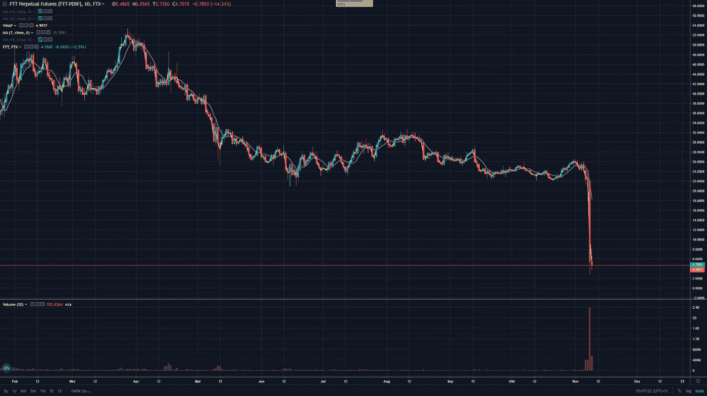
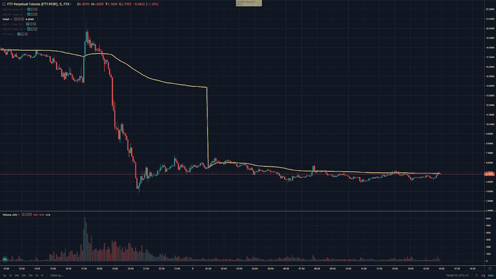

# 交易聚焦—加密货币$FTT (FTX 兑换令牌)

> 原文：<https://medium.com/coinmonks/trading-spotlight-cryptocurrency-ftt-ftx-exchange-token-5e1073e59700?source=collection_archive---------55----------------------->

这个交易聚光灯处理 FTX 中央交易所(CEX)的加密货币令牌，称为 FTT。如果你错过了最近所有关于币安想卖掉他们所有的 FTT，以及币安可能想收购 FTX 的报道，那么你可能不会关注新闻。这不仅出现在秘密新闻中，而且很可能出现在大多数主要的经济报纸和网站上。在下面的 FTT 日线图中你可以看到灾难的图表。

尽管我不希望 FTX 破产，也不希望投资 FTX 的人无法撤回资金，损失金钱，但它仍然提供了交易机会。高波动性和高流动性给了你很大的获利空间，但如果你被错误的一方抓住，也会亏损。目前，我唯一愿意交易的计划是做空 FTT，或者少量做多，如果它在长期下跌后决定反弹的话。

没有理由画任何线，因为情况会很快改变。Sam-Bankman Fried 或 CZ 的一条推文可能会让 FTT 跌至 0 美元或飙升至上涨，所以请确保在适当的位置设置止损，以限制损失，不要被清算。上图中的线显示了 VWAP(成交量加权平均价)，意思是参与者开仓的平均价格。我会用它作为交易的指导指标。

再次声明，我不喜欢 FTX 可能会破产，停业和人们失去他们的钱，但它仍然提供了机会，这是交易者需要利用的，尽管这听起来很难。

希望你们都平安，保重！

尼克拉斯

这不是财务建议，仅用于教育目的。

如果您喜欢这篇文章或想给我一些反馈，请花 2 分钟时间参与以下调查，我将不胜感激:[https://docs . Google . com/forms/u/1/d/1 fwfltulzy 7 vbvdv 1 hlz-sbksth 3 bjtigsmgkywhfafu/edit？usp=drive_web](https://docs.google.com/forms/u/1/d/1fwfltulzY7vBVdV1hLz-sBKstH3BJTigsmGkYWhFAfU/edit?usp=drive_web)

> 交易新手？试试[密码交易机器人](/coinmonks/crypto-trading-bot-c2ffce8acb2a)或者[复制交易](/coinmonks/top-10-crypto-copy-trading-platforms-for-beginners-d0c37c7d698c)