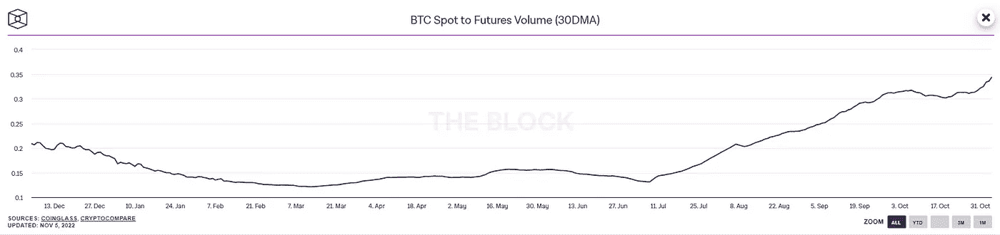
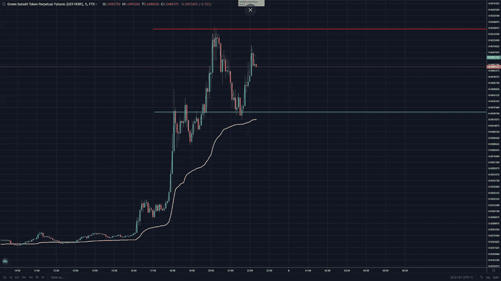

# 交易聚焦—加密货币绿色 Satoshi 令牌(GST)

> 原文：<https://medium.com/coinmonks/trading-spotlight-cryptocurrency-green-satoshi-token-gst-1e477de9e869?source=collection_archive---------19----------------------->

这是一个关于加密货币$GST 的快速聚焦，它是 STEPN 应用程序的“游戏内”货币或令牌。如果您持有 STEPN 的 NFT，您基本上可以获得步行/慢跑/跑步的代币。这种代币没有限制，因此它会引发通货膨胀，并随着时间的推移而贬值。这种代币的价格不时大幅上涨。这很可能是由于加密货币期货市场上的大量空头头寸以及抛售稳定货币的代币。期货在加密市场中占很大比例，你可以在下图中看到交易量的关系(或点击此链接:[https://www . the block . co/data/crypto-markets/spot/btc-spot-to-futures-volume](https://www.theblock.co/data/crypto-markets/spot/btc-spot-to-futures-volume))，它显示了过去 30 天 BTC 现货对期货的交易量。

但现在我们来谈谈 100 美元的商品及服务税.它的价格时不时会飙升，这提供了一个获利的好机会。你必须等待它弹出，它刚刚做了什么(05.11.2022)，并在它上面建立一个空头头寸。注意不要在正面做空，因为你无法预测它会跑多远。在下图中，它在几个小时内从大约 0.02 美元飙升到 0.05 美元。你可以在高点做空，在高点做空，或者等待它进一步下跌。

这很可能会再次下降，所以不要错过机会，但要小心和安全。如果形势对你不利，不要做空。这一点都不好玩，我只能告诉你这么多。

希望这对你有帮助！像往常一样，这不是财务建议，祝你愉快。如果这对你有帮助或者你想提出批评的话，如果你能留下评论，我将不胜感激。

尼克拉斯

> 交易新手？试试[密码交易机器人](/coinmonks/crypto-trading-bot-c2ffce8acb2a)或者[复制交易](/coinmonks/top-10-crypto-copy-trading-platforms-for-beginners-d0c37c7d698c)