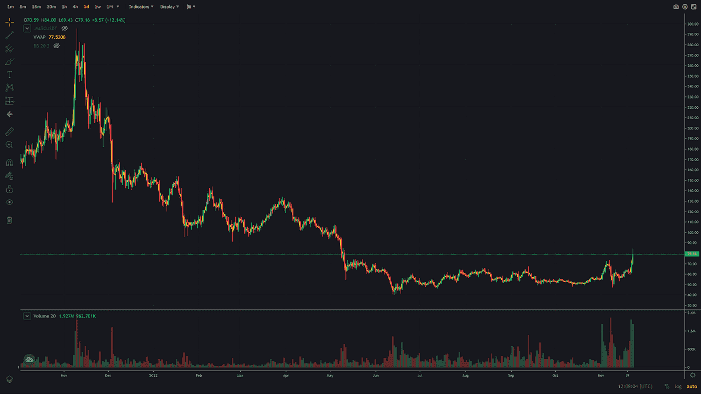
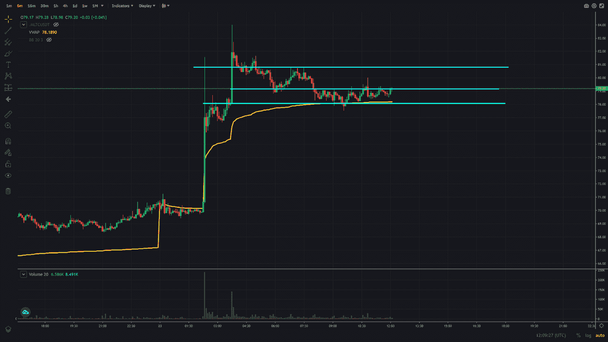

# 交易聚焦—加密货币莱特币(LTC)

> 原文：<https://medium.com/coinmonks/trading-spotlight-cryptocurrency-litecoin-ltc-c043c9f89798?source=collection_archive---------24----------------------->

今天的交易焦点涉及加密货币莱特币，这可能是大多数加密爱好者/交易者都知道的。与最近几天的整体加密市场相比，莱特币的交易方向相反，因为它最近从低点反弹了相当大的幅度。在过去的日子里，价格从 60 多美元一路跌至 80 多美元。下面的日线图显示了莱特币最近的涨势。

由于一切都取决于整体市场(至少在一定程度上)，我也会关注市场以做出决策。所以在交易莱特币的时候，要时刻牢记比特币和以太坊。交易这些也有两种选择，类似于我上次在奶油金融上的交易计划([https://medium . com/@ niklas . scho maker/trading-spot light-cryptocurrency-Cream-Finance-Cream-b 535 a 129 dd2d](/@niklas.schomaker/trading-spotlight-cryptocurrency-cream-finance-cream-b535a129dd2d))。玩莱特币有多头和空头两种选择。在下面的 5 分钟图表中，你可以看到我的短期兴趣线。

最后一行是我认为的短期支撑，当试图做多时，这可以用作风险水平。在中线和最低线之间建立一个多头头寸，并在线下设置止损。它也恰好是 5 分钟图的成交量加权平均价格(VWAP ),代表建仓时的平均价格。因此，平均进场价格约为 78.50 美元，风险约为 77.50 美元。这里的目标是 80 美元或以上。如果这真的可以得到运动，它可能会打破前期高点约 84 美元。

对于做空的策略，我会等待一个峰值，这基本上是上面的做多策略，但如果它找到了顶部，就做空，或者当它跌破最低线/VWAP 并加入下降趋势时，就做空。在第一种情况下，等待一个较低的高点，并将其作为风险水平。在第二种情况下，使用最低利率线或 VWAP 作为风险水平。

我希望这能帮助你了解我对这个密码的计划，以及我将如何交易它。与以前的加密货币相比，莱特币的日交易量更大，因此更容易建立更大的$ number 美元头寸，并且仍然不会出现太多的滑点。只是作为一个辅助信息。

如果你对我的计划或我如何决定做多/做空有任何问题，请随意写在评论中，我很乐意帮助你。如果你对这些计划有不同的想法，我也很乐意讨论。

另外，如果你喜欢这些文章，请随时关注我或在 Twitter 上订阅我的时事通讯。

祝你今天开心！玩的开心！

尼克拉斯

这不是理财建议，只是出于教育目的！

如果你有 2 分钟的时间，如果你能给我反馈，我会很感激，我可以用来提高我的写作。为了获得反馈，您可以参加反馈调查:[https://forms.gle/EfkFpn31K65QeQhh7](https://forms.gle/EfkFpn31K65QeQhh7)

> 交易新手？试试[密码交易机器人](/coinmonks/crypto-trading-bot-c2ffce8acb2a)或者[复制交易](/coinmonks/top-10-crypto-copy-trading-platforms-for-beginners-d0c37c7d698c)