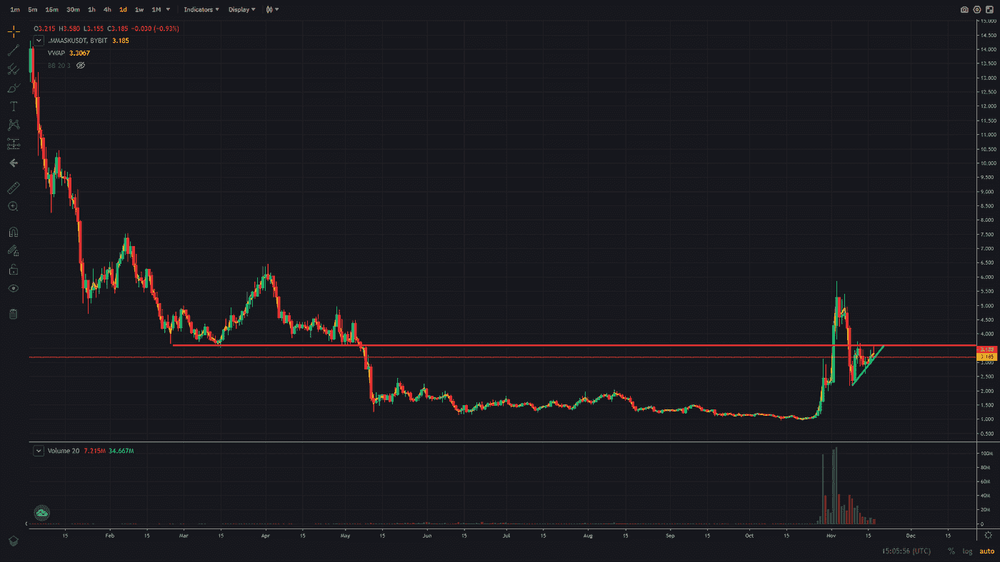
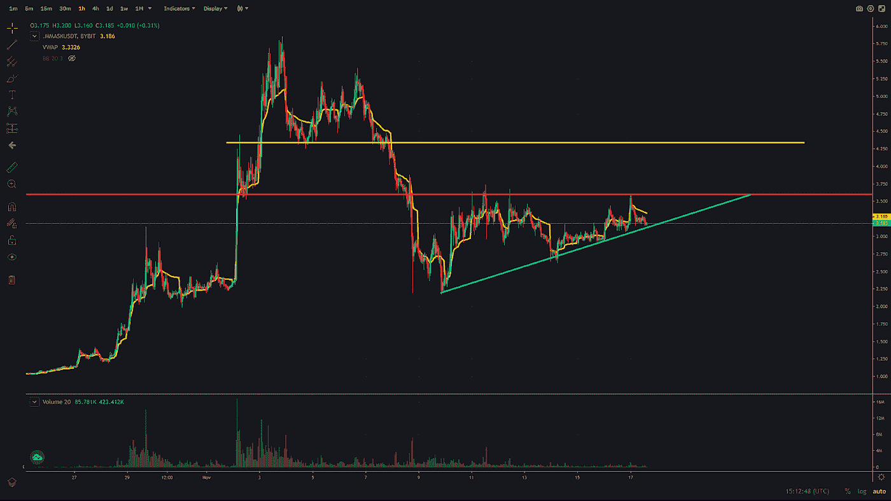

# 交易聚焦—加密货币面具

> 原文：<https://medium.com/coinmonks/trading-spotlight-cryptocurrency-mask-2baea384f46a?source=collection_archive---------29----------------------->

今天的交易焦点集中在加密货币面具上，自大约一个月前以来，加密货币面具出现了大幅波动和巨大的成交量增长。它从 10 月底的 1 美元左右一直涨到 11 月初的 5 美元左右。如果你有正确的计划和耐心，这提供了一个很好的获利机会。在撰写本文时，口罩的价格约为 3.17 美元。它在小时图上呈上升趋势，低点更高，阻力在 3.60 美元区域，这是今年 3 月以来的所有支撑。下面日线图中的红线显示了这个旧的支撑位，它现在可能会成为阻力。

我有两个想法来交易这个，一个是做多，一个是做空。从长远的想法开始。

在做多的情况下，我会等待加密货币面具打破 3.60 美元的阻力，然后加入趋势向上，如果它超越。我会将我的风险水平设定在 3.60 美元，如果价格没有上涨，我就会卖出。由于这是一个熊市，大多数人会看空(我也喜欢在这个市场做空)，所以做空者可能会措手不及，被挤出市场。在这种情况下，我会寻找 4.20 美元到 4.30 美元的目标位置卖出，因为这是下一个阻力，可以在下图中用黄色看到。

在做空加密面具的情况下，我会试图等待 3.60 美元的阻力保持住，并将其作为风险水平，或者如果价格跌破上升趋势线(蓝色)，加入下降趋势。

如果做多的想法出现，请耐心等待，后面会有足够的时间做空，并可能使用上述 4.30 美元区域作为风险水平。

希望这有助于了解计划，并有助于可能的执行。

祝你们今天愉快。

尼克拉斯

这不是理财建议，只是出于教育目的！

如果你有 2 分钟的时间，如果你能给我反馈，我会很感激，我可以用来提高我的写作。为了获得反馈，您可以参加反馈调查:[https://forms.gle/bw7RfCkxv7G3ss6v5](https://forms.gle/bw7RfCkxv7G3ss6v5)

> 交易新手？试试[密码交易机器人](/coinmonks/crypto-trading-bot-c2ffce8acb2a)或者[复制交易](/coinmonks/top-10-crypto-copy-trading-platforms-for-beginners-d0c37c7d698c)