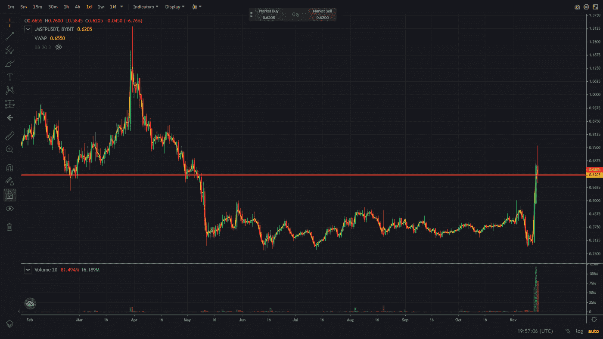
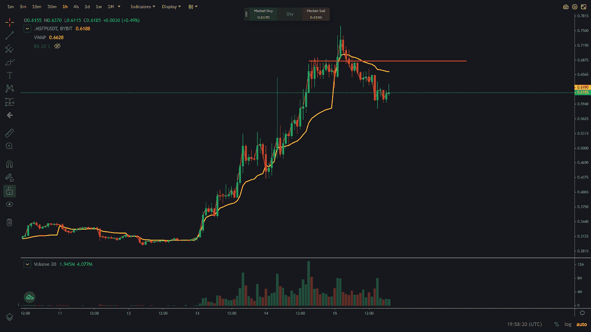

# 交易聚焦—加密货币 SFP

> 原文：<https://medium.com/coinmonks/trading-spotlight-cryptocurrency-sfp-3f999c9b482d?source=collection_archive---------38----------------------->

今天的交易焦点是加密货币 SFP，可以在 ByBit 或币安上交易。实际上，我不知道加密货币的用途，但制定交易计划或执行交易计划并不重要。SFP 最近两天涨了 100%以上，你可以在下面的日线图上看到。

你可以看到一条红色的线，这条线在今年年初一直是支撑线。这是一条需要记住的重要价格线。在下面的小时图上，你可以看到一条红线，价格在几个小时前停滞不前。这将在 0.69 美元左右给出一个很好的进场价格，并远离当前 0.75 美元左右的高点。

当然，为了使该计划适用，加密货币 SFP 需要首先反弹，因为追逐不是一个选项，大多数时候会受到市场的惩罚。

希望这有助于了解该计划，并有助于可能的执行。

你可以看看我的另一篇关于$DYDX 的文章([https://medium . com/coin monks/trading-spot light-cryptocurrency-DYDX-3526 b5 AE 4c 84](/coinmonks/trading-spotlight-cryptocurrency-dydx-3526b5ae4c84))，当加密从 2.40 美元跌至 2.10 美元时，它成功了。

祝你们今天愉快。

尼克拉斯

这不是理财建议，只是出于教育目的！

如果你有 2 分钟的时间，如果你能给我反馈，我会很感激，我可以用来提高我的写作。为了获得反馈，您可以参加反馈调查:【https://forms.gle/bw7RfCkxv7G3ss6v5 

> 交易新手？试试[密码交易机器人](/coinmonks/crypto-trading-bot-c2ffce8acb2a)或[复制交易](/coinmonks/top-10-crypto-copy-trading-platforms-for-beginners-d0c37c7d698c)