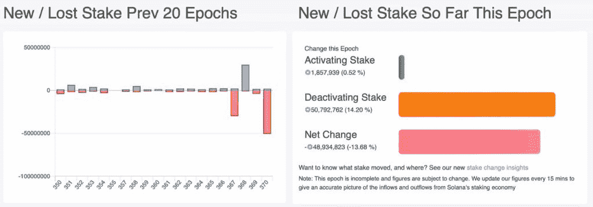
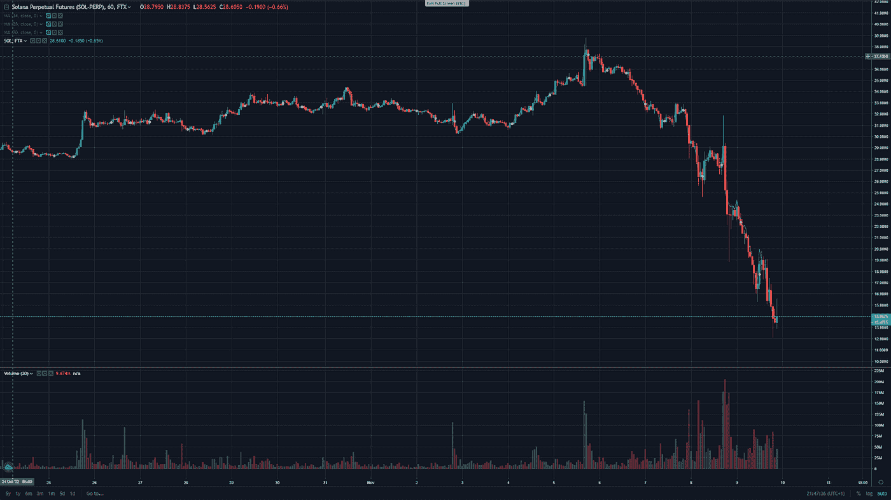

# 交易聚焦——加密货币 sola(SOL)

> 原文：<https://medium.com/coinmonks/trading-spotlight-cryptocurrency-solana-sol-74550851c4eb?source=collection_archive---------47----------------------->

加密货币 Solana 在过去几天也受到了沉重打击，在撰写本文时比 4 天前下跌了约 63%。索拉纳从 38 美元跌至 13.8 美元，随着明天大量索拉纳(SOL)解锁，索拉纳面临更多可能的下行。

这可能会推动索拉纳价格进一步下跌，因为人们可能会清算他们未锁定的索拉纳，这意味着更大的下行可能。可以是做空索拉纳，从中获利的好机会。我会等待价格可能的上涨，建立空头头寸。例如，如果价格涨到 15 美元并停滞不前，用它作为风险水平，尝试做空。别忘了为了保护自己，永远要有止损。如果你相信索拉纳·区块链，相信这项技术和它的开发者，那么这可能是一个千载难逢的机会，以一个非常好的价格买到一个大包。也许可以用一些短期的利润来买一些长期的索拉纳。

这张图片显示了过去几天和几个小时的索拉纳图表。但最重要的是，要注意安全，不要被清算，也不要过度举债。

我希望你在最近的危机中仍然表现良好。

尼克拉斯

这不是财务建议，仅用于教育目的。

如果您喜欢这篇文章或可以提出一些改进建议，请花 2 分钟时间参加以下调查:[https://docs . Google . com/forms/d/1 fwfltulzy 7 vbvdv 1 hlz-sbksth 3 bjtigsmgkywhfafu/edit？usp=drive_web](https://docs.google.com/forms/d/1fwfltulzY7vBVdV1hLz-sBKstH3BJTigsmGkYWhFAfU/edit?usp=drive_web)

> 交易新手？试试[密码交易机器人](/coinmonks/crypto-trading-bot-c2ffce8acb2a)或者[复制交易](/coinmonks/top-10-crypto-copy-trading-platforms-for-beginners-d0c37c7d698c)