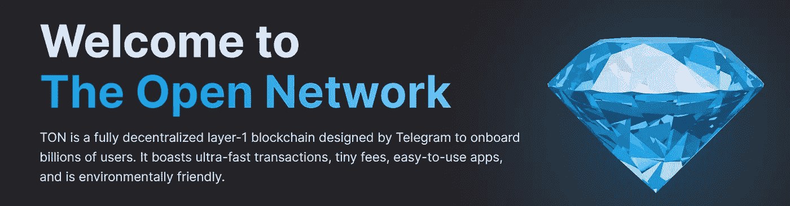
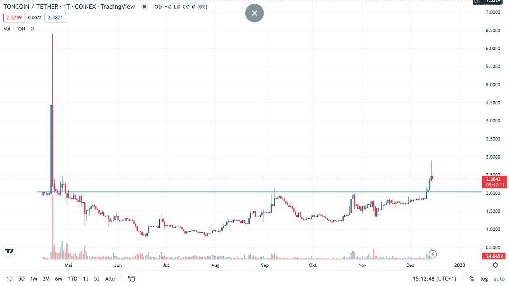
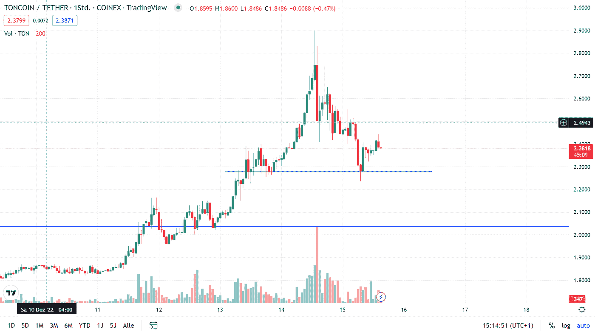

# 交易聚焦—加密货币 Toncoin (TON)

> 原文：<https://medium.com/coinmonks/trading-spotlight-cryptocurrency-toncoin-ton-d623a89dc79c?source=collection_archive---------22----------------------->

> ***15.12.2022***

Toncoin (TON)

今天的交易焦点是加密货币 Toncoin，这是另一个第一层区块链。对于不想读所有这些的人，在底部会有一句 TLDR，尽管如果你读完整个分析，我仍然会很感激。

到目前为止，通币还没有在币安和比特币基地这样的大型交易所上市，这提供了一个很好的机会。许多人现在没有机会购买/交易这种加密货币。如果你现在就能买下它，并且币安和比特币基地上市的传言开始升温，价格可能会上涨，直到它真正上市(cryptos 之后往往会抛售)。因为它是较大的密码之一(Coingecko 上 21 个，Coinmarketcap 上 22 个；按 Mktcap 排序。)，但仍未在主要交易所上市，这些交易所可能会考虑上市，以增加其平台的交易量。

对于那些可以在像 KuCoin 这样的交易所购买的人来说，机会就在这里。你可以买硬币，在实际上市前找一个打气筒，然后开始卖。我仍然认为你需要一个更精确的贸易计划。

在下面的图片和段落中，你会看到一些关于硬币价格历史的 TA 和一个关于进场、出场和风险水平的计划。

在下面的日线图上，你可以看到吨的价格历史，它在 2 美元区域有一个重要的水平。它在那里遇到了两次阻力，然后顺利通过。这是一个值得记住的价格水平。

Daily Trading Chart

在过去几天的小时图中，你可以看到加密货币 Toncoin 进展相当顺利。在日线图上突破了 2 美元附近的阻力，几乎到了 3 美元。

Hourly Trading Chart

它最近从 2.25 美元到 2.30 美元的水平反弹，这是我用来作为风险水平的价格水平之一。另一个是 2 美元附近的下趋势线，之前是阻力。这个计划肯定会持续很长时间。如果短期内价格走势再次看涨或在 2 美元附近，可以在 2.30 美元附近进场。2 美元区域的一个缺点和从那里推高肯定是更健康的价格行为。

对于退出水平，要说出一个具体的水平有点困难，但更依赖于更大的 CEX 的上市加密货币。例如，如果在上市日期前有谣言或新闻出现，在 Twitter 上寻找 FOMO。买入谣言，卖出新闻类型的交易。

> **TLDR**

在币安/比特币基地上市前买入，当硬币真正上市时卖出。

我希望这有助于你得到一个关于这个交易的想法。

祝您愉快！

尼克拉斯

这不是理财建议，只是出于教育目的！

如果你有 2 分钟的时间，如果你能给我反馈，我会很感激，我可以用来提高我的写作。为了获得反馈，您可以参加反馈调查:[https://forms.gle/EfkFpn31K65QeQhh7](https://forms.gle/EfkFpn31K65QeQhh7)

> *交易新手？试试* [*密码交易机器人*](/coinmonks/crypto-trading-bot-c2ffce8acb2a) *或* [*复制交易*](/coinmonks/top-10-crypto-copy-trading-platforms-for-beginners-d0c37c7d698c)
> 
> *分散密码持有量，了解* [*币安替代品*](https://coincodecap.com/binance-alternatives)
> 
> *加入 Coinmonks* [*电报频道*](https://t.me/coincodecap) *和* [*Youtube 频道*](https://www.youtube.com/c/coinmonks/videos) *获取每日* [*加密新闻*](http://coincodecap.com/)

# 另外，阅读

*   [复制交易](/coinmonks/top-10-crypto-copy-trading-platforms-for-beginners-d0c37c7d698c) | [加密税务软件](/coinmonks/crypto-tax-software-ed4b4810e338)
*   [网格交易](https://coincodecap.com/grid-trading) | [加密硬件钱包](/coinmonks/the-best-cryptocurrency-hardware-wallets-of-2020-e28b1c124069)
*   [密码电报信号](/coinmonks/top-3-telegram-channels-for-crypto-traders-in-2021-8385f4411ff4) | [密码交易机器人](/coinmonks/crypto-trading-bot-c2ffce8acb2a)
*   [最佳加密交易所](/coinmonks/crypto-exchange-dd2f9d6f3769) | [印度最佳加密交易所](/coinmonks/bitcoin-exchange-in-india-7f1fe79715c9)
*   面向开发人员的最佳加密 API
*   最佳[密码借贷平台](/coinmonks/top-5-crypto-lending-platforms-in-2020-that-you-need-to-know-a1b675cec3fa)
*   [免费加密信号](/coinmonks/free-crypto-signals-48b25e61a8da) | [加密交易机器人](/coinmonks/crypto-trading-bot-c2ffce8acb2a)
*   [杠杆代币的终极指南](/coinmonks/leveraged-token-3f5257808b22)