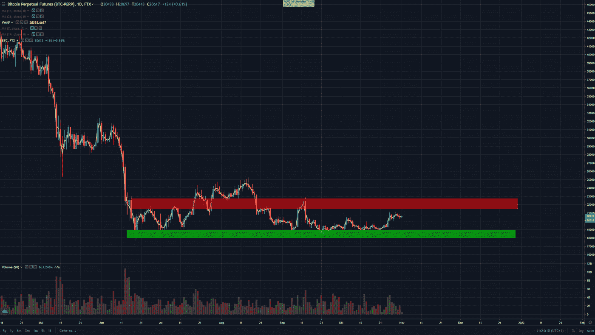
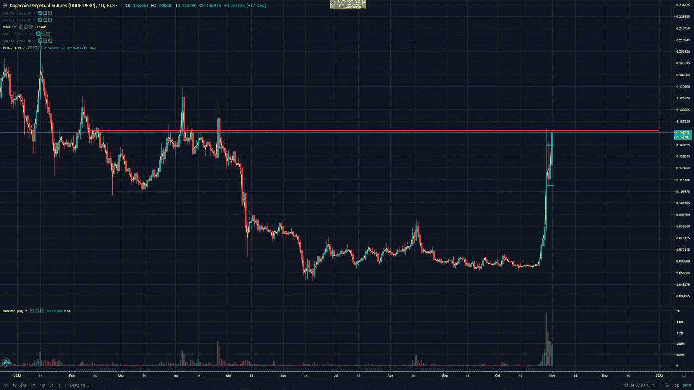
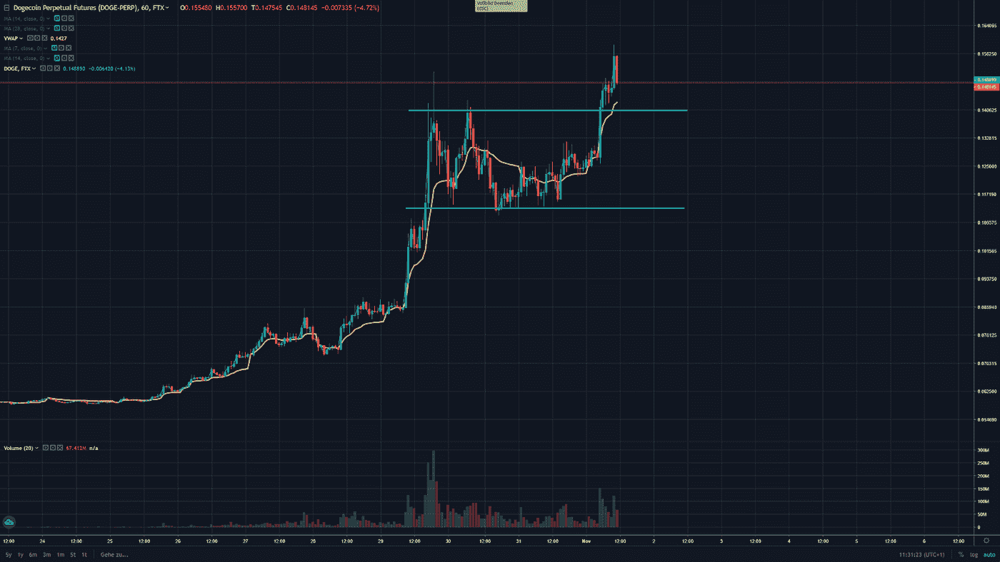

# 加密聚光灯— Dogecoin ($DOGE)

> 原文：<https://medium.com/coinmonks/trading-spotlight-dogecoin-doge-dff60ad8eb46?source=collection_archive---------34----------------------->

今天的加密货币焦点是 Dogecoin，因为它正在产生巨大的价格波动，你们可能都已经注意到了。但首先我想快速分析一下比特币的价格走势。

**比特币(BTC)**

比特币仍在 18000 美元至 22000 美元之间横向盘整。除了 7 月至 8 月在上方有所突破之外，它基本上已经在该通道中运行了 4 个月。成交量没有大幅上升，这让我认为我们不会很快在这些水平之上或之下有大的波动。这一切当然取决于世界发展的整体状况，战争，衰退等因素。18k 美元的支撑位一直很强，所以作为短期交易，我会买入/回补支撑区域，卖出/做空阻力区域。如果它以强劲的成交量突破了这些区域中的一个，并保持住它，那么大的波动可能就要来了，所以要小心，不要在失去的位置上坚持太久。我经常这样做，但 90%的情况下都不会有好结果。

到目前为止，比特币的价格走势。现在轮到 Dogecoin 了。

**DOGE coin(DOGE)**

Dogecoin 已经大幅上涨，从 0.06 美元一直涨到现在的 0.15 美元。可能是因为埃隆·马斯克收购 Twitter 以及随之而来的猜测，但也是因为短暂的挤压，因为那里有大蜡烛。到目前为止，价格行为来自哪里，但我真的不太关心这个，如果我想交易价格行为。0.15 美元区域是一个重要的心理数字，可以作为支撑或阻力，这取决于 Dogecoin 决定走多高。

从短期来看，趋势仍在上升，但可能会在此范围内盘整。如果它能保持在 0.15 美元附近或以上，我可以看到它会更高，如果空头在这一点上。我的想法也是做空 Dogecoin，但等到派对结束，它明显是一个压力小得多的交易趋势。我期待着 Dogecoin 在卷干的时候会慢慢消失。让它尽可能地飙升，寻找一个价格快速开始改变方向的高交易量区域。这可以作为一个风险等级。不要在前面被抓住，采取更容易的后面移动，会有足够的空间让它下去。如果 Dogecoin 仍然决定高于你的进场或风险水平，不要犹豫，削减你的头寸，重新评估形势。

随着 Dogecoin 的上涨，你也可以交易其他 meme coin，因为它们跟随 meme coin 的“领导者”。柴犬(SHIB)是一个可能的交易选择，因为它很好地跟随了 Dogecoin。

我希望这能帮助你得到一个交易的想法。注意安全，不要超大号。我感谢每一个评论和反馈，以便在未来提供更好的文章和分析。

祝你愉快，

尼克拉斯

这不是财务建议，仅用于教育目的。

> 交易新手？试试[加密交易机器人](/coinmonks/crypto-trading-bot-c2ffce8acb2a)或者[复制交易](/coinmonks/top-10-crypto-copy-trading-platforms-for-beginners-d0c37c7d698c)