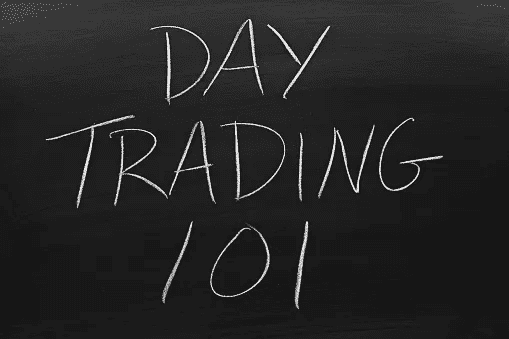

# 传统的日交易方式

> 原文：<https://medium.com/coinmonks/traditional-day-trading-the-cryptoverse-way-548c5ce4e24e?source=collection_archive---------53----------------------->

istock

西伯利亚的冬天没有减弱的迹象——目前还没有。但这并不意味着在隐密体中找不到赚钱的机会。

传统的日内交易是一门艺术，寻找准备运行的股票；当它达到一个特定的价格点时，尽可能多的买入并在当天卖出。