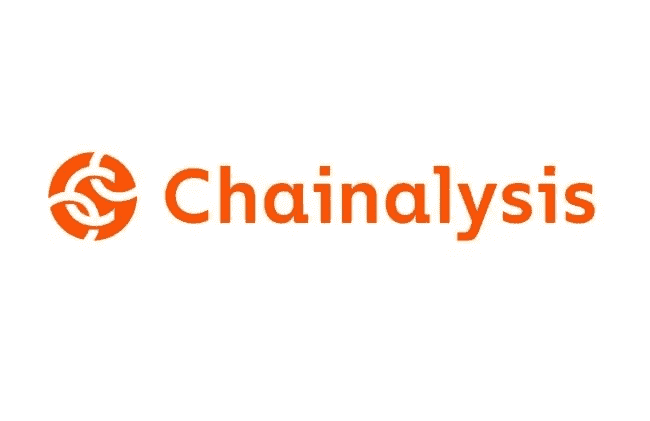
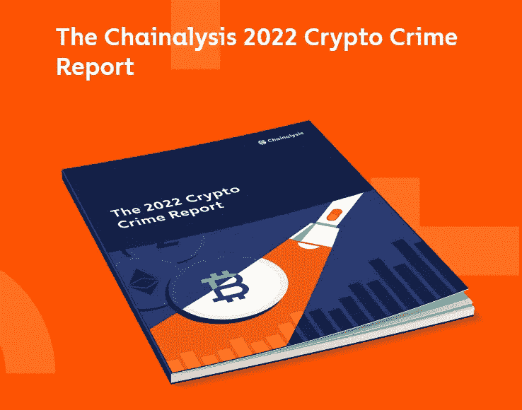

# 涉及非法地址的交易仅占 2021 年加密货币交易量的 0.15%——chain analysis 2022 加密犯罪报告

> 原文：<https://medium.com/coinmonks/transactions-involving-illicit-addresses-represented-just-0-15-25daee0ecb08?source=collection_archive---------28----------------------->

所有部门都受到犯罪活动的影响，甚至加密货币部门也不能幸免。尽管大规模采用还有很长的路要走，但不幸的是，加密货币也被用于非法活动。Chainalysis 是密码行业中一家领先的信任建立公司，总部位于美国纽约。

Chainalysis logo

正如你可以从他们的[网站](https://www.chainalysis.com/)上读到的，他们的使命是“为建立在区块链基础上的全球经济创造透明度，让银行、企业和政府对人们如何使用加密货币有一个共同的理解。”该公司成立于 2014 年，当时是对[Mt. Gox](https://www.investopedia.com/terms/m/mt-gox.asp)被黑事件的官方调查人员(在 7 月 6 日的[信函](http://www.mtgox.com/img/pdf/20220706_announcement_en.pdf)中，受托人 Nobuaki Kobayashi 律师证实，mt . Gox 正准备向账户持有人还款)。两位联合创始人是迈克尔·格罗纳格尔和乔纳森·莱文。

The two co-founders Michael Gronager and Jonathan Levin

他们两人的履历都意义重大。迈克尔·格罗纳格尔是 Uni-C /丹麦研究网络和瑞典林雪平大学国家超级计算机中心的董事会成员。他还是北海巨妖交易所的顾问和首席运营官的顾问。乔纳森·莱文还是 Coinometrics(一个国际公认的品牌)的首席执行官，并在著名的英国牛津大学获得了经济学哲学硕士学位。

在 Chainalysis 的主要客户中，我们发现:
-联邦调查局、缉毒署和国税局刑事调查(美国联邦机构)
-巴克莱银行(金融机构)
- Gemini、Bitstamp 和 BitPay(加密公司)

Chainalysis 为[调查](https://www.chainalysis.com/solutions/investigations/)、[合规](https://www.chainalysis.com/solutions/compliance/)、[违规](https://www.chainalysis.com/solutions/defi/)和[非关税壁垒提供解决方案。](https://www.chainalysis.com/solutions/nfts/)，提供各种产品([反应堆](https://www.chainalysis.com/chainalysis-reactor/)， [KYT](https://www.chainalysis.com/chainalysis-kyt/) ，[氪星](https://www.chainalysis.com/chainalysis-kryptos/)，[市场英特尔](https://www.chainalysis.com/chainalysis-market-intel/)，[商业数据](https://www.chainalysis.com/chainalysis-business-data/))和服务([调查&特别计划](https://www.chainalysis.com/crypto-investigations-and-special-programs/)，[突发事件应对](https://www.chainalysis.com/crypto-incident-response/)，[培训&认证](https://www.chainalysis.com/chainalysis-certification-programs/))。他们创建的 2022 年加密犯罪报告是真正详尽的，由 140 页组成。

The 2022 Crypto Crime Report

你可以点击[这里](https://go.chainalysis.com/2022-crypto-crime-report.html)下载一份免费的。正如报告中所述，最令我震惊的是，“尽管非法交易量的原始值达到了有史以来的最高水平，但涉及非法地址的交易仅占 2021 年加密货币交易量的 0.15%”。这份报告充满了信息、数据和准确的分析。我热情地邀请您阅读它，以避免诈骗，并对我们社会中基于加密货币的犯罪有一个大致的了解。在下面留下评论，告诉我你对 Chainalysis 2022 Crypto Crime 报告的看法。把这个空间当成一个没有审查的谈话场所。

胜利者是永不放弃的梦想家。

***免责声明*** *:我不知道所使用的图片有任何第三方权利。如有任何资料来源，我保证予以引用，如有要求，我将调整立场。*

***免责声明*** *:交易加密货币具有很高的风险，可能不适合所有投资者。在决定交易加密货币之前，你应该仔细考虑你的投资目标和你的经验水平。自己做研究。此处表达的所有观点归各自作者所有，不应被视为任何形式的财务建议。*

> 交易新手？尝试[加密交易机器人](/coinmonks/crypto-trading-bot-c2ffce8acb2a)或[复制交易](/coinmonks/top-10-crypto-copy-trading-platforms-for-beginners-d0c37c7d698c)