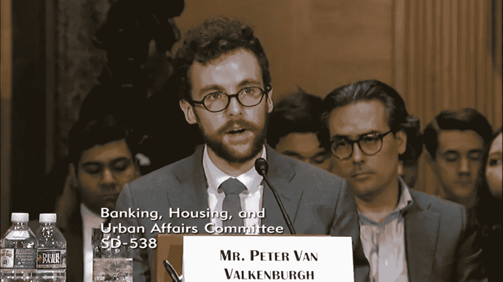

# 彼得·范·瓦尔肯伯格在美国银行、住房和城市事务委员会听证会上的比特币演讲文字记录(10/11/2018)

> 原文：<https://medium.com/coinmonks/transcript-of-peter-van-valkenburghs-bitcoin-speech-at-the-hearing-of-the-us-committee-on-banking-b6823dc2cb1a?source=collection_archive---------1----------------------->

2018 年 10 月 11 日，美国参议院银行、住房和城市事务委员会举行公开会议，就“**探索加密货币和区块链生态系统**”举行听证会。见证人是**努里埃尔·鲁比尼**博士，纽约大学斯特恩商学院经济学和国际商务教授；**彼得·范·瓦尔肯伯格**先生，[钱币中心](https://www.coincenter.org/)研究总监。

Peter Van Valkenburgh speaking about Bitcoin at a hearing of the United States Senate Committee on Banking, Housing, and Urban Affairs

原出处可以在 [**这里找到**](https://www.banking.senate.gov/hearings/exploring-the-cryptocurrency-and-blockchain-ecosystem) 。

在听证会期间**彼得·范·瓦尔肯伯格**就**比特币**发表了以下演讲:

> C hairman *Crapo* ，高级成员 *Brown，*委员会的各位成员，感谢你们今天给我机会与你们交谈。
> 
> 我是 Peter Van Valkenburgh，是 CoinCentre 的研究总监，coin centre 是一家独立的非营利组织，专注于影响加密货币和公共区块链网络的公共政策问题。
> 
> 比特币是什么？
> 比特币是世界上第一种加密货币，它的工作得益于世界上第一个公共区块链网络。
> 
> 比特币是做什么的？
> 很简单。它让你只需要一台电脑和一个互联网连接就可以向世界上的任何人发送和接收价值。
> 
> 为什么它是革命性的？因为不像其他通过互联网汇款的工具，它不需要信任中间人。中间没有任何公司，这意味着比特币是世界上第一个公共数字支付基础设施。我所说的公共仅仅是指所有人都可以使用，而不是由任何一个实体所拥有。
> 
> 我们拥有信息、网站和电子邮件的公共基础设施。它叫做互联网。但是我们唯一的公共支付基础设施是现金，就像纸币一样。而且只在面对面的交易中有效。在比特币出现之前，如果你想通过电话或互联网远程支付，你就不能使用公共基础设施。你可以依靠一家私人银行来打开他们的账簿，添加一个分类账条目，记入你的借方，记入你付款人的贷方。如果你们不使用同一个银行，那么将会有多个银行和多个分类账分录。
> 
> 对于比特币，账本是公开的区块链。任何人都可以在账本上添加一个条目，将他们的比特币转移给其他人。任何人，无论其国籍、种族、宗教、性别、性别或信用度如何，都可以免费创建一个比特币地址，以接收数字支付。
> 
> 比特币是世界上第一种全球可获取的公共货币。
> 
> 完美吗？不，
> 电子邮件在 1972 年发明时也不是。比特币并不是所有领域的最佳货币。它还没有被到处接受，它不经常被用来报价，它也不总是一个稳定的存储值。但是它正在工作，而且仅仅是它在没有可信中介的情况下工作**这一事实就令人惊讶。**
> 
> 这是计算机科学的突破，对自由、繁荣和人类繁荣的意义不亚于互联网的诞生。而比特币只是一个开始。如果我们可以取代私人支付基础设施，那么我们也可以取代人类互动的其他私人瓶颈。
> 
> 我们为什么要建设更多的公共基础设施？为什么我们应该拥抱区块链而不是公司中介？为什么我们要容忍它们的低效并努力使它们变得更好？为什么我们应该希望这项技术的先驱在美国，而不是逃往海外？
> 
> 一个简单的原因。
> **因为提供当今关键但私有的基础设施的公司中介正在变得越来越少、越来越大、越来越强大**。他们的失败越来越严重。
> 
> 大约一半的美国人，也就是 1 . 43 亿人，因为 Equifax 的漏洞而使他们的社会安全号码暴露给黑客。
> 由于孟加拉国、越南、厄瓜多尔和俄罗斯的会员银行遭到黑客攻击，SWIFT 网络已经转发了数亿美元的欺诈交易。联邦调查局现在怀疑这些黑客攻击中最大的一次是由朝鲜实施的。
> 一家印度银行 Punjab National 的腐败低层员工能够伪造 Swift 报文，窃取了 18 亿美元。这是历史上最大的电子银行抢劫案。事实上，这是历史上最大的银行抢劫案。
> 
> 2016 年 10 月，估计有 120 万台联网设备被黑客攻击，变成了僵尸网络，在几个小时内，欧洲和北美的主要网站都无法访问，包括 CNN 和福克斯新闻频道，纽约时报和华尔街日报。
> 
> 越来越多的物理机器被连接到互联网上以增强它们的能力。它们通过服务器连接，这些服务器由私有和可信的中间设备拥有和维护，即所谓的物联网(IoT)。
> 
> 圣裘德医院的心脏起搏器被黑了。趋势网的婴儿监视器被黑了。吉普公司的吉普车已经被黑客攻击到可以远程征用并驶离公路的程度。
> 
> 在具有单点故障的系统中，这些漏洞是不可避免的。无论故障点是企业还是政府都没关系。不应该有单点故障。
> 
> 类似的瓶颈在互联网出现之前就存在了。如果你想传递一个信息，你必须通过三家电视广播公司或几家报纸中的一家。**私营企业必不可少，但任何关键基础设施都不应依赖一两家**。
> 
> 互联网消除了通信基础设施中的单点故障，并在其公共轨道之上迎来了新媒体公司之间的竞争浪潮。
> 
> **区块链同样可以实现关键支付和物联网基础设施的非中介化**。这项技术目前还不能回答所有这些问题，但它是我们最大的希望。正如 20 世纪 90 年代的互联网一样，我们需要一个宽松的、支持创新的政策，以确保这些创新在美国蓬勃发展，为所有美国人的利益和安全服务。

> 交易新手？尝试[加密交易机器人](/coinmonks/crypto-trading-bot-c2ffce8acb2a)或[复制交易](/coinmonks/top-10-crypto-copy-trading-platforms-for-beginners-d0c37c7d698c)