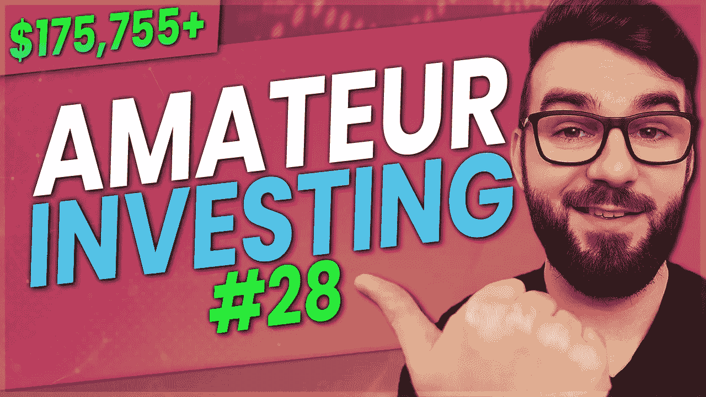

# 趋势上升——业余投资#28

> 原文：<https://medium.com/coinmonks/trending-up-amateur-investing-28-b9728593ac1?source=collection_archive---------33----------------------->

是时候更新我的投资组合和我的被动收入之旅了。在这一集里，我将分享我每月定期更新的投资内容和原因。这是最好的业余投资！

****免责声明:这不是理财建议，纯属娱乐目的。我所有的股票信息都是 100%准确的，但我的加密数据可能是也可能不是模拟的****

我分享一切，所以你可以 100%透明地跟踪我做的一切。做这一切的目的是向你展示这是可能的，并提供某种可以遵循的框架。这不是财务建议，你不应该完全复制我的投资。你应该做的是找出最适合你的方法，坚持平均成本原则，投资优质资产，避免负债，复利，节俭，低买高卖。

【https://bit.ly/investingtemplate】投资电子表格模板链接:

**收入跟踪电子表格模板链接:**[https://bit.ly/incometemplate](https://bit.ly/incometemplate)

**预算电子表格模板链接:**[https://bit.ly/expensestemplate](https://bit.ly/expensestemplate)

**下面我将为月报列出所有内容:**

我开始慢慢加大在股市的投资，并继续将我的被动收入复合再投资于更多的 ETF 和加密产品，如 HBD、创和 Atom。市场到处都是，但它似乎是向上的趋势，我最后一次呼吁底部是正确的。

我平均每月从股票分红、加密收入和一些音乐版税的被动收入中获得 96.65 美元。我不会在这上面投入太多，但是我会让它们慢慢恢复。我更专注于建立我的隐私硬币位置，我会尽可能多地回顾这些位置，并在未来的剧集中进行比较。

我的投资组合大致分为 70%的密码、6%的股票、3%的贵金属和 19%的流动现金。我每年被动来源的总收入预计为 1159 美元。这些年利润中有 396 美元来自股票股息，约 760 美元来自加密货币赌注。

我没有用我的稳定资本投资在最好的地方，但是现在我处于绿色，所以我很高兴我持有的决定。市场后来有所下跌，但最近波动太大，我试图不那么密切地关注它。

在我最近一次更新中，我的投资组合总价值是 149，424 加元。我目前的投资组合价值是 175，755 美元。这大约增加了 26，330 美元。我仍然看涨，并相信我们已经触底，但在加密领域，你永远不会知道。

我从股票分红中赚了 33.80 加元，从赌注 ATOM、HBD 和现在的 Tron 中赚了 56.37 加元。总的来说，我从 crypto 赚了大约 1，208.18 加元，从股票分红中赚了 2，067.26 加元。

我的投资组合按股票板块细分，只有 100%是 ETF，52%是 VDY，33%是 FCCD，15%是 XEI 的被动股息收入。

这对你有帮助吗？你投资什么股票？你喜欢增长投资还是建立被动收入？你投资定期支付的加密货币吗？请在下面的评论中告诉我你对此的看法，别忘了订阅哦！

👥支持我&跟随我去别的地方👥

👉[http://www.scottcbusiness.com](http://www.scottcbusiness.com)

在我的电报中提问:【https://t.me/cryptoandthings】T2

你可以在 https://cointr.ee/scottcbusiness 的[上找到我所有的加密货币地址](https://cointr.ee/scottcbusiness)

你可以在这里找到我所有的推荐链接:[https://linktr.ee/scottcbusiness](https://linktr.ee/scottcbusiness)

> 交易新手？尝试[加密交易机器人](/coinmonks/crypto-trading-bot-c2ffce8acb2a)或[复制交易](/coinmonks/top-10-crypto-copy-trading-platforms-for-beginners-d0c37c7d698c)