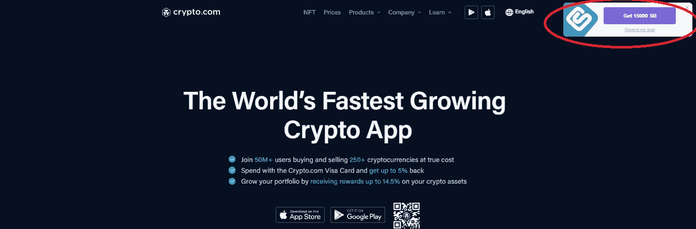

# 三重威胁— 3 笔价值 890 美元的简单交易

> 原文：<https://medium.com/coinmonks/triple-threat-3-deals-worth-890-dollars-bb346170510b?source=collection_archive---------14----------------------->

嘿，伙计们，我过去已经写了不少类似的文章，我想再一次分享和强调那些能带来可观回报的简单交易。过去几天出现的几笔交易:

# 1.eToro——240 美元+120 美元

为了有资格获得全部 360 美元，你首先必须在[开设一个免费的 gocashback](https://www.gocashback.com/r/1781159) 账户(这是一个在线购物返现门户网站)，然后点击他们页面上的链接开设一个 eToro 账户:

开立新的 etoro 账户后，向账户中存入至少 2000 美元，并至少进行一次交易(我相信可以是他们平台上任何交易的任何交易)，最后你需要至少 90 天不提取任何资金。为了获得全额$360 美元的资格，您实际上是将 [Gocashback](https://www.gocashback.com/r/1781159) 优惠与 eToro 的标准新帐户注册奖金叠加在一起。对于仅 90 天就获得 18%的投资回报率或 93.88%的 APY 来说，这还算不错。

我要直截了当地说我不是 eToro 的粉丝。复制交易的想法很酷，但老实说，我宁愿通过 3 commas[3](https://3commas.io/?c=tc1301390)来做，也不用担心蹩脚的付费墙。然而，如果你从来没有一个 eToro 帐户(或者 30 天内没有一个开放的帐户)，注册奖金已经有一段时间没有这么好了，所以我会说这可能是值得的 360 美元。

为了进一步澄清 30 天的旧帐户，我收集了一点猜测，即使你过去有一个帐户，但关闭了它，只要它被正式关闭超过 30 天，当重新打开一个新的帐户时，你可能有资格获得这笔奖金(但当然这并不保证，所以你要自担风险)。

# 2.苏菲——280 美元(甚至可能是 480 美元)

我过去曾写过关于 SoFi 的文章，但现在在 Swagbucks 上，他们的注册费用是我所见过的最高的，从 200 美元到 220 美元不等。另外的 60 美元来自另外两个应该会叠加的报价。不管出于什么原因，最初的 200 美元报价也仍然在我的账户上公布——我不确定它是否是 o 型，但我想 Swagbucks 可能会给你们两个积分。

为了获得资格，你首先需要有一个 [Swagbucks](https://www.swagbucks.com/register?rb=10826501&cmp=72&cxid=1200-twitter) 账户，在搜索功能中输入“sofi”，你应该会看到以下优惠:

为了获得**所有**优惠的资格，您需要完成以下步骤:

1.  至少有 200 美元的直接存款(220 美元+可能还有 200 美元)
2.  做一笔 10 美元或以上(50 美元)的交易
3.  用你的 SSN(10 美元)有效注册你的信用评分

就我个人而言，我不认为给另一方你的社会安全号码值 10 美元，但这只是我的看法。在过去的几年里，我一直在使用 SoFi，因为他们可以报销国际自动取款机的费用，如果你需要在旅行时取出当地货币，这绝对是一个好主意。哦，对了，另外苏菲也有联邦存款保险公司的保险。

不管怎样，如果你完成了所有三个要求，你将得到总共 48，000 SB。如果您决定通过 paypal 套现，这些 SB 可以通过礼品卡或直接现金的形式轻松兑换 1SB : 1 美分。每月一次，如果您获得特价兑换，您还可以获得比 1:1 更好的兑换:

我本人经常以 2,200 SB(相当于 22 美元)的价格获得 25 美元的亚马逊礼品卡。

如果你是 Swagbucks 的新手，请考虑支持这个博客，并使用我的推荐链接来赚取价值 13 美元的 SB:【https://www.swagbucks.com/register?rb=10826501】T4&CMP = 72&cxid = 1200-Twitter。开设一个账户是完全免费的，正如你将在下面看到的，Swagbucks 经常为随机注册提供许多促销优惠，而且我经常发现 Swagbucks 上的注册通常与任何可用的公共优惠一样好，如果不是更好的话。

# 3.Crypto.com——150 美元

同样在[上的还有 Crypto.com 的新会员注册交易。目前，在首次存款至少 100 美元并进行至少一笔交易后，您可以赚取 15，000 SB，可兑换 150 美元:](https://www.swagbucks.com/register?rb=10826501&cmp=72&cxid=1200-twitter)

你可能很幸运，只需通过 Swagbucks 搜索“Crypto.com”就能得到它，但对我个人来说，该优惠只通过 Swagbucks 扩展显示，你必须在访问该网站时下载并激活它:

我个人并不太喜欢 Crypto.com([尤其是他们的加密卡](/coinmonks/why-crypto-com-visa-cards-are-getting-worse-4407f0dba9b6))，但我绝对是免费资金的粉丝。

# 结论:

免费资金总是令人敬畏的，正如我之前提到的，SoFi 是联邦存款保险公司保险的，这基本上意味着你的资金由联邦政府支持，至少高达 25 万美元，所以在我看来，你真的只需要担心机会成本。我认为最大的痛苦是确保你的报价符合 Swagbucks——这些年来，我在所有不同的 swag bucks 报价中可能有 90%的成功率，但如果没有，如果你的奖金没有公布，你就必须通过客户服务。也就是说，我已经使用 Swagbucks 年了，在这段时间里，我已经赚了 1000 美元。如果你是 Swagbucks 的新手，请考虑支持这个博客，并使用我的推荐链接赚取价值 13 美元的 SB 并开设一个免费帐户:[https://www.swagbucks.com/register?rb=10826501&CMP = 72&cxid = 1200-Twitter](https://www.swagbucks.com/register?rb=10826501&cmp=72&cxid=1200-twitter)。

至于 gocashback，我已经使用 cashback 门户网站大约 4 年了，他们也有相当不错的记录。像 Swagbucks 一样，GoCashback 也是免费的，如果你使用我的推荐链接，你只需注册就可以获得 5 美元:【https://www.gocashback.com/r/1781159】T2

感谢阅读，请一如既往地在 twitter 上关注我，阅读我的所有最新发现和更新:【https://twitter.com/CryptosWith

声明:这些信息都不是财务建议，只是我在网上随便找的一个人的推测。请考虑这纯粹是教育和娱乐的目的。像往常一样，请做你自己的研究或联系财务顾问，找到什么投资可能最适合你。

> 交易新手？尝试[加密交易机器人](/coinmonks/crypto-trading-bot-c2ffce8acb2a)或[复制交易](/coinmonks/top-10-crypto-copy-trading-platforms-for-beginners-d0c37c7d698c)