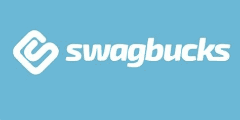

# 三重威胁——价值 677.50 美元的免费交易

> 原文：<https://medium.com/coinmonks/triple-threat-deals-worth-677-50-5cc78293be1e?source=collection_archive---------8----------------------->

嘿，伙计们，我过去曾写过关于 Swagbucks.com 的文章，但我认为最近出现的几笔交易值得一提。如果你不熟悉 Swagbucks，它基本上是一个大规模的返现网站，在这里你可以以“SB”的形式赚取积分或返现如果您决定通过 paypal 套现，这些 SB 可以通过礼品卡或直接现金的形式轻松兑换 1SB : 1 美分。每月一次，如果您有特价商品，您还可以获得比 1:1 更好的兑换:

我本人经常以 2,200 SB(相当于 22 美元)的价格获得 25 美元的亚马逊礼品卡。

如果你是 Swagbucks 的新手，请考虑支持这个博客，并使用我的推荐链接来赚取价值 13 美元的 SB:【https://www.swagbucks.com/register?rb=10826501】T2&CMP = 72&cxid = 1200-Twitter。开设一个账户是完全免费的，正如你将在下面看到的，Swagbucks 经常为随机注册提供许多促销优惠，我经常发现 Swagbucks 上的注册通常与任何可用的公共优惠一样好，如果不是稍好的话。

开户后，要访问以下每一项优惠，只需在搜索栏中键入“SoFi”、“Chime”或“Upgrade”，您应该会看到交易立即在屏幕顶部弹出。

# 苏菲(377.50 美元)

目前 SoFi 实际上有 4 个并发优惠，如果您完成所有 4 个，您可以获得高达 377.50 美元的奖励:

在过去的几年里，我一直在使用 SoFi，因为他们可以报销国际自动取款机的费用，如果你需要在旅行时取出当地货币，这绝对是一个好主意。

即使没有 ATM 费用，SoFi 也是一个非常可靠的选择，因为他们提供 2.50%的 APY 利息储蓄。他们也有价值 50 美元的免费加密购买选项，但老实说，我不会用它作为你的主要加密堆栈，因为它不是通过自保管钱包。

# 钟声(200 美元)

我在过去开了一个 Chime 账户，只是为了注册奖金，然后在几个月的直接存款后，我取出我的钱，然后忘记了它。所以对于 Chime 的实际用法，我就不多说了。然而，我得到了我的支出，看到了一点风险，因为这(像列表中的所有其他交易)都是联邦存款保险公司保险。

# 升级(100 美元)

不管你是否只是用它来获得 100 美元的注册奖金，升级似乎是一个非常可靠的选择，因为你可以在日常开支中获得 2%的现金返还，然后在其他事情上获得 1%的现金返还。

如果你看一下上面的条款，你会注意到他们真正需要的是 25 美元的押金，这比标准的推荐链接好得多，标准的推荐链接也提供 100 美元，但也要求你在 60 天内完成 3 次借记卡购买:

依我看，25 美元的押金要求要容易得多，尤其是如果你不确定你会实际使用多少升级卡的话。

# 结论:

免费资金总是令人敬畏的，正如我之前提到的，以上所有选项都有联邦存款保险公司的保险，这基本上意味着你的资金由联邦政府支持，至少高达 25 万美元，所以在我看来，这些注册没有太大的风险。我认为最大的痛苦是确保你的提议能被跟踪——这些年来，我做过的所有不同的 Swagbucks 提议的成功率可能有 90%,但如果你的奖金没有公布，你就必须通过客户服务。也就是说，我已经使用 Swagbucks 年了，在这段时间里，我已经赚回了 1000 美元。

同样，如果你是 Swagbucks 的新手，请考虑支持这个博客，并使用我的推荐链接赚取价值 13 美元的 SB 并开设一个免费账户:[https://www.swagbucks.com/register?rb=10826501&CMP = 72&cxid = 1200-Twitter](https://www.swagbucks.com/register?rb=10826501&cmp=72&cxid=1200-twitter)。

感谢阅读，请一如既往地在 twitter 上关注我，阅读我的所有最新发现和更新:【https://twitter.com/CryptosWith

声明:这些信息都不是财务建议，只是我在网上随便找的一个人的推测。请考虑这纯粹是教育和娱乐的目的。像往常一样，请做你自己的研究或联系财务顾问，找到什么投资可能最适合你。

> 交易新手？试试[密码交易机器人](/coinmonks/crypto-trading-bot-c2ffce8acb2a)或[复制交易](/coinmonks/top-10-crypto-copy-trading-platforms-for-beginners-d0c37c7d698c)