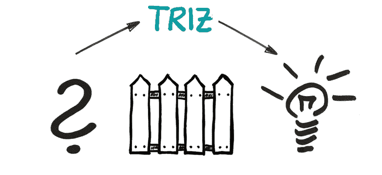

# 区块链项目中的 TRIZ 方法:创造性思维技术

> 原文：<https://medium.com/coinmonks/triz-method-in-blockchain-projects-creative-thinking-technology-8dcd34e8bf9c?source=collection_archive---------7----------------------->

人类不会停止前进，过去几十年证实了这一点——成就和发现的数量正在稳步增长。这都要归功于这样一个事实，即有些人找到了独特的算法来简化标准的常规流程。其中之一是 TRIZ 方法。创造性问题解决理论(TRIZ)是最有争议的方法之一。

**历史**

1946 年，苏联工程师、科学家和科幻小说作家 Genrich Altshuller 开始研究发明家最常用的解决问题的技巧。总之，他指出了 40 种技术，他称之为创造性解决问题的理论(TRIZ)。他得出的结论是，一个技术问题的解决导致了一个问题还没有答案的时刻，有很多选项。每个发明家都发现自己处于这种情况。Altshuller 还总结说，解决一个问题的最有效的方法是借助一个人已经拥有的资源(物质、时间、空间、人力等等)。那么答案就显而易见了。在 80 年代，这一理论被作为苏联学校教学方法的基础，并在工厂中使用。今天，TRIZ 被全世界广泛认可。领先的制造公司在工作中使用 TRIZ 方法和工具，如三星、LG、吉列、惠普、英特尔、波音、施乐、福特、丰田、柯达、强生等。每年都举行世界 TRIZ 会议，国际、亚洲和欧洲 TRIZ 协会都积极参与其活动。1998 年，Altshuller 学院在美国成立，旨在培训工程师和管理人员。

**什么事？**

TRIZ 是一套解决问题和改进系统的方法。有了它，你可以提高效率，提高解决复杂问题的能力，同时使用创造性的方法，发展想象力和灵活的思维。一些专家认为这一理论对开发创造性技能最有效，因为它不是基于评估，也不能提供唯一正确的答案。当一个人的创造性问题出现时，这个理论就被应用了。这些可能是那些没有用显而易见或熟悉的方式解决的问题。也就是说，你需要发明一些能帮助你在没有任何损失的情况下获胜的东西。

**什么时候使用？**

TRIZ 解码暗示了一些创造性的问题。当它们出现时，应用理论的需要就开始了。创造性问题是不能通过已知或明显的方法解决的问题。因此，需要一种能让你赢，同时又不会失去任何东西的发明。通往发明之路的第一步:重新表述问题，使表述本身切断低效的解决方案:

一切都应该保持原样

有害的、不必要的品质必须消失

要么会出现一种新的有用的品质

因此，当需要消除矛盾以解决矛盾时，或者换句话说，为了达到理想的最终结果，一个普通的任务就变成了一个创造性的任务。

**如何处理矛盾？**

矛盾是两个概念和判断之间的关系，每个概念和判断都是对另一个的否定。TRIZ 有三种矛盾。在列表中，它们按照分辨率从最简单到最困难的顺序排列:

ü当“系统需要改进，但我不知道如何改进或我没有权利这样做”时，就会发生管理冲突。这种矛盾可以通过研究额外的材料或作出行政决策来中和，也就是说，通过寻找可以解决这种矛盾的资源。

ü当系统的一个参数的改善导致另一个参数的恶化时，就会出现技术矛盾。例如，飞机的机翼需要坚固——为此需要更多的材料。但它应该是轻的——但这样它就不会很强。

④物理矛盾:“要改善系统，它的某一部分必须同时处于不同的物理状态，这是不可能的。”这是最困难的矛盾，因为它依赖于自然的物理法则。

**理想的解决方案**

理想的解决方案或理想的最终结果是在没有任何成本或损失的情况下解决问题。也就是说，没有使用外部资源，系统中没有任何东西变得更复杂，也没有不良影响出现。理想解决方案的制定可以通过三种方式进行，但在任何情况下，都要使用“自我”、“自身”、“由你自己”等词语。如果理想的解决方案制定正确，那么预期的效果将几乎免费实现，即利用现有的资源。因此，基本上，使用理想溶液的三种配方:

1.系统独立实现该功能。

2.没有系统，其功能是通过使用可用的资源来执行的。

3.该功能不是必需的。

**TRIZ 资源的种类**

资源是实现预期结果所必需的一切有用的东西。正如我们所记得的，为了达到一个结果，有必要只使用那些已经可用的资源。在 TRIZ，它们被分为几类:

ü临时

ü信息。这包括书籍和其他媒体，以及社会渠道。

ü材质。这里值得考虑的是设备、金钱或工具。

④空间性。面积、体积和其他资源。

ü人道主义。这一类别包括人本身及其能力，如视觉、听觉、嗅觉和触觉。

ü精力充沛。电、热、原子能、声音信号等等在这里脱颖而出。

ü其他。这包括文化、形象和其他资源，包括过去的事件。

**TRIZ 的决策技巧**

在 TRIZ，已经确定了 40 种不同的方法和技术来解决技术发明问题中的矛盾。下面我会列出 10 个最受欢迎的:

1.分裂的原则

它是这样工作的:

我们将物体分成独立的部分；

我们以部分形式执行任务；

增加分裂的程度。

2.发行原则

这里，我们从对象中分离出那些干扰或不需要的部分或属性，或者相反，我们选择必要的元素。

3.关联原则

为了实现它，我们执行以下操作:

我们连接同质的或用于相关操作的对象；

我们及时联合同质或相邻的业务。

4.相反的原则

这里我们遵循以下算法:

采取与问题条件相反的行动；

让运动的部分不动，让不动的部分动起来；

将物品内外翻转或上下颠倒。

5.有用行为的连续性原则

在实施过程中，必须持续开展工作。在这种情况下，所有元件必须始终满负荷运行，表演者应消除闲置和中间动作。

6.“化害为利”的原则

非标准方法，但有效，如下所示:

利用有害因素达到积极效果；

我们通过将有害因素与其他有害因素相结合来消除有害因素；

我们将有害因素强化到不再有害的程度。

7.“中介”原则

要实现它，您应该引入一个传递或转移动作的中间对象。您也可以将另一个容易移除的对象临时附加到项目对象。

8.自助服务的原则

这里一切都很简单——对象独立服务，如果需要，执行辅助和修复操作。

9.复制的原理

可以使用更简单或更便宜的复制品来代替不可接近的、复杂的、昂贵的、不方便的或易碎的部分。

10.廉价易碎而非耐用的原则

这意味着用较便宜的零件替换昂贵的零件，这些零件在某些方面不如原来的零件，如耐用性。

**TRIZ 和创造力**

为了理解 TRIZ 和创造性方法之间的共同点，让我们找出它们之间的一些相似之处。所以，这两种方法都是基于以下方法来寻找解决方案的:

头脑风暴是几个参与者对一个目标的积极讨论，没有对提案进行初步评估。每个人都应该提供尽可能多的解决问题的方案，即使这些方案实施起来不切实际。

类比方法包括比较和识别两个对象之间的相似性。与头脑风暴结合使用时效果很好。

形态学分析是对问题的单个元素及其在作品中的进一步组合的解决方案的探索。

聚焦物体的方法是寻找与随机物体的关联，并使用与主体无关的属性。

Robinson 方法包括寻找使用所选物品的最多样的方式。

系统运算符意味着找到允许您创建单独系统的连接

**如何利用 TRIZ 解决区块链问题**

为了使该技术有助于解决问题，建议遵循以下操作算法:

1.制定项目中的代码发明问题

2.分析系统并确定任务由哪些参数组成

3.识别矛盾，确定属于哪一类

4.制定理想的最终结果——应该是什么

5.确定有助于解决问题的可用资源

6.使用一种或多种合适的技术

7.分析结果

尽管这项技术最初是为了解决技术问题，但它在其他领域也有广泛的应用。在它的帮助下，你可以找到标准问题的非标准解决方案。事实上，每个人每天都在运用 TRIZ 技术和原理，只是不知道而已。

**作者谢尔盖·戈卢别夫(сергейголубев)**

[**Crynet 营销解决方案**](crynet.io) **、**[**vtorov . tech**](vtorov.tech)**、欧盟结构基金、ICO/STO/IEO 项目、NGO &投资项目、项目管理**

> 交易新手？尝试[加密交易机器人](/coinmonks/crypto-trading-bot-c2ffce8acb2a)或[复制交易](/coinmonks/top-10-crypto-copy-trading-platforms-for-beginners-d0c37c7d698c)