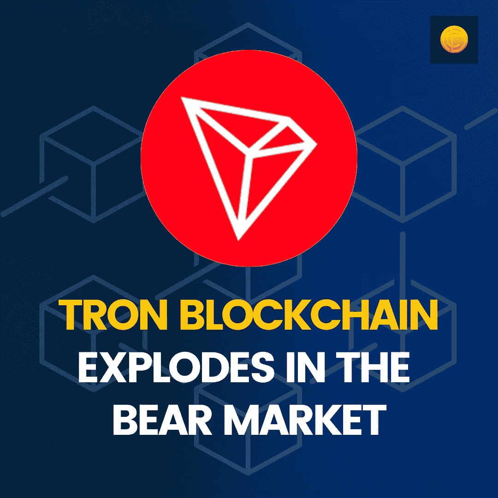

# TRON 区块链在熊市爆发

> 原文：<https://medium.com/coinmonks/tron-blockchain-explodes-in-the-bear-market-b1d3d4b3f98a?source=collection_archive---------42----------------------->

虽然一些[加密货币](https://blog.coindhan.com/2022/08/09/tron-blockchain-explodes-in-the-bear-market-a-2-billion-locked-in-tvl-on-defi/)可能在过去几个月里经历了一次演习，但 Tron 生态系统已经找到了新的动力。由于最近市场动荡带来的稳定需求，该生态系统已经超出了其他加密货币的神经。Tron 的 TVL 已从 7 月份的 39.5 亿美元加速至 60 亿美元。在不到一个月的时间里，估值健康地上涨了 20 亿美元。这是史无前例的，因为当前的市场动态和宏观因素不利于风险资产。

# 创是什么？

Tron 是一个生态系统，通过使用 Tron 区块链，以数字形式促进对等基础上的娱乐内容共享。为了简化这个操作，使用了 Tron 生态系统的原生令牌 Tronix。简而言之，就是俗称的 Tron。

# 为什么最近 Tron 爆了？

这种冲动主要归因于期待已久的以太坊的合并，这一合并姗姗来迟；尽管如此，它终于发生了。Vitalik Buterin 已经说过，他们已经推迟了修复，因为错误，但非常关注！它将被解决，以太坊将变得强大和可扩展。这点燃了 DeFi 生态系统的新希望，因为以太坊已经在其生态系统上推出了近 70%至 80%的 [DeFi](https://blog.coindhan.com/2022/07/15/top-defi-projects-of-2022/) 。

由于创拥有最支持 DeFi 生态系统的智能合同，并且许多稳定的硬币都托管在创区块链上，这是 DeFi 空间的构建模块，从理性的角度来看，这种势头无疑是有效的。

# [如何购买创令牌？](https://www.coindhan.com/trading/trxinr)

购买 Tron 令牌非常简单。你可以直接通过借记卡或信用卡购买，也可以通过 P2P 购买。点对点交易是 Coindhan 平台将在未来几天推出的一项新功能，旨在提高交易效率。Coindhan 拥有所有智能功能，如 3 步快速 KYC、止损和限价单，可帮助您在平台上轻松交易。然而，加密货币市场涉及大量风险，保持正确的风险偏好是维持市场的必要条件。也就是说，DYOR，无论何时你进入加密市场，都要做好自己的研究。

> 加入 Coinmonks [电报频道](https://t.me/coincodecap)和 [Youtube 频道](https://www.youtube.com/c/coinmonks/videos)了解加密交易和投资

# 另外，阅读

*   [印度最佳 P2P 加密交易所](https://coincodecap.com/p2p-crypto-exchanges-in-india) | [柴犬钱包](https://coincodecap.com/baby-shiba-inu-wallets)
*   [8 大加密附属计划](https://coincodecap.com/crypto-affiliate-programs) | [eToro vs 比特币基地](https://coincodecap.com/etoro-vs-coinbase)
*   [最佳以太坊钱包](https://coincodecap.com/best-ethereum-wallets) | [电报上的加密货币机器人](https://coincodecap.com/telegram-crypto-bots)
*   [交易杠杆代币的最佳交易所](https://coincodecap.com/leveraged-token-exchanges) | [购买 Floki](https://coincodecap.com/buy-floki-inu-token)
*   [3Commas 对 Pionex 对 Cryptohopper](https://coincodecap.com/3commas-vs-pionex-vs-cryptohopper) | [Bingbon 评论](https://coincodecap.com/bingbon-review)