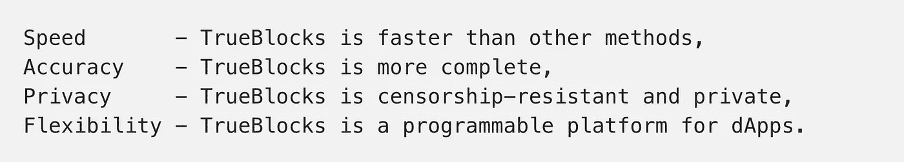
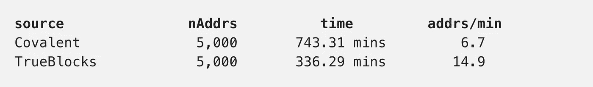
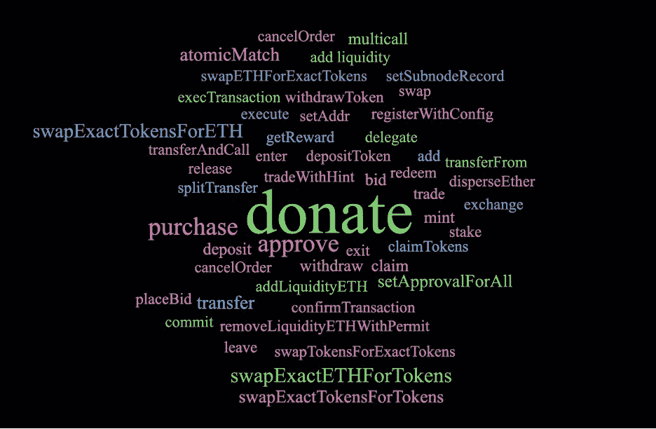
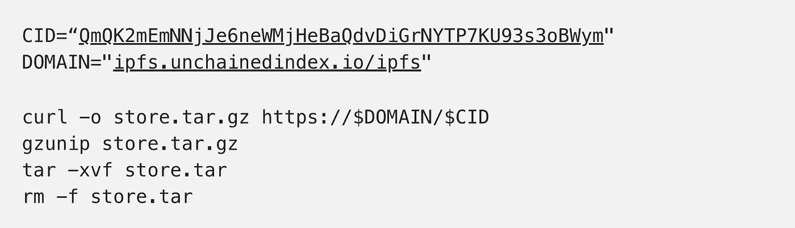

# 真实模块/共价比较

> 原文：<https://medium.com/coinmonks/trueblocks-covalent-comparison-7b42f3d1e6f7?source=collection_archive---------4----------------------->

# 介绍

本文通过将我们的软件与流行的共价 API 进行比较，强调了使用 TrueBlocks 的主要优势，true blocks 是区块链数据提取的本地优先解决方案。优点是:



我们通过在一台“结实”的 Mac 笔记本电脑上本地运行 TrueBlocks 进行了分析(*苹果 M1 Max，64GB 内存，蒙特利版本 12.2.1* )。在同一台机器上，我们将 Erigon Ethereum mainnet 客户端作为归档节点运行。

我们从同一台机器上查询了[这个文档](https://www.covalenthq.com/docs/api/#/0/Get%20transactions%20for%20address/USD/1)中描述的共价 API。注意共价是一种“共享资源”，因此*必然*受速率限制。

# 我们的流程

我们使用 TrueBlocks APIs 提取了 5000 个随机选择的以太坊地址的交易历史。我们使用共价的相应 API 来提取相同的历史。然后我们比较了结果。

整个过程，连同到我们使用的 shell 脚本的链接以及关于如何访问我们生成的数据的信息，在这里详细介绍[。](https://github.com/TrueBlocks/tokenomics/blob/main/explorations/covalent/PROCESS.md)

我们将在下面讨论这四个优点，然后讨论潜在的错误来源。

# 优势

## 速度:TrueBlocks 更快

我们提取了两组数据。一个针对真嵌段，另一个针对共价。在下表中，我们给出了完成这两个假设相同的任务所花费的时间。



**注意:**从共价提取时，我们被迫减慢处理速度，否则我们的请求就会超时。经过实验，我们决定为每个共价请求增加一秒钟的延迟，以避免超时。这又增加了 83.3 分钟的处理时间。虽然有更好的方法来撤销 API，但是我们认为额外的编程工作是不必要的，特别是考虑到我们不需要为 TrueBlocks 做同样的事情。

**结果:** TrueBlocks 的速度几乎是共价的两倍。

## 准确性:TrueBlocks 更完整

从每个来源提取数据后，我们比较了结果。结果连我们都感到惊讶。

我们查询了 5000 个随机选择的地址。在 ***中，没有一种情况*** 中共价返回的结果比 TrueBlocks 多。对于其中的 3174 个地址，TrueBlocks 返回的结果比共价的多。

结果总结如下:

```
 **Covalent returned data      TrueBlocks returned data
nAddrs       that TrueBlocks did not       that Covalent did not**
5,000                  -                           3,174
```

通过返回的事务总数查看的相同信息如下:

```
**nTxs (Covalent)   nTxs (TrueBlocks)       Diff       Material**
  1,336,508           1,534,997         198,489       45,328
```

**注:**按照我们的说法，一项“重大”交易是指地址的以太网余额因交易而发生变化的交易。TrueBlocks 有能力进一步扩展这个定义，以包括任何 ERC20 令牌余额，但是，我们选择不这样做。如果我们这样做了，上述结果会更加偏向于我们。

**结果:** TrueBlocks 比其他方法找到更多的数据。

## 为什么 TrueBlocks 更准确？

这怎么可能呢？事实证明这相当简单。TrueBlocks 更深入地挖掘数据。这种“更深入挖掘”的能力*与完全本地的 TrueBlocks 不受速率限制的事实*不无关系(我的意思是它非常相关)。我们在针对非链式索引的[规范的第一个版本中讨论了这个问题。](https://trueblocks.io/papers/2022/file-format-spec-v0.40.0-beta.pdf)

我们研究了“材料”交易(45，328)。我们查看了构成这些事务的函数调用——它们输入数据的前四个字节。

我们发现了 436 种不同的四字节模式，其中 253 种是我们“已知的”(也就是说，我们能够从 EtherScan 下载 ABI 文件)。函数调用可以在数据存储的`reason`文件夹中找到(参见[我们的数据管道](https://github.com/TrueBlocks/tokenomics/blob/main/explorations/covalent/PROCESS.md)的描述中如何获取数据)。

我们总结一下这个词云中的“已知”功能:



Word cloud of missed material transactions found by TrueBlocks but not Covalent

下面我讨论一下最明显的功能(捐赠)，但是看看这些词:`donate`、`splitTransfer`、`withdraw`、`placeBid`、`atomicMatch`、`addLiquidity`。这些词尖叫，“价值转移。”共价没有返回它们。难怪 mainnet 上的每块统计根本没用。

**结果:**如果一个人遗漏了交易，他甚至不能指望在一个精确到小数点后 18 位的分类账上做完美的核算。

## 隐私:TrueBlocks 是本地优先的

TrueBlocks 完成的所有处理，包括访问 Erigon 节点，都在本地运行(在笔记本电脑上！).我们幸福地躲在防火墙后面。我们称这种操作模式为“在节点后面运行”我们认为节点是一个屏障，不仅可以防止不完整或不准确的数据，还可以防止审查和窥探。TrueBlocks 根本不要求第三方提供任何数据(ABIs 除外:-)。这些都不是共价的。

**结果:** TrueBlocks 允许更快地获得*更好的数据*并且是完全保密的。

## 灵活性:TrueBlocks 是一个平台

TrueBlocks 是一个由许多组件组成的开源软件包。有一组命令行工具、一个 API 服务器、一个 docker 包、一个地址监控系统、一个索引器，以及一个越来越强大的文档化 GoLang 包和 SDK 的集合。你可以用它来编程，就像我们完成这项研究一样。

**结果:** TrueBlocks 是一个工具和库的平台，面向个人用户和开发者，能够本地、准确、私密和灵活地工作。

# 误差来源

为了完成这篇文章，我们在分析中提出了几个可能的误差源。我们欢迎任何旨在帮助我们改进工作的意见。

## 数据集中与 GitCoin 相关的地址占优势

我们研究的许多地址都与 GitCoin 智能合约进行了交互。由于这个原因，许多“丢失”的函数调用是`donate`(大约 71%)。虽然说 TrueBlocks 返回了这些事务而共价没有返回是准确的，但是说共价可以很容易地将这种“特例”添加到它们的处理中也是准确的。然而，我想指出的重要一点是，TrueBlocks 没有“特例”。TrueBlocks 有目的地处理数据，而不知道其含义。这是我们找到交易而其他方法找不到的主要原因。我们称这方面的工作为“不受长尾问题的困扰”

**结果:**我们的数据倾向于某种类型的地址。

## 共价原料药的误用

我们尽了最大努力来研究共价 API 并正确使用它们，但我们可能遗漏了一些东西。如果我们做了，请让我们知道。也许共价有付费 API 端点，提供更好的数据。但是，如果是这样的话，问问自己这是否符合 web3 的精神。

**结果:**我们可能误用了公共共价 API。

## 关注较小的地址

我们有目的地将我们的研究限制在少于 6，000 笔交易的地址。虽然 TrueBlocks 可以轻松处理更多事务的地址，但共价限制了速率。我们认为，如果我们查询超过 6000 次交易的地址，我们会遇到两个问题:(1)共价将变得太慢，不切实际，(2)共价将禁止我们从他们的网站。

**结局:**限速烂透了。如果你运行自己的节点(和 TrueBlocks)，你将不会受到速率限制。

## 块范围限制

我们有目的地从分析中排除了 3，000，000 块之前的交易。令人惊讶的是，我们发现共价已经为 2016 年 10 月以太坊 dDos 攻击的许多交易这样做了。虽然他们这样做是合理的，因为许多交易都不是“实质性的”，但它提醒我们，集中式 API 可以在未经我们允许(或不知情)的情况下，成为他们向用户显示哪些数据的仲裁者 TrueBlocks 则不是这样。如果我们包括了那些记录，这项研究的结果将会更加偏向于我们。

**结果:**在该分析中忽略了一些较老块。

# 再现结果

有人说“区块链数据不是火箭科学”也有人说是。我们说它至少应该是科学——毕竟，分类账精确到小数点后 18 位，并且不可改变。一切都应该是可再生的。下面是如何做到这一点:

## 使用这个回购

1.  克隆[这个 repo](https://github.com/TrueBlocks/tokenomics) 并转换到`./exploration/covalent`文件夹。
2.  访问共价网站并获得 API 密钥。将密钥(单独)放在`covalent`文件夹中的一个名为`.env`的文件中。
3.  运行`./init`设置文件夹，构建一个简单的后处理工具(需要`go`语言版本 1.18 或更高)。
4.  收集你自己的地址列表(或者使用我们的——见文件夹中的文件`addresses.txt`)。创建一个名为`./download`的 shell 脚本(或者使用我们的)。让 shell 脚本反复调用`./download.1`(就像我们的一样)来处理每个地址。
5.  运行`./download`命令。
6.  该命令的结果将被放置在名为`./store`的文件夹中适当命名的子文件夹中。

## 获取数据

我们非常努力地想让数据重现。你所需要的只是一个共价的 API 密匙，一个本地运行的 TrueBlocks 版本，一个本地运行的 Erigon 版本，以及几天或几周等待数据下载。或者，您可以使用以下命令直接从 IPFS 下载我们的数据:



# 结论

加入范式转变。运行自己的节点。索引你自己的数据。加快你的生活！我们已经展示了本地优先软件甚至在较小的硬件上也比 API 更快。我们已经证明了本地优先软件可以是私有的。但是，最重要的是，我们已经证明了一个人可以“挖掘得更深”这是因为速度。你还在等什么？加入我们的使命。

# 支持我们的工作

首先，感谢我们最大的支持者，梅里亚姆·赞迪和达维德·斯拉克塔，感谢你们对这篇文章的帮助。

TrueBlocks 的自筹资金来自我们自己的个人资金和我们的支持者的赠款，包括以太坊基金会(2018 年)、Consensys (2019 年)、Moloch DAO (2021 年)、Filecoin/IPFS (2021 年)，当然，还有我们的 GitCoin 捐助者。

如果你喜欢这篇文章并希望支持我们的工作，请向我们的 git coin grant[https://gitcoin.co/grants/184/trueblocks](https://gitcoin.co/grants/184/trueblocks)捐款。即使很少的量也会有很大的影响。

如果您愿意，可以直接通过 **trueblocks.eth** 或`0xf503017d7baf7fbc0fff7492b751025c6a78179b`将 ETH 或任何其他令牌发送给我们。

> 交易新手？尝试[加密交易机器人](/coinmonks/crypto-trading-bot-c2ffce8acb2a)或[复制交易](/coinmonks/top-10-crypto-copy-trading-platforms-for-beginners-d0c37c7d698c)