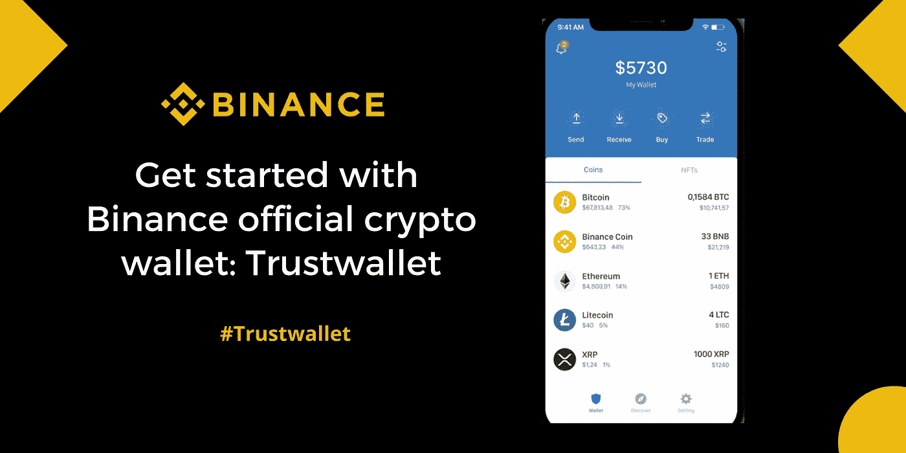
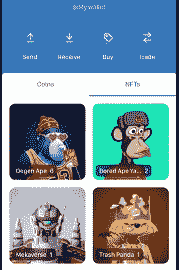

# 新手的信任钱包(简而言之)

> 原文：<https://medium.com/coinmonks/trust-wallet-for-beginners-in-a-nutshell-6bbde888b441?source=collection_archive---------38----------------------->

对密码世界的陌生意味着你必须不断学习。币安的官方加密钱包应该是优先考虑的，尤其是如果你在币安的生态系统中玩的话。

Trust wallet 提供了一种多样化的加密货币钱包软件，本质上为用户提供了一个访问和控制其数字资产的中央基础。用户可以购买，存储，交换，收集 NFT 和赚取密码。

信任钱包应用程序可在 Play store 和 App store 下载。它目前支持 65 个区块链，拥有超过 450 万个加密资产，包括分散的应用程序。由于其简单的用户界面，该平台吸引了 1000 多万用户。

Trust wallet 本质上只是一个中介，用户可以通过它的节点连接到各种区块链。此外，联系信息仅在交易方之间共享，您可以放心，个人信息不会共享给第三方用户。

该平台实际上并不持有用户资金，用户完全负责并持有对其私钥的访问权。下载该应用程序后，用户可以发送、接收和存储多种密码。

Trust Wallet 还可以访问以太坊区块链和币安智能链上的 DApps。因此，用户可以在信任钱包上使用 DApps，而无需登录。

此外，该应用程序还可以用来管理你的 NFT 和游戏资产。信任钱包支持币安智能链和以太坊 NFTs。用户可以从 Open Sea 等受支持的 NFT 市场交易 NFT，也可以将他们的 NFT 资产转移到该应用程序。

## 信任钱包主要用于:

1.  **购买密码**——平台赋予用户购买密码的能力。你只需要一张信用卡/借记卡，你就可以购买 40 多种加密资产。
2.  **赌注加密**——如果你正在寻找一个大钱包来赚取额外的利息，trustwallet 应该是你的首选。你可以获得高达 11%的密码资产年利率。
3.  **互换和交换**——通过 Trustwallet 的分散交换，跨链互换成为可能。例如，您可以交换 BEP-2 和 BEP-20 令牌，但是这将花费您一些网络费用。
4.  花掉并储存稳定积分 -信托钱包是储存稳定积分的好地方，可以花在你认为合适的地方。持有一些稳定的硬币将始终确保你的加密资产保持易变。

信托钱包最突出的一点是，它的交易和交换费用为零。产生的唯一费用是网络费用，产生于交易发生的区块链。

要开始使用信任钱包，只需前往您的 playstore 或 Appstore 下载即可。

如果您还没有开通您的币安账户， [***这里开通一个> >***](https://accounts.binance.com/en/register?ref=431277160)

***关联披露:*** *本帖包含关联链接。如果您使用这些链接购买一些东西，我们可能会赚取佣金，对您没有额外的费用。感谢*。

> 交易新手？尝试[加密交易机器人](/coinmonks/crypto-trading-bot-c2ffce8acb2a)或[复制交易](/coinmonks/top-10-crypto-copy-trading-platforms-for-beginners-d0c37c7d698c)