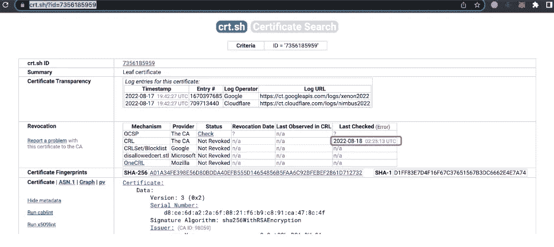

# 策勒网络 cBridge 跨链桥事件背后的真相:BGP 劫持

> 原文：<https://medium.com/coinmonks/truth-behind-the-celer-network-cbridge-cross-chain-bridge-incident-bgp-hijacking-52556227e940?source=collection_archive---------1----------------------->

## 背景

Celer Network 官员在 8 月 18 日声明，在北京时间 3:45 到 6:00 之间，某些 cBridge 用户被定向到恶意智能合同。最初，cBridge 前端接口疑似遭到 DNS 劫持。

完全不同于以往的游牧、虫洞、浪人、和谐等跨链桥黑客事件。，此次攻击并非由智能合约和跨链协议中的 bug 或相关服务器的入侵引起，锁定在 cBridge 中的跨链资产也一直保持安全。**在此次攻击中，黑客直接针对 Celer 系统之外的互联网架构中的底层基础设施，通过欺骗互联网底层路由协议(BGP)，允许跨链用户在一段时间内访问一个“钓鱼”前端用户界面。**由于响应迅速，Celer network 能够限制损失。这是因为 Celer 网络团队拥有 24 小时监控系统。他们的客户服务团队能够及时发现问题并提醒社区。Celer Network 团队授权 SlowMist 安全团队对这一紧急事件做出响应，并进行深入调查。

[https://twitter.com/CelerNetwork/status/1560022871564775424](https://twitter.com/CelerNetwork/status/1560022871564775424)

## 分析处理

Celer Network 团队最初怀疑是 DNS 劫持，在与他们沟通后，我们能够了解到有关该域名的更多信息:cbridge-prod2.celer.network。我们发现浏览器在攻击期间没有报告证书错误。因此，我们的调查首先从解决 DNS 劫持的可能性开始。(特别感谢 [@greysign1](https://twitter.com/greysign1) 帮助我们快速排查 DNS 劫持的可能性)

我们首先查看相关的证书信息:

[https://crt.sh/?q=celer.network](https://crt.sh/?q=celer.network)

该证书似乎已被意外更改，由 Let's Encrypt 颁发的原始证书被替换为由 GoGetSSL 颁发的伪造证书。

GoGetSSL 可以免费发放 90 天的证书:

[https://www.gogetssl.com/sslcerts/free-ssl/](https://www.gogetssl.com/sslcerts/free-ssl/)

*   证书 1 分析:【https://crt.sh/?id=7356185959 

[https://search.censys.io/certificates/a01a34fe398e56d80bdda40efb555d14654856b5faa6c92bfebef2861d712732](https://search.censys.io/certificates/a01a34fe398e56d80bdda40efb555d14654856b5faa6c92bfebef2861d712732)

证书上在以下时间出现 CRL 检查错误:

*   证书 2 的分析:[https://crt.sh/?id=7356185959](https://crt.sh/?id=7356184952)

[https://search.censys.io/certificates/579fabee3a9f7efecd43c99795744c4b93dc49a4fb93e174b201f8a333990c1a](https://search.censys.io/certificates/579fabee3a9f7efecd43c99795744c4b93dc49a4fb93e174b201f8a333990c1a)

此证书在以下时间也有一个 CRL 检查错误:

在检查了 IP 地址、证书以及与证书 1 相关的其他信息后，我们发现该证书绑定的 IP 地址是 44.235.216.69。

[https://search.censys.io/hosts/44.235.216.69](https://search.censys.io/hosts/44.235.216.69)

证书 2 的 IP 地址未能查询到证书 2 对应的 IP 地址，可能是由于攻击持续时间短，互联网搜索引擎未能收集到相关信息。

因此，我们重点分析了 cbridge-prod2.celer.network 域的 IP 解析数据:

IP 地址 44.235.216.69 与 cbridge-prod2.celer.network 关联了很长一段时间。

问题是:这个 IP 地址 44.235.216.69 与 cbridge-prod2.celer.network 关联了很长一段时间，这一事实证明它属于官方的 Celer Network 服务器。Celer Network 团队也证实了这一点。那么为什么会有一个伪造的证书与这个 IP 相关联呢？

于是我们开始调查 44.235.216.69 的 AS，发现这个 IP 对应的 AS 不一般。

AS16509 *宣布波哥大*:

[https://bgp.he.net/AS16509](https://bgp.he.net/AS16509)

浏览 bogons，我们能够确定这通常是攻击者假冒 IP 地址来执行攻击的情况:
[https://network direction . net/articles/routingandswitching/BGP-bogonsandmarshall/](https://networkdirection.net/articles/routingandswitching/bgp-bogonsandmartians/)
[https://forum.networklessons.com/t/what-are-bogons/6333](https://forum.networklessons.com/t/what-are-bogons/6333)

由于 44.235.216.69 的 AS 出现异常，我们首先怀疑是 BGP 的问题，因此我们联系了 Celer Network 以获取攻击者 54.84.236.100 的 IP 地址。我们发现 IP 地址所在的 AS14618 也有异常。(AS14618 也宣布博贡)

巧合的是，AS14618 的上游是 AS16509 (AS16509 也是 44.235.216.69 所在的 AS)。这提醒我们 BGP 劫持攻击的可能性。

我们的调查显示，IP:54.84.236.100 被标记为恶意。

我们从我们的社区收集了关于 IP:54.84.236.100 的相关信息，发现其中提到该 IP 地址与 2014 年发生的另一起 BGP 劫持事件有关。但是，因为这件事发生在很久以前，所以可能不再相关。

[https://www.secureworks.com/research/bgp-hijacking-for-cryptocurrency-profit](https://www.secureworks.com/research/bgp-hijacking-for-cryptocurrency-profit)

然后，我们根据 BGP 劫持留下的记录继续调查:

追踪攻击 IP 的 BGP 记录:54.84.236.100 透露该路由不再可用。

我们继续跟踪 celer 的 IP:44.235.216.69 的 BGP 路由器踪迹，并且能够找到正确的路由。

然后我们查看了 BGP 节点变更日志:
北京时间:2022 年 8 月 18 日上午 2:48—2022 年 8 月 18 日上午 7:48 UTC+8

在 2022 年 8 月 18 日，在英国夏令时凌晨 2:48-7:48 之间的时间段发现有大量节点添加和删除变更记录。

我们继续监控 AS 更改日志，发现 AS14618 以前有路由信息 44.235.216.0/24，但该路径后来被更改为撤销，这证明:

1.  AS14618 中的 44.235.216.0/24 曾经是最佳路径
2.  现在 AS14618 中的 44.235.216.0/24 不再是最优路径；它被撤回了。

(当 BGP 劫持发生时，攻击者将发布一条最佳路径，将流量定向到自己的服务器)

[https://smakd.potaroo.net/cgi-bin/per-as?as=14618](https://smakd.potaroo.net/cgi-bin/per-as?as=14618)

为了获得更准确的数据，我们使用以下 bgplay 来检查攻击前后与 44.235.216.69 相关的路径变化。

[https://stat.ripe.net/special/bgplay#bgplay_fetch.resource=44.235.216.69](https://stat.ripe.net/special/bgplay#bgplay_fetch.resource=44.235.216.69)

在 2022 年 8 月 17 日，我们可以看到在 19:19:23 +UTC 和 23:19:23 +UTC 之间的时间段内，BGP 路由路径的信息出现了明显的波动。

这种变化反映在将流量从 44.235.216.0/24 定向到 AS14618，在攻击后，流量从 44.235.216.0/24 通过 AS16509 出去。

因此，我们认为这一事件很可能是 BGP 劫持事件，其中 AS14618 似乎是受攻击者控制的节点(AS14618 的路由器可能存在安全问题，可能被攻击者利用)，攻击持续约 4 小时。

攻击者能够将证书 1(伪造的证书)绑定到 Celer Network 的 IP:44.235.216.69，因为攻击者有一个具有相同 IP 的恶意服务器。由于 gogetssl 支持 http 进行身份验证，他们可以将 gogetssl 提供的文本输入到恶意服务器中。因此，可以通过 BGP 劫持将流量定向到具有相同 IP 的恶意服务器来绑定证书 1。因此，浏览器会收到证书错误的警告。

我们确定 AS14618 是由攻击者控制的，原因如下。

1.  攻击者首先将 44.235.216.69 的流量定向到 AS14618，并在攻击后将 44.235.216.69 路由回 AS16509。
2.  攻击 IP:54.84.236.100 也在 AS14618 里面。
3.  袭击发生后，AS14618 被撤回 44.235.216.69。

要回答这个问题:这个 IP 地址 44.235.216.69 与 cbridge-prod2.celer.network 关联了很长一段时间，这一事实证明它属于官方的 Celer Network 服务器。Celer Network 团队也证实了这一点。那么为什么会有一个伪造的证书与这个 IP 相关联呢？

如果您使用 HTTPS 协议进行通信，在没有获得证书的私钥的情况下，您无法加密/解密数据(包括客户端/服务器通信的数据)。因此，为了确保证书的正确性并能够实施中间人攻击，攻击者需要将权威机构申请的证书重新绑定到具有相同 IP 44.235.216.69 的恶意服务器上。这使得攻击者能够解密客户端的数据，并将恶意代码插入到响应数据包的数据中。

## 分析结论

我们与 Celer Network 团队合作调查了这次攻击。尽管事实上这是 Celer 网络上一次复杂的 BGP 劫持尝试，攻击者准备了从攻击时机、证书伪造、as 控制和其他操作的一切。

最终，我们认识到许多项目已经意识到与 BGP 劫持攻击相关的风险，并采取了适当的预防措施。然而，许多人仍然没有意识到，特别是当涉及到由 AS 变化引起的网络路径修改时。如果没有足够的准备和响应措施，同一攻击者或其他攻击者发动进一步攻击的风险相当大。因此，我们敦促组织、ISP 和服务器托管提供商认识到这种风险，并协调防御策略，以防止类似事件再次发生。和往常一样，如果您需要帮助，请联系 SlowMist 安全团队。

## 附件

BGP 劫持原理参考链接:
[https://www . cloud flare . com/en-us/learning/security/glossary/BGP-jacking/](https://www.cloudflare.com/en-us/learning/security/glossary/bgp-hijacking/)

cbridge-prod2.celer.network DNS 图表:

> 交易新手？试试[密码交易机器人](/coinmonks/crypto-trading-bot-c2ffce8acb2a)或者[复制交易](/coinmonks/top-10-crypto-copy-trading-platforms-for-beginners-d0c37c7d698c)