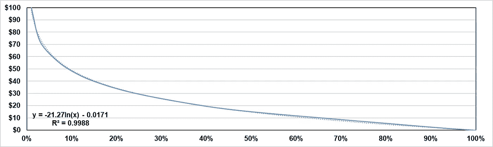

# 调整比特币网格交易机器人中的网格增量

> 原文：<https://medium.com/coinmonks/tuning-the-grid-increment-in-bitcoin-grid-trading-bot-to-significantly-increase-its-profitability-c077bca27b7a?source=collection_archive---------22----------------------->

# 介绍

网格交易是一种流行的策略，包括在预定的价格水平下一系列的买卖订单，在图表上形成网格模式。这个策略可以用来利用市场趋势、波动或其他因素。网格交易可以手动完成，但也可以使用一种叫做网格交易机器人的软件实现自动化。

Grid Trading bot illustration

网格交易机器人是自动化的投资工具，它使用算法根据预定的网格交易策略来买卖资产。这些机器人可以被编程为遵循从简单到复杂的广泛策略，并可用于投资各种资产，包括股票、加密货币等。

网格交易机器人可以提供一种方便且潜在有利可图的交易方式，但它们也有自己的风险和考虑因素。在这个 [Medium](/@mohrabandah) 故事中，我们将探索网格交易机器人的基础知识，它们是如何工作的，以及在使用之前你应该考虑什么。

> 交易新手？在[最佳加密交易](/coinmonks/crypto-exchange-dd2f9d6f3769)上尝试[加密交易机器人](/coinmonks/crypto-trading-bot-c2ffce8acb2a)或[复制交易](/coinmonks/top-10-crypto-copy-trading-platforms-for-beginners-d0c37c7d698c)

# 网格交易机器人参数

网格交易机器人通常有许多可调参数，允许用户定制他们的投资策略。以下是关于四个常用参数的更多信息:上限、下限、网格数和网格增量。

1.  上限:该参数决定网格交易机器人发出卖出指令的最高价格。例如，如果将上限设置为高于当前市场价格 10%，机器人将不会发出高于此价格的卖出订单。
2.  下限:该参数决定网格交易机器人发出买入订单的最低价格。例如，如果下限设置为低于当前市场价格 10%，则机器人不会发出低于此价格的购买订单。
3.  网格数量:该参数确定网格交易机器人将在上限和下限内发出的买卖订单数量。例如，如果网格数设置为 10，机器人将在当前市场价格以下发出 5 个买入订单，在当前市场价格以上发出 5 个卖出订单。
4.  网格增量:该参数决定网格交易机器人发出的买卖订单之间的间隔。例如，如果网格增量设置为$50，机器人将在当前市场价格上下 50 美元的间隔下订单。

注意:当上限和下限预先确定时，网格数和网格增量可能是多余的。

这些参数可以根据用户偏好的投资策略和风险承受能力进行调整。需要注意的是，不同的网格交易机器人可能有不同的参数和选项，用户应该在设置机器人之前仔细查看和理解这些。

# **为什么是比特币？**

由于竞争加剧和商业模式的变化，加密货币交易所近年来一直为包括比特币在内的某些资产提供 0 美元的交易费。这一趋势极大地有利于交易机器人，如网格交易机器人，因为它们被编程为进行大量交易。由于交易费用为零，网格交易机器人有更多的灵活性来调整他们的头寸和利用市场机会，特别是在快速变化的市场中。

此外，零交易费可以提高网格交易机器人的风险回报率，让它们在不产生重大成本的情况下更积极地交易，这在价格波动可能很小的横向市场中非常有用。需要注意的是，可能会收取其他费用，在设置网格交易机器人之前，查看任何交易所的收费表是非常重要的。零交易费的趋势也可能随着时间的推移而改变。

# 网格增量调谐

为了评估网格增量参数对网格交易机器人性能的影响，将使用来自横向市场条件的真实比特币价格数据，使用不同的网格增量值来测试机器人，以便消除价格变化的影响。

Bitcoin price data (04/08/2022)

网格交易机器人测试了四次，初始投资都是 1000 美元，上限和下限分别是 43，900 美元和 42，700 美元，这些都是根据可用数据选择的。为了选择网格增量值，绘制了每分钟比特币价格的变化，因为网格交易机器人旨在捕捉任何大于网格增量的价格变化。用 1 美元、10 美元、50 美元和 100 美元的网格增量值进行了四次测试，分别得到 1200、120、24 和 10 个网格。

Change in Bitcoin price per minute (04/08/2022)

此外，通过绘制网格增量相对于大于网格增量的价格变化百分比，发现这两个变量之间存在对数关系。

Percentage of price change larger than the grid increment

以 1 美元、10 美元、50 美元和 100 美元的网格增量值测试网格交易机器人，结果分别获得 1.71%、1.49%、1.12%和 0.84%的利润，而同期比特币价格上涨了 0.66%。当计入比特币价格升值时，bot 利润为 1.05%、0.82%、0.45%和 0.18%。

Investment value of different grid increment

最后，下图说明了利润百分比与网格数量的关系。可以观察到，800 格(格增量 1.5 美元)后，盈利能力并没有随着格数的增加而提高，200 格以下(格增量 6 美元)，盈利能力随着格数的减少而显著下降。

Percent of profit against the number of grids

# 解释

基于上面显示的例子，如果网格增量大于 6 美元，或当时比特币价格的 0.0139%，则网格交易机器人无效。许多加密货币交易所对可以使用的网格数量有限制，由于网格交易机器人需要大量的网格，因此很可能会超过这些限制，使其成为无效的策略。

我个人在考虑研究另类交易策略。有什么建议吗？