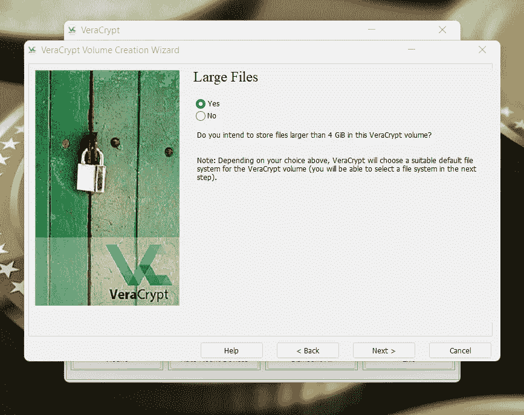

# 将闪存盘变成安全的加密钱包

> 原文：<https://medium.com/coinmonks/turn-a-flash-drive-into-a-secure-crypto-wallet-dc2e528f99de?source=collection_archive---------12----------------------->

检查我的所有内容和一堆新内容的新网站。我希望它能帮助人们获得和学习 Crypto。我的目标是向每个人展示在线获得加密是多么容易，保证它的安全又是多么容易。

[哈蒂斯沙克](https://www.hattysshack.org/)

我希望每个人都度过了美好的一周。我想花点时间向大家展示创建自己的冷钱包是多么容易。最长的一段时间，我想买一个大牌的钱包。最终，当我攒够钱后，我买了一台 SecuX V20。我认为这是一个伟大的想法，我可以保持我的密码安全，并开始保存它。我最终在那里存了一大笔钱。对很多人来说只是小钱，但对我来说却很重要。我就放了一段时间，觉得很安全。大约一两个月后，我决定上它，看看我收集的密码。当我把它插到我的电脑上时，它就更新了。更新后，我的密码消失了。我自以为聪明，写下了我的种子短语，并把它放在安全的地方。当我试图恢复我保存的加密，我不能。我不确定发生了什么，但我很确定钱包没有承诺的那么安全。从公司网上购买钱包可能会有风险。我的钱包可能已经以某种方式受到了损害，有人能够轻而易举地拿走我的密码。我所知道的是，在我把种子短语放在一个安全的地方之前，我会多次检查它们。我并不是说 SecuX V20 是一个糟糕的钱包。我想说的是，你需要小心你从谁那里买钱包。我做了一个愚蠢的决定，从亚马逊上买了我的钱包。对我来说，这是一堂相当昂贵的课。

我想说的是，创造你自己的冷钱包是安全的，就好像不是更安全一样。你可以用加密软件做到这一点，或者如果你不怕有人得到它，你可以直接把 Coinomi 安装在一个闪存盘上。我学到的是，创造你自己的冷钱包是一样好，如果不是更好的话。这让你的钱包只属于你。这使得没有第三方参与持有和可能危及您的硬件。

在这方面，我绝不是专家，但这些年来，我学到了一些东西。我将带你经历创建你自己的冷钱包的过程，这将使你在你的加密之旅中真正自由。

你需要三种不同的东西来制作这个钱包。

1.  [闪存盘 4GB 以上](https://amzn.to/3zVXKAW)
2.  [Veracrypt](https://www.veracrypt.fr/en/Downloads.html)
3.  [Coinomi](https://www.coinomi.com/en/)

这就是你创建自己的冷钱包所需要的一切。这将让你省下一大笔钱。你能在网上买到的合法且安全的最便宜的冷钱包接近 100 美元或更多。你可以用这个价格的一小部分来制作你自己的安全冷藏钱包。你可以用低至 5 美元的价格制作一个安全的闪存盘冷钱包。下面的视频将引导你完成这个过程。

我制作这个视频是为了向人们展示创造自己的冷钱包是多么容易。这是一个简单的过程，让你真正从大公司中解脱出来。你再也不用买昂贵的冷钱包了。这可以让你把更多的钱投资到加密上，或者做一些你一直计划做的有趣的事情。

如果你不想看上面的视频，那么你可以继续阅读，我会试着解释它是如何工作的。

在你的电脑上安装 Veracrypt 并打开它后，你会看到一个类似上面的屏幕。请确定您要使用的闪存驱动器已插入您的计算机，并准备就绪。准备就绪后，您将通过单击“Create volume”按钮开始。

单击“创建卷”按钮后，您将进入 VeraCrypt 卷创建向导。您需要单击“加密非系统分区/驱动器”按钮。你可以用这个程序做更多的事情，但我只是要告诉你如何创建一个加密的非系统分区/驱动器，因为这将是你的钱包。

接下来，您需要单击标准 VeraCrypt 音量按钮，然后单击下一步。

将弹出一个分区/驱动器列表。你需要点击你插入电脑的闪存盘。

选择驱动器后，您需要单击创建加密卷并对其进行格式化。这将会清除您闪存驱动器上的所有内容，因此请确保您没有保存任何想要保留的内容。

接下来，您将看到加密选项。你会想让它保持原样。您可以更改这些设置，但这不是必需的。此外，你需要知道你在做什么，才能改变加密算法。

接下来，您将被带到体积大小。你不想管这件事。只要确保卷大小对于您尝试加密的闪存驱动器是正确的。

接下来，您将进入需要创建密码的页面。请务必记下您的密码，并将其放在安全的地方。确保你是唯一知道这在哪里的人。

下一个提示是大文件提示。如果你打算在这个闪存盘上存储的不仅仅是你的钱包，那么我建议你点击是。如果你只是把它当作钱包使用，那么你可以选择“否”。我总是选择“是”,以防万一我想把别的东西放在硬盘上。

接下来，将出现卷格式提示。你需要不停地移动你的鼠标来完成这个过程。

当从鼠标移动中收集的随机性填满时，你需要点击提示顶部的快速格式化，然后点击底部的格式化。这将是一个快速的格式化过程。如果你试图做一个深度清洁格式，那么不要点击快速格式化按钮，但我必须警告你，这将需要很长时间。

当格式化过程完成后，你会看到一个类似上面的提示。要打开您的加密驱动器，您需要单击自动安装设备。这是你打开硬盘的唯一方法。如果您尝试从常规文件资源管理器中打开它，您将无法打开。

单击自动装载设备按钮后，系统会提示您输入自己创建的密码。输入您的密码，然后单击确定。

在您使用您的密码登录后，您将会看到如上所示的提示。这是您可以访问加密驱动器的地方。这将是您能够访问它的唯一方式。

一旦你完成了所有这些，保持你的闪存驱动器安装，然后开始 Coinomi 安装过程。当你被问及在哪里安装 Coinomi 时，你会想把它安装到你的 VeraCrypt 应用程序中列出的驱动器上。我的驱动器是 E，所以我要把它安装到 E。如果你试图把它安装到实际的 USB 驱动器，它不会工作。您需要将它安装在加密驱动器上。

我已经尽力解释了。如果你理解有困难，那么我建议你看看我的视频，因为我做了一个完整的过程。

一旦你完成并安装了它，你就可以开始了。记得把你的种子短语写下来，保存在安全的地方。

1.  [4GB 或更大容量的闪存驱动器](https://amzn.to/3zVXKAW)
2.  [Veracrypt](https://www.veracrypt.fr/en/Downloads.html)
3.  [Coinomi](https://www.coinomi.com/en/)

如果你有任何问题，请留下你的评论，我会尽我所能帮你解决你遇到的任何问题。

记得去我的网站看看我所有的内容！

[哈蒂斯沙克](https://www.hattysshack.org/)

[read.cash 上的原创文章](https://read.cash/@HattyHats/turn-a-flash-drive-into-a-secure-crypto-wallet-6d967926)

> 交易新手？尝试[加密交易机器人](/coinmonks/crypto-trading-bot-c2ffce8acb2a)或[复制交易](/coinmonks/top-10-crypto-copy-trading-platforms-for-beginners-d0c37c7d698c)