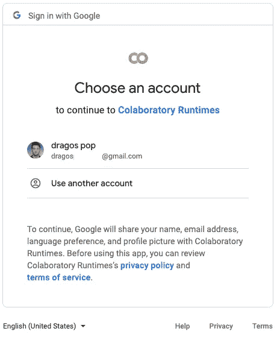

# 教程:区块链交易检索

> 原文：<https://medium.com/coinmonks/tutorial-blockchain-transaction-retrieval-601875014a7e?source=collection_archive---------25----------------------->

## 使用 Python、SQL 和 Google BigQuery 提取区块链上的特定事务


Photo by [GuerrillaBuzz Crypto PR](https://unsplash.com/@theshubhamdhage?utm_source=medium&utm_medium=referral) on [Unsplash](https://unsplash.com?utm_source=medium&utm_medium=referral)

你有没有想过使用区块链交易来生成你自己的分析，但不知道在哪里以及如何提取它们？

那么，这篇文章以教程的形式给出了一个可能的解决方案，可以很容易地根据您未来的密码学习的需要进行调整。

# **1。要求:**

为了遵循教程，你需要满足两个要求。更准确地说，您应该:

*   一个谷歌账户(使用谷歌 Colab 和 BigQuery)
*   SQL 知识

# 2.连接到您的 Google 帐户:

在您处理完需求之后，您可以继续打开一个新的 Google Colab 笔记本。我使用 Google Colab 而不是 Jupyter 的原因是它更容易连接到 Google BigQuery，这是一个存储数据的平台。接下来，所需的包已经安装好了，所以只需要导入它们，如下所示。

```
from google.colab import auth
from google.cloud import bigquery
```

通过调用下面的代码，您允许笔记本访问您的 Google Cloud 数据。

```
auth.authenticate_user()
```

运行之后，会出现一个如下图所示的弹出窗口。


Fig. 1— Pop-up window 1

按下`Allow`，您将被引导至一个页面，在该页面上您可以选择想要使用的 Google 帐户。



Fig. 2— Pop-up window 2

如果一切顺利，你的笔记本应该有权限访问你的谷歌账户。

# 3.创建和连接谷歌云项目:

此时，需要一个 Google Cloud 项目，它可以很容易地在 Google Cloud 仪表板中创建。如果你在这方面需要任何帮助，看看谷歌的[官方文档。](https://cloud.google.com/resource-manager/docs/creating-managing-projects)

最后，新创建的项目的 ID 在下面的单元格中使用，以允许您的笔记本访问该项目的 BigQuery 环境。

```
project_id = 'clever-arcadia-342004' #use your own project_id
client = bigquery.Client(project=project_id)
```

# 4.选择适当的表格:

最初，您需要选择要从中提取事务的区块链。在教程里，我用的是比特币。然而，在撰写本文时(2022 年 8 月)，BigQuery 还提供比特币现金(BCH)、以太坊(ETH)、以太坊经典(ETC)、Dash (DASH)、Dogecoin (DOGE)、Litecoin (LTC)和 ZCash (ZEC)。之后，您只需将“crypto_bitcoin”替换为“crypto_”以及您在以下单元格的代码中选择的区块链(即“crypto_ethereum_classic”、“crypto_dash”等)。

```
dataset_ref = client.dataset('crypto_bitcoin', project='bigquery-public-data')
dataset = client.get_dataset(dataset_ref)
table_ref = dataset.table('transactions')
table = client.get_table(table_ref)
```

# 5.查询交易:

现在，您已经准备好开始查询事务了。为此，您需要了解一些 SQL，就像开头提到的那样。为了简单起见，我检索了比特币分类账上的前 10 笔交易。您还负责选择您想要获取的字段。在我的例子中，我选择了块的时间戳、涉及的地址、转移的值和费用。

```
N = 10 * 2 # multipled by 2 because BTC transactions are first sending the total amount held by the sender and then the sender receives the change back in another transactionquery = """ SELECT block_timestamp, inputs.addresses, outputs.addresses, outputs.value, feeFROM `bigquery-public-data.crypto_bitcoin.transactions` AS transactions, transactions.outputs as outputs, transactions.inputs as inputsWHERE transactions.block_timestamp_month = "2009-01-01"LIMIT """ + str(N) query_job = client.query(query)
```

# 6*.解析 Pandas 数据帧中的结果

或者，您可以在 Pandas 数据框架中解析查询结果，如下面的代码所示。

```
import pandas as pddates = list()
senders = list()
receivers = list()
amounts = list()
fees = list()i = 0
for row in query_job:
  if (row[1][0]!=row[2][0]):
    dates.append(row[0])
    senders.append(row[1][0])
    receivers.append(row[2][0])
    amounts.append(row[3])
    fees.append(row[4])
  i+=1df = pd.DataFrame({‘Date’: dates, ‘Sender’: senders, ‘Receiver’: receivers, ‘Amount’: amounts, ‘Fees’:fees})
```


Fig. 3 — Resulted DataFrame

## 现在您知道了如何从您最喜欢的区块链中检索交易，并在您的分析中使用它们！

如果你想看完整的代码或者下载笔记本，可以在我的 [GitHub](https://github.com/dragos-pop/Crypto/blob/main/Blockchain-Txn-Retrieval/Demo-BTC.ipynb) 上找到。

感谢您的宝贵时间！

如果你喜欢读这篇文章，请给它一个掌声，并关注更多的密码相关的文章！

> 交易新手？试试[密码交易机器人](/coinmonks/crypto-trading-bot-c2ffce8acb2a)或者[复制交易](/coinmonks/top-10-crypto-copy-trading-platforms-for-beginners-d0c37c7d698c)